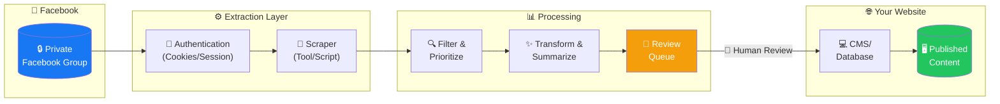
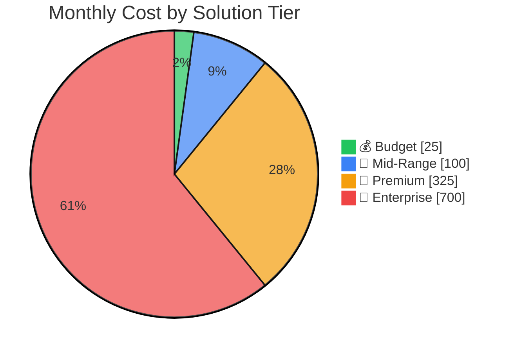
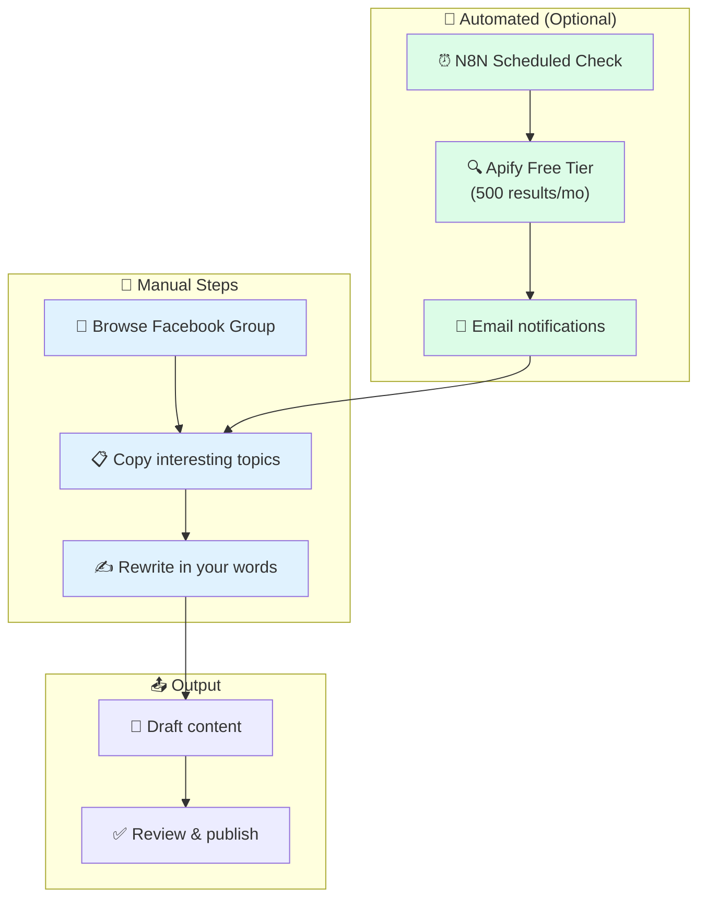
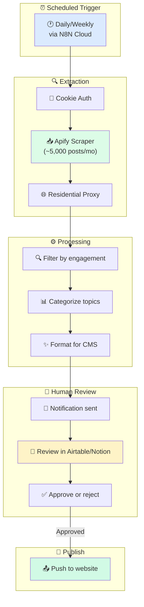
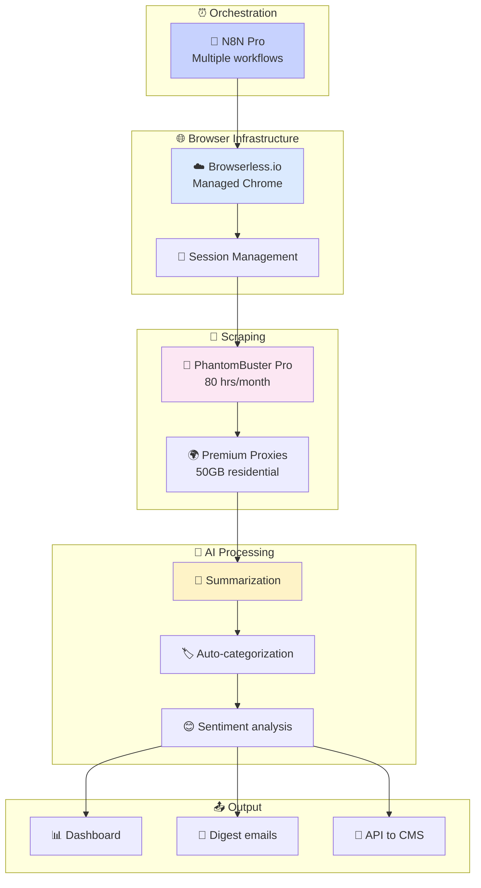
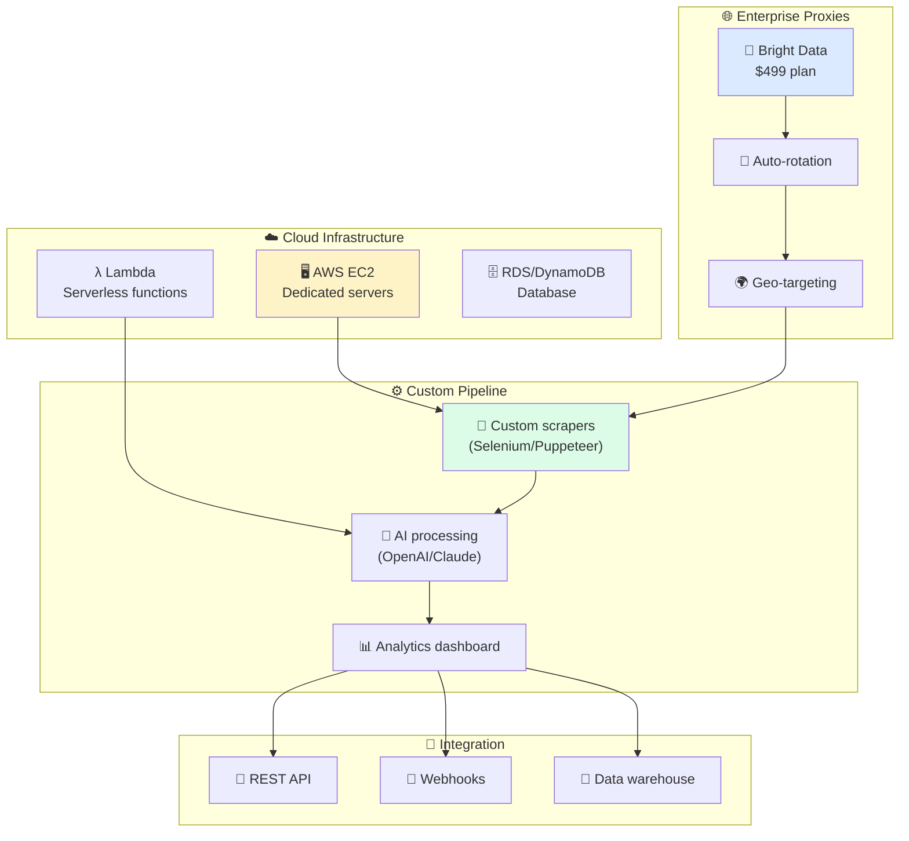
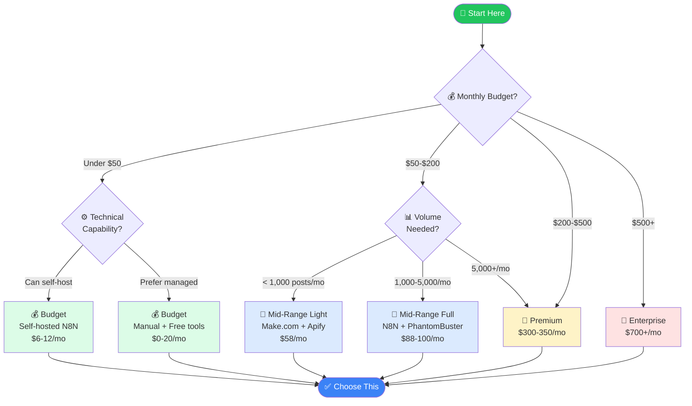
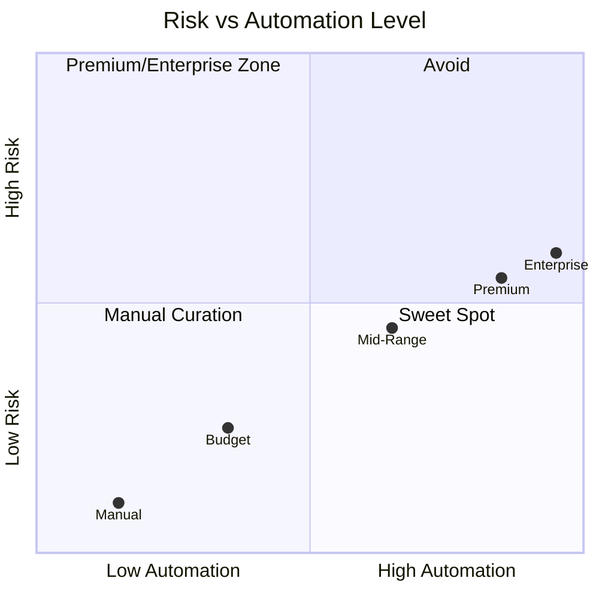
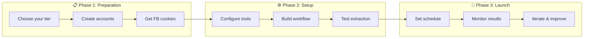

# 🔗 Facebook Group Content Integration Guide

## 📱 Private Facebook Group → 🌐 Your Website

**A Complete Guide to Syncing & Repurposing Content**

*Multiple approaches • Detailed cost breakdowns • Automated solutions*

---

## 📋 Table of Contents

- [Executive Summary](#-executive-summary)
- [How It Works](#-how-it-works)
- [Quick Comparison](#-quick-comparison)
- [Solution Options](#-solution-options)
  - [Option 1: Budget](#-option-1-budget--0-50month)
  - [Option 2: Mid-Range](#-option-2-mid-range--50-150month)
  - [Option 3: Premium](#-option-3-premium--300-350month)
  - [Option 4: Enterprise](#-option-4-enterprise--700month)
- [Tool Deep-Dives](#-tool-deep-dives)
- [Which Option is Right for You?](#-which-option-is-right-for-you)
- [Important Considerations](#-important-considerations)
- [Next Steps](#-next-steps)

---

## 📊 Executive Summary

### The Challenge

Extracting content from a **private Facebook group** to repurpose on your own website presents unique challenges:

| Challenge | Impact |
|-----------|--------|
| 🔒 **API Restrictions** | Facebook's Graph API doesn't allow members to pull group content |
| 📜 **Terms of Service** | Automated scraping violates Facebook's ToS |
| 🛡️ **Privacy Concerns** | Content shared in private groups has privacy expectations |
| 🔐 **Login Required** | Any solution requires authenticated access |

### The Solution

We've identified **4 cost-tiered approaches** ranging from manual curation to fully automated pipelines. Each balances:

- 💵 **Cost** — Monthly infrastructure expenses
- ⚡ **Automation Level** — How much manual work required
- ⚠️ **Risk Level** — Potential for account issues
- 🕐 **Setup Time** — Time to get running

---

## 🔄 How It Works

### High-Level Architecture

### Data Flow Summary

| Step | Description | Who Does It |
|------|-------------|-------------|
| 1️⃣ | Authenticate with Facebook using your member credentials | 🤖 Automated |
| 2️⃣ | Extract posts from the group feed | 🤖 Automated |
| 3️⃣ | Filter for relevant/popular discussions | 🤖 Automated |
| 4️⃣ | Transform into your website's format | 🤖 Automated |
| 5️⃣ | Review and approve content | 👤 Human |
| 6️⃣ | Publish to your website | 🤖/👤 Either |

---

## ⚡ Quick Comparison

### All Options at a Glance

| | 💰 Budget | 💎 Mid-Range | 🚀 Premium | 🏢 Enterprise |
|---|:---:|:---:|:---:|:---:|
| **Monthly Cost** | $0 - $50 | $50 - $150 | $300 - $350 | $700+ |
| **Automation** | ⭐ Low | ⭐⭐⭐ High | ⭐⭐⭐⭐ Full | ⭐⭐⭐⭐⭐ Full + Scale |
| **Setup Time** | 2-4 hours | 4-8 hours | 1-2 days | 3-5 days |
| **Technical Skill** | 🟢 Minimal | 🟡 Some | 🟠 Moderate | 🔴 High |
| **Risk Level** | ✅ Very Low | ⚠️ Low | ⚠️ Medium | ⚠️ Medium |
| **Best For** | Testing / Low volume | Regular sync | High volume | Large scale |

### Visual Cost Comparison

---

## 🛠️ Solution Options

---

### 💰 Option 1: Budget — $0-50/month

**Best for:** Testing the concept, low-volume needs, or tight budgets

#### Overview

This approach combines **manual monitoring** with **free/low-cost tools** to automate parts of the workflow while keeping costs minimal.

#### Workflow Diagram

#### Cost Breakdown

| Component | Service | Monthly Cost | Notes |
|-----------|---------|-------------|-------|
| 🖥️ **Server** | DigitalOcean Basic Droplet | $6 | 1GB RAM, 1 vCPU |
| ⚙️ **Automation** | N8N Community Edition | $0 | Self-hosted, unlimited |
| 🔍 **Scraping** | Apify Free Tier | $0 | $5 credits = ~500 posts |
| 🌐 **Proxy** | None (use carefully) | $0 | Higher detection risk |
| | | | |
| | **TOTAL** | **$6 - $12/mo** | |

#### What You Get

| Feature | Included |
|---------|----------|
| Post extraction | ✅ Limited (500/month) |
| Scheduled runs | ✅ Yes |
| Email alerts | ✅ Yes |
| Human review queue | ✅ Basic |
| Detection protection | ❌ Minimal |

#### Pros & Cons

| ✅ Pros | ❌ Cons |
|---------|---------|
| Very low cost | Manual work required |
| Easy to start | Limited automation |
| Low risk (mostly manual) | Doesn't scale well |
| No technical expertise needed | May miss active discussions |

---

### 💎 Option 2: Mid-Range — $50-150/month

**Best for:** Regular syncing, moderate volume, some automation desired

#### Overview

This tier uses **cloud-based automation tools** to handle most of the extraction and processing, with human review only for final approval.

#### Workflow Diagram

#### Cost Breakdown

| Component | Service | Monthly Cost | Notes |
|-----------|---------|-------------|-------|
| ⚙️ **Automation** | N8N Cloud Starter | $24 | 2,500 executions |
| 🔍 **Scraping** | Apify Starter | $49 | ~10,000+ posts |
| 🌐 **Proxy** | Webshare Residential | $15 | ~3GB bandwidth |
| 📊 **Review Tool** | Airtable Free | $0 | Or Notion, Google Sheets |
| | | | |
| | **TOTAL** | **$88/mo** | |

**Alternative Stack:**

| Component | Service | Monthly Cost |
|-----------|---------|-------------|
| ⚙️ **Automation** | Make.com Core | $9 |
| 🔍 **Scraping** | PhantomBuster Starter | $69 |
| 🌐 **Proxy** | Included in PhantomBuster | $0 |
| | **TOTAL** | **$78/mo** |

#### What You Get

| Feature | Included |
|---------|----------|
| Post extraction | ✅ 5,000-10,000/month |
| Scheduled runs | ✅ Daily or custom |
| Smart filtering | ✅ By engagement, keywords |
| Human review queue | ✅ Professional (Airtable/Notion) |
| Detection protection | ✅ Residential proxies |
| Email notifications | ✅ Yes |

#### Pros & Cons

| ✅ Pros | ❌ Cons |
|---------|---------|
| High automation | Monthly subscription costs |
| Professional tools | Some setup required |
| Good proxy protection | Learning curve for tools |
| Scalable if needed | Still requires human review |
| Visual workflow builders | |

---

### 🚀 Option 3: Premium — $300-350/month

**Best for:** High volume, fully automated pipelines, minimal manual intervention

#### Overview

This tier provides **enterprise-grade automation** with dedicated browser infrastructure, professional scraping tools, and robust proxy networks for reliable, high-volume extraction.

#### Workflow Diagram

#### Cost Breakdown

| Component | Service | Monthly Cost | Notes |
|-----------|---------|-------------|-------|
| ⚙️ **Automation** | N8N Cloud Pro | $60 | 10,000 executions |
| 🤖 **Scraping** | PhantomBuster Pro | $159 | 80 hours execution |
| 🌐 **Browser** | Browserless.io Starter | $50 | Managed headless Chrome |
| 🔒 **Proxies** | Premium Residential | $50 | ~10-15GB via Oxylabs/Webshare |
| | | | |
| | **TOTAL** | **$319/mo** | |

#### What You Get

| Feature | Included |
|---------|----------|
| Post extraction | ✅ Unlimited |
| Scheduled runs | ✅ Multiple per day |
| Smart filtering | ✅ Advanced with AI |
| Human review queue | ✅ Optional (can auto-publish) |
| Detection protection | ✅ Enterprise-grade |
| Content summarization | ✅ AI-powered |
| Auto-categorization | ✅ Yes |
| API integration | ✅ Direct to CMS |
| Support | ✅ Priority |

#### Pros & Cons

| ✅ Pros | ❌ Cons |
|---------|---------|
| Fully automated | Higher monthly cost |
| AI-powered processing | Requires setup expertise |
| Enterprise reliability | More components to manage |
| Scales to high volume | Overkill for small groups |
| Direct CMS integration | |
| Priority support | |

---

### 🏢 Option 4: Enterprise — $700+/month

**Best for:** Large-scale operations, multiple groups, custom requirements

#### Overview

This tier provides **custom infrastructure** with dedicated cloud resources, enterprise-grade proxy services, and full customization capabilities for organizations with serious scale requirements.

#### Architecture Diagram

#### Cost Breakdown

| Component | Service | Monthly Cost | Notes |
|-----------|---------|-------------|-------|
| ☁️ **Cloud** | AWS EC2 (xlarge) | $200 | Dedicated compute |
| λ **Serverless** | AWS Lambda | $10 | Processing functions |
| 🗄️ **Database** | AWS RDS | $50 | Persistent storage |
| 🌐 **Proxies** | Bright Data Residential | $499 | Enterprise tier |
| ⚙️ **Automation** | Make.com Teams | $180 | High-volume workflows |
| | | | |
| | **TOTAL** | **$939/mo** | |

**Scaled-Down Enterprise:**

| Component | Service | Monthly Cost |
|-----------|---------|-------------|
| ☁️ **Cloud** | AWS Lambda + S3 | $50 |
| 🌐 **Proxies** | Oxylabs Starter | $99 |
| ⚙️ **Automation** | N8N Enterprise | Custom |
| | **TOTAL** | **$700+/mo** |

#### What You Get

| Feature | Included |
|---------|----------|
| Post extraction | ✅ Unlimited, multi-group |
| Scheduled runs | ✅ Real-time capable |
| Smart filtering | ✅ Custom AI models |
| Detection protection | ✅ Best available |
| Custom development | ✅ Full flexibility |
| Analytics | ✅ Full dashboard |
| Data warehouse | ✅ Long-term storage |
| SLA/Support | ✅ Enterprise agreements |
| Multi-tenant | ✅ Multiple clients |

#### Pros & Cons

| ✅ Pros | ❌ Cons |
|---------|---------|
| Unlimited scale | High ongoing cost |
| Full customization | Requires dedicated DevOps |
| Best proxy quality | Complex architecture |
| Enterprise support | Overkill for most use cases |
| Multi-group capable | |
| Data analytics | |

---

## 🔧 Tool Deep-Dives

### ⚙️ N8N — Workflow Automation

<strong>Click to expand N8N details</strong>

#### What is N8N?

N8N is a **workflow automation platform** that connects different services and automates tasks. Think of it as "if this, then that" for complex business processes.

#### Pricing Options

| Plan | Cost | Executions | Best For |
|------|------|------------|----------|
| 🆓 **Community** | Free (self-host) | Unlimited | Budget-conscious |
| ⭐ **Starter** | $24/month | 2,500/mo | Getting started |
| 💼 **Pro** | $60/month | 10,000/mo | Regular use |
| 🏢 **Enterprise** | Custom | Custom | Large teams |

#### For Facebook Scraping

N8N can:
- ⏰ Schedule scraping runs
- 🔗 Connect to scraping services (Apify, PhantomBuster)
- 📊 Process and filter data
- 📧 Send notifications
- 🔌 Push to your CMS

#### Self-Hosted vs Cloud

| Aspect | Self-Hosted | Cloud |
|--------|-------------|-------|
| **Cost** | $6-10/mo (server) | $24-60/mo |
| **Executions** | Unlimited | Limited by plan |
| **Setup** | 2-4 hours | Instant |
| **Maintenance** | You handle | N8N handles |
| **Updates** | Manual | Automatic |

---

### 🔄 Make.com — Visual Automation

<strong>Click to expand Make.com details</strong>

#### What is Make.com?

Make.com (formerly Integromat) is a **visual automation builder** with a drag-and-drop interface. Great for non-technical users.

#### Pricing

| Plan | Cost | Operations | Best For |
|------|------|------------|----------|
| 🆓 **Free** | $0 | 1,000/mo | Testing |
| 📗 **Core** | $9/month | 10,000/mo | Basic needs |
| 📘 **Pro** | $19/month | 10,000/mo | Advanced features |
| 📙 **Teams** | $180/month | 150,000/mo | Teams |

#### Operations Explained

Each "step" in a workflow = 1 operation
- Fetching a post = 1 operation
- Filtering = 1 operation
- Saving to database = 1 operation

A 5-step workflow processing 100 posts = 500 operations

#### Integration with Facebook Tools

Make.com connects natively to:
- PhantomBuster
- Apify
- Google Sheets
- Airtable
- Most CMS platforms

---

### 👻 PhantomBuster — Social Media Automation

<strong>Click to expand PhantomBuster details</strong>

#### What is PhantomBuster?

PhantomBuster provides **pre-built "Phantoms"** that automate social media tasks without coding.

#### Pricing

| Plan | Cost | Execution Time | Best For |
|------|------|----------------|----------|
| 🧪 **Trial** | Free | 2 hours | Testing |
| ⭐ **Starter** | $69/month | 20 hours | Light use |
| 💼 **Pro** | $159/month | 80 hours | Regular use |
| 👥 **Team** | $439/month | 300 hours | Teams |

#### Facebook-Specific Phantoms

| Phantom | What It Does |
|---------|--------------|
| **Group Members Export** | Extract member lists |
| **Profile Scraper** | Get profile details |
| **Auto Liker** | Engage with posts |
| **Post Scraper** | Extract post content |

#### Execution Time Explained

- Running a Phantom = uses execution time
- Extracting 1,000 members ≈ 15-30 minutes
- Daily scrape of 100 posts ≈ 5-10 minutes
- 20 hours/month = ~40-80 daily runs

---

### 🔍 Apify — Web Scraping Platform

<strong>Click to expand Apify details</strong>

#### What is Apify?

Apify is a **web scraping platform** with pre-built scrapers and pay-per-result pricing.

#### Pricing Model

**Platform Plans:**
| Plan | Cost | Credits | Best For |
|------|------|---------|----------|
| 🆓 **Free** | $0 | $5/month | Testing |
| ⭐ **Starter** | $49/month | $49 credits | Regular use |
| 📈 **Scale** | $499/month | $499 credits | High volume |

**Pay-Per-Result (Facebook):**
| Scraper | Cost per 1,000 |
|---------|----------------|
| Facebook Posts | $4.00 |
| Facebook Ads | $5.00 |
| Facebook Marketplace | $5.00 |
| Facebook Followers | $7.00 |

#### Facebook Scrapers Available

1. **Facebook Pages Scraper** — Public pages
2. **Facebook Posts Scraper** — Post content
3. **Facebook Ads Library** — Ad creatives
4. **Facebook Marketplace** — Listings

⚠️ **Note:** Private groups require custom setup with your login cookies

---

### 🌐 Proxy Services — Detection Protection

<strong>Click to expand Proxy details</strong>

#### Why Use Proxies?

Proxies help avoid detection by:
- 🔄 Rotating your IP address
- 🌍 Appearing from different locations
- 🏠 Using residential IPs (real devices)

#### Provider Comparison

| Provider | Starting Price | Type | Best For |
|----------|---------------|------|----------|
| **Webshare** | $2.99/mo | Mixed | Budget |
| **Oxylabs** | $99/mo (11GB) | Premium | Mid-range |
| **Bright Data** | $499/mo | Enterprise | High volume |

#### Data Usage Estimates

| Activity | Data per 1,000 |
|----------|----------------|
| Post extraction | ~50-100 MB |
| With images | ~500 MB - 1 GB |
| Full page loads | ~1-2 GB |

**Budget Estimate:**
- 1,000 posts/month (text only) ≈ 100 MB ≈ $0.50-$5
- 5,000 posts/month ≈ 500 MB ≈ $2.50-$25

---

## 🤔 Which Option is Right for You?

### Decision Flowchart

### Quick Recommendation Matrix

| Your Situation | Recommended Option |
|----------------|-------------------|
| 🧪 Just testing the concept | 💰 Budget ($6-12) |
| 💼 Small team, moderate needs | 💎 Mid-Range ($50-100) |
| 📈 Growing, need reliability | 🚀 Premium ($300-350) |
| 🏢 Enterprise, multiple groups | 🏢 Enterprise ($700+) |
| 💻 Technical team available | Self-host where possible |
| 🙅 No technical team | Fully managed services |

---

## ⚠️ Important Considerations

### 🔒 Risk Assessment

### Facebook Terms of Service

| ⚠️ What's Against ToS | ✅ What's Generally OK |
|-----------------------|------------------------|
| Mass automated scraping | Manual browsing & copying |
| Storing personal data | Summarizing topics/ideas |
| Republishing verbatim content | Rephrasing in your words |
| Using bots to interact | Reading as a logged-in member |
| Selling scraped data | Internal research use |

### 🛡️ Detection Mitigation Best Practices

| Practice | Impact |
|----------|--------|
| 🐢 **Slow down scraping** | Reduces detection significantly |
| 🔄 **Use residential proxies** | Appears like normal user |
| ⏰ **Randomize timing** | Avoids pattern detection |
| 📉 **Low volume** | <100 posts/day recommended |
| 🍪 **Fresh cookies** | Update session regularly |
| 📱 **Mobile site** | Often less protected |

### ⚖️ Ethical Content Use

**DO:**
- ✅ Summarize discussions in your own words
- ✅ Extract topic ideas (not exact text)
- ✅ Anonymize any user references
- ✅ Add your own value/insights
- ✅ Get permission for direct quotes

**DON'T:**
- ❌ Copy-paste entire posts
- ❌ Include personal information
- ❌ Share without transformation
- ❌ Claim others' work as yours
- ❌ Expose private discussions publicly

---

## 🚀 Next Steps

### Getting Started Checklist

### Action Items by Tier

#### 💰 If choosing Budget:
1. ☐ Set up DigitalOcean account ($6 droplet)
2. ☐ Install N8N Community Edition
3. ☐ Create Apify free account
4. ☐ Export Facebook cookies
5. ☐ Build basic workflow

#### 💎 If choosing Mid-Range:
1. ☐ Sign up for N8N Cloud Starter ($24)
2. ☐ Create Apify Starter account ($49)
3. ☐ Set up Webshare proxy ($15)
4. ☐ Create Airtable/Notion for review queue
5. ☐ Connect all services in N8N

#### 🚀 If choosing Premium:
1. ☐ Sign up for N8N Pro ($60)
2. ☐ Create PhantomBuster Pro account ($159)
3. ☐ Set up Browserless.io ($50)
4. ☐ Configure premium proxies ($50)
5. ☐ Build comprehensive workflow

#### 🏢 If choosing Enterprise:
1. ☐ Consult with DevOps team
2. ☐ Set up AWS infrastructure
3. ☐ Contact Bright Data for enterprise plan
4. ☐ Design custom architecture
5. ☐ Plan implementation timeline

---

## 📚 Resources & Links

### Tool Links

| Tool | Website | Pricing Page |
|------|---------|--------------|
| N8N | [n8n.io](https://n8n.io) | [Pricing](https://n8n.io/pricing/) |
| Make.com | [make.com](https://make.com) | [Pricing](https://www.make.com/en/pricing) |
| PhantomBuster | [phantombuster.com](https://phantombuster.com) | [Pricing](https://phantombuster.com/pricing) |
| Apify | [apify.com](https://apify.com) | [Pricing](https://apify.com/pricing) |
| Browserless | [browserless.io](https://browserless.io) | [Pricing](https://www.browserless.io/pricing) |
| DigitalOcean | [digitalocean.com](https://digitalocean.com) | [Pricing](https://www.digitalocean.com/pricing/droplets) |
| Webshare | [webshare.io](https://webshare.io) | [Pricing](https://www.webshare.io/pricing) |
| Bright Data | [brightdata.com](https://brightdata.com) | [Pricing](https://brightdata.com/pricing) |

---

---

**📄 Document Version:** 1.0
**📅 Last Updated:** December 2024
**💰 Pricing Verified:** December 2024

*Prices are subject to change. Always verify current pricing on vendor websites.*

---

