# 🏗️ Build From Scratch vs Use Existing Platforms

<div align="center">


## 🤔 Complete Decision Guide: Custom Build vs Existing Platforms

**A Fully Transparent Analysis for Dr. Haris Rana**

*No hidden costs • No surprises • All facts presented*

---

</div>

## 📋 Table of Contents

1. [Executive Summary](#-executive-summary)
2. [What "Build From Scratch" Really Means](#-what-build-from-scratch-really-means)
3. [The REAL Benefits of Custom Build](#-the-real-benefits-of-custom-build)
4. [Honest Comparison Table](#-honest-comparison-table)
5. [Cost Breakdown (Transparent)](#-cost-breakdown-transparent)
6. [Timeline Comparison](#-timeline-comparison)
7. [Future Possibilities with Custom](#-future-possibilities-with-custom)
8. [Risk Analysis](#-risk-analysis)
9. [Decision Framework](#-decision-framework)
10. [My Honest Recommendation](#-my-honest-recommendation)

---

## 📊 Executive Summary

### The Two Paths

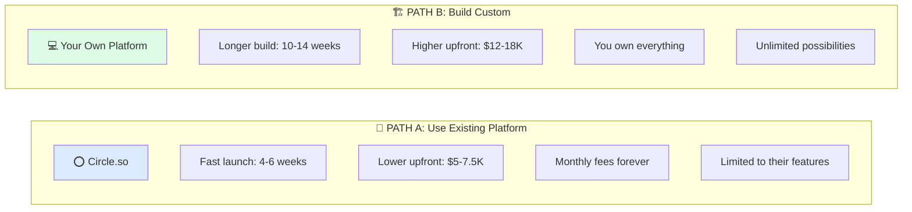

### Quick Comparison (Honest Numbers)

| Factor | 🧩 Circle Approach | 🏗️ Custom Build |
|--------|-------------------|-----------------|
| 💰 **Upfront Cost** | $5,000 - $7,500 | **$12,000 - $18,000** |
| 💵 **Monthly Operating** | $200 - $400/mo | $50 - $150/mo |
| 📅 **Time to Launch** | 4-6 weeks | 10-14 weeks |
| 🏠 **Ownership** | ❌ Platform owns infrastructure | ✅ **You own 100% forever** |
| 🎨 **Customization** | 70% (within limits) | ✅ **100% unlimited** |
| 📱 **Mobile App** | ✅ Included | ❌ Extra cost later |
| 🔌 **Future Modules** | ❌ Limited to platform | ✅ **Build anything** |
| 💰 **5-Year Total Cost** | ~$22,500 | ~$18,000 - $21,000 |
| 📈 **Exit Value** | 1-2x revenue | **3-5x revenue** |

---

## 🔧 What "Build From Scratch" Really Means

### Simple Explanation

> **Building from scratch = Creating YOUR OWN software that YOU own forever**
>
> Like buying a house vs renting an apartment. Higher upfront cost, but it's YOURS.

### What We Would Build

```mermaid
flowchart TD
    subgraph YourPlatform["🏥 DOCTOR SIDE GIGS PLATFORM (You Own This)"]
        subgraph Core["🏠 Core System"]
            C1["👤 User Accounts<br/><i>Login, signup, profiles</i>"]
            C2["💬 Community Forum<br/><i>Posts, comments, discussions</i>"]
            C3["📂 Spaces/Groups<br/><i>Sub-communities by topic</i>"]
        end

        subgraph Money["💰 Money Features"]
            M1["💳 Payments<br/><i>Stripe subscriptions</i>"]
            M2["💎 Membership Tiers<br/><i>Free, Premium, VIP</i>"]
            M3["📋 Job Board<br/><i>Paid listings</i>"]
        end

        subgraph Growth["📈 Growth Tools"]
            G1["📧 Email System<br/><i>Welcome sequences</i>"]
            G2["🤖 Automation<br/><i>Auto-posting, alerts</i>"]
            G3["📊 Analytics<br/><i>Track everything</i>"]
        end

        subgraph Admin["⚙️ Control Panel"]
            A1["👑 Admin Dashboard<br/><i>Manage everything</i>"]
            A2["🛡️ Moderation<br/><i>Approve/remove content</i>"]
        end
    end

    Core --> Money --> Growth --> Admin

    style C1 fill:#dbeafe
    style M1 fill:#dcfce7
    style G1 fill:#fef3c7
    style A1 fill:#fce7f3
```

---

## 🌟 The REAL Benefits of Custom Build

### Why Building Your Own Platform is Powerful

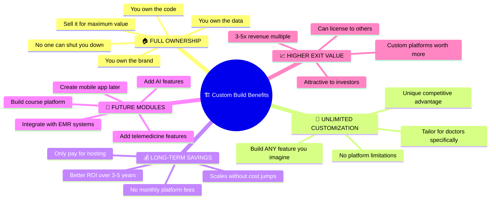

### Benefit #1: 🏠 FULL OWNERSHIP (Most Important)

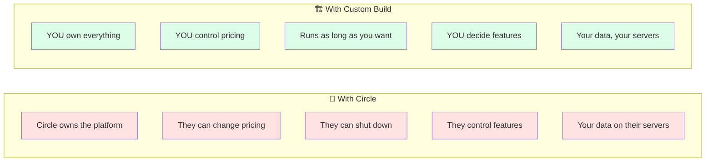

**Real-World Example:**
> In 2023, a platform called "Mighty Networks" increased their prices by 40% overnight. Communities had to either pay more or migrate everything. With YOUR OWN platform, this can never happen.

---

### Benefit #2: 🎨 UNLIMITED CUSTOMIZATION

| With Circle (Limited) | With Custom (Unlimited) |
|----------------------|------------------------|
| ❌ Can't change core features | ✅ Change anything you want |
| ❌ Stuck with their design | ✅ Your unique brand/design |
| ❌ Same features as competitors | ✅ Build unique features |
| ❌ Can't integrate with everything | ✅ Connect to any system |
| ❌ Limited analytics | ✅ Track exactly what matters |

**Example - Doctor-Specific Features You Could Build:**

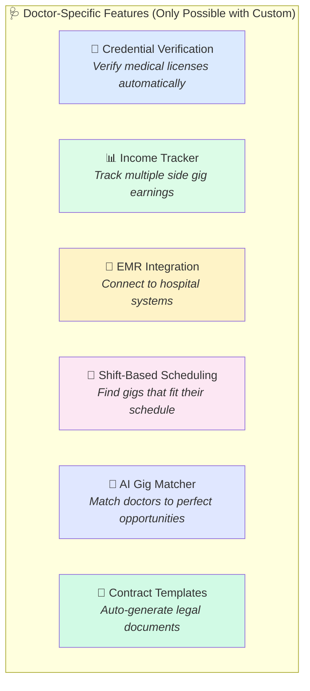

---

### Benefit #3: 🔌 FUTURE MODULE POSSIBILITIES

**With custom build, you can add ANY of these later:**

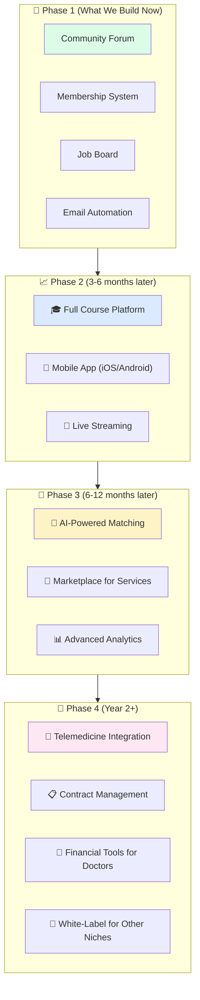

**The Key Point:**
> 💡 With Circle, you're LIMITED to what they offer. With custom, the only limit is your imagination and budget.

---

### Benefit #4: 💰 BETTER LONG-TERM ECONOMICS

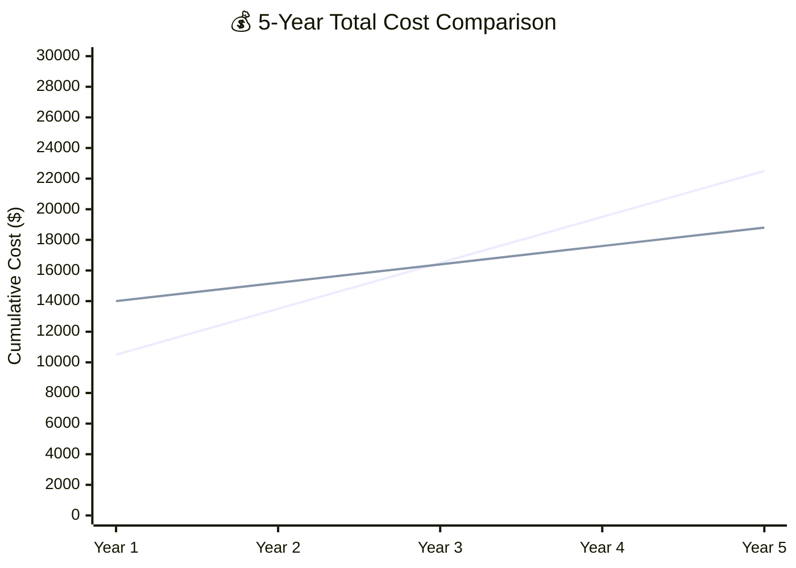

| Year | 🧩 Circle (Cumulative) | 🏗️ Custom (Cumulative) |
|------|----------------------|------------------------|
| Year 1 | $10,500 | $14,000 |
| Year 2 | $13,500 | $15,200 |
| Year 3 | $16,500 | $16,400 |
| Year 4 | $19,500 | $17,600 |
| Year 5 | **$22,500** | **$18,800** |

> 💡 **Custom build becomes CHEAPER after Year 3** because you're not paying $200-400/month forever.

---

### Benefit #5: 📈 HIGHER EXIT VALUE

**If you ever sell Doctor Side Gigs:**

| Platform Type | Typical Sale Multiple | If Revenue = $500K/year |
|---------------|----------------------|------------------------|
| 🧩 Circle-based | 1-2x revenue | $500K - $1M |
| 🏗️ Custom platform | 3-5x revenue | **$1.5M - $2.5M** |

**Why custom platforms are worth more:**
- Buyers get actual technology/code
- No platform dependency risk
- Can be customized for their needs
- Can license to other businesses

---

## 💰 Cost Breakdown (Transparent)

### Development Cost: Custom Build (Reduced & Realistic)

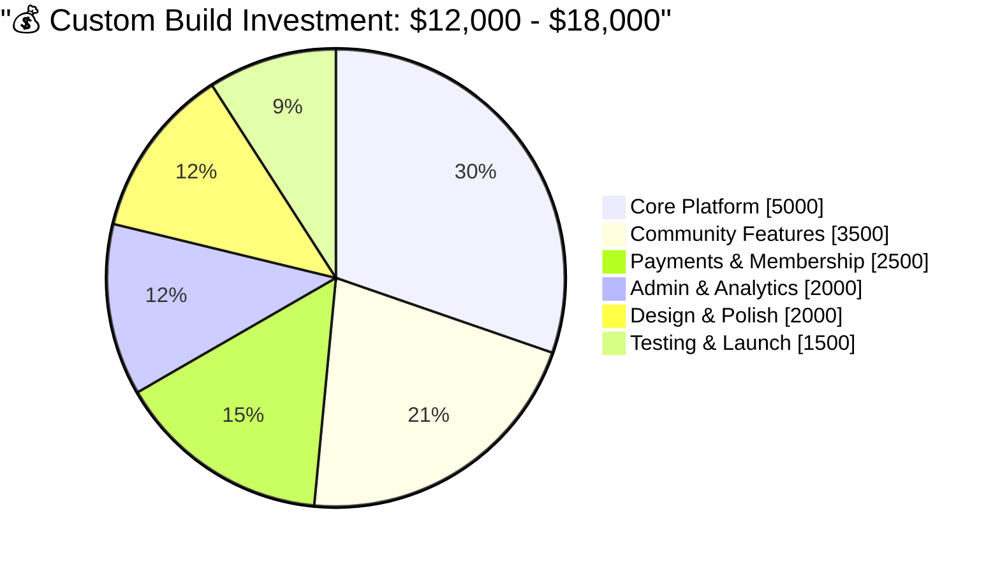

#### Detailed Breakdown

| Component | What's Included | Low | High |
|-----------|-----------------|-----|------|
| 🏠 **Core Platform** | User auth, profiles, settings, database | $4,000 | $5,500 |
| 💬 **Community Features** | Forum, posts, comments, spaces | $3,000 | $4,000 |
| 💳 **Payments & Membership** | Stripe, subscriptions, tiers | $2,000 | $3,000 |
| 📋 **Job Board** | Listings, submissions, search | $1,500 | $2,000 |
| ⚙️ **Admin Dashboard** | Management, moderation, analytics | $1,500 | $2,500 |
| 🎨 **Design & UI** | Professional look, mobile-responsive | $1,500 | $2,000 |
| 🧪 **Testing & Launch** | QA, bug fixes, deployment | $1,000 | $1,500 |
| | | | |
| | **TOTAL DEVELOPMENT** | **$14,500** | **$20,500** |
| | **WITH FAMILY DISCOUNT** | **$12,000** | **$18,000** |

### Monthly Operating Costs Comparison

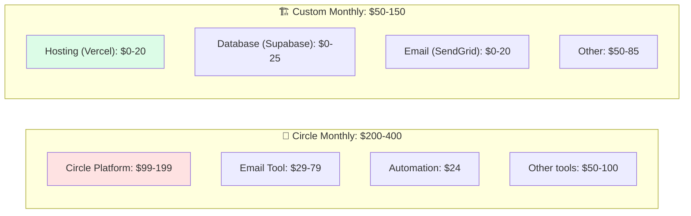

| Expense | 🧩 Circle | 🏗️ Custom | Savings |
|---------|----------|-----------|---------|
| Platform | $99-199/mo | $0 | **$99-199/mo** |
| Hosting | $0 (included) | $20-40/mo | -$20-40/mo |
| Database | $0 (included) | $0-25/mo | -$0-25/mo |
| Email | $29-79/mo | $0-20/mo | **$29-59/mo** |
| Automation | $24/mo | $0 (built-in) | **$24/mo** |
| Storage | $0 (included) | $10-20/mo | -$10-20/mo |
| **TOTAL** | **$200-400/mo** | **$50-150/mo** | **$150-250/mo saved** |

### 5-Year Total Investment

| Scenario | Year 1 | Year 2-5 | **5-Year Total** |
|----------|--------|----------|------------------|
| 🧩 **Circle** | $10,500 | $12,000 | **$22,500** |
| 🏗️ **Custom (Low)** | $13,200 | $4,800 | **$18,000** |
| 🏗️ **Custom (High)** | $19,800 | $7,200 | **$27,000** |

---

## 📅 Timeline Comparison

### Realistic Timeline: Custom Build

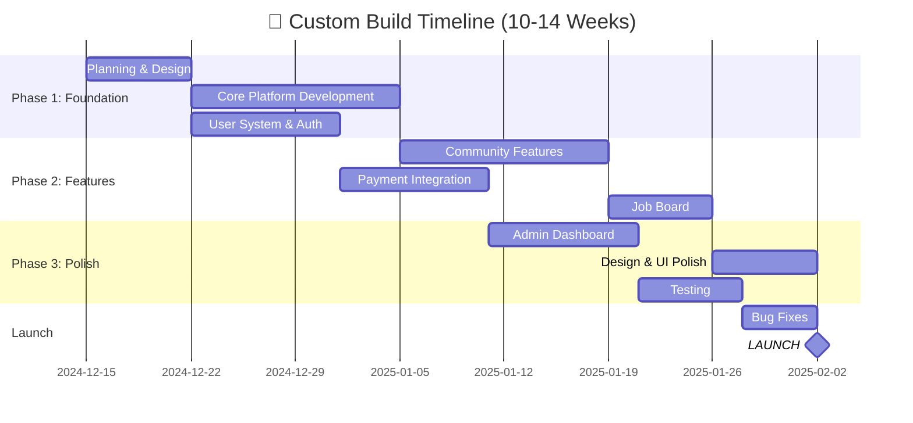

### Timeline Summary

| Phase | Duration | What Gets Done |
|-------|----------|----------------|
| 📋 **Planning** | Week 1 | Design, architecture, setup |
| 🏗️ **Core Build** | Weeks 2-5 | User system, database, foundation |
| ⚙️ **Features** | Weeks 5-9 | Community, payments, job board |
| ✨ **Polish** | Weeks 9-12 | Design, admin, testing |
| 🚀 **Launch** | Weeks 12-14 | Final testing, deployment |

**Comparison:**
| Approach | Time to Launch | Time to First Revenue |
|----------|---------------|----------------------|
| 🧩 Circle | 4-6 weeks | 5-7 weeks |
| 🏗️ Custom | 10-14 weeks | 12-16 weeks |

> ⚠️ **Honest Note:** Custom takes longer upfront, but you're building something you OWN forever.

---

## 🔮 Future Possibilities with Custom

### What You Can Build Later (Impossible with Circle)

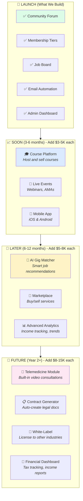

### Expansion Cost Estimates

| Future Module | Estimated Cost | Timeline | Revenue Potential |
|---------------|---------------|----------|-------------------|
| 🎓 Course Platform | $4,000 - $6,000 | 3-4 weeks | $5K-20K/mo |
| 📱 Mobile App | $8,000 - $12,000 | 6-8 weeks | +30% engagement |
| 🤖 AI Gig Matcher | $5,000 - $8,000 | 4-5 weeks | Premium feature |
| 💼 Services Marketplace | $6,000 - $10,000 | 5-6 weeks | 10-15% commission |
| 🏥 Telemedicine Module | $10,000 - $15,000 | 8-10 weeks | New business vertical |
| 🎯 White-Label Version | $8,000 - $12,000 | 6-8 weeks | License fees |

---

## ⚠️ Risk Analysis

### Transparent Risk Comparison

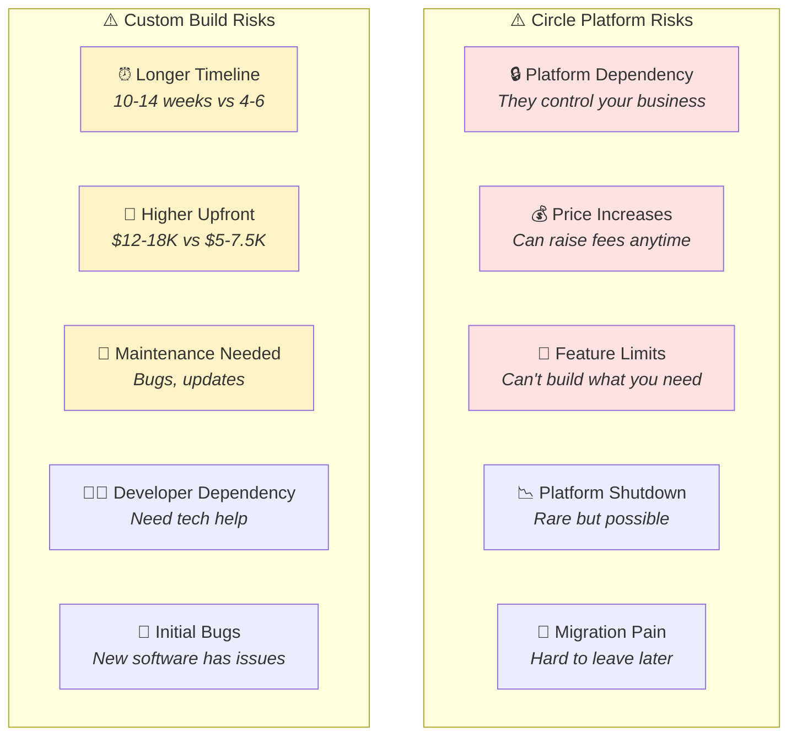

### Risk Mitigation (Custom Build)

| Risk | How We Handle It |
|------|------------------|
| ⏰ **Longer timeline** | Phased launch - basic version in 8 weeks |
| 💸 **Higher upfront** | Payment in milestones, not all at once |
| 🔧 **Maintenance** | Simple tech stack, good documentation |
| 👨‍💻 **Developer dependency** | Train you on basics, provide documentation |
| 🐛 **Initial bugs** | Thorough testing, soft launch first |

---

## 🤔 Decision Framework

### Answer These Questions Honestly

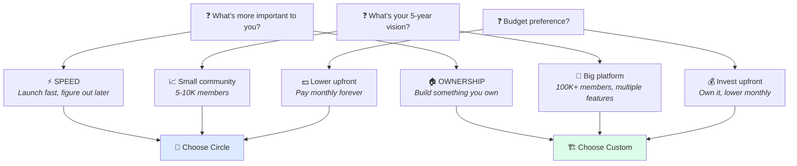

### Decision Matrix

| If You Want... | Choose |
|----------------|--------|
| ⚡ Launch in 4-6 weeks | 🧩 Circle |
| 🏠 Own your platform forever | 🏗️ Custom |
| 💵 Lower upfront investment | 🧩 Circle |
| 💰 Lower 5-year total cost | 🏗️ Custom |
| 🎨 Unlimited customization | 🏗️ Custom |
| 📱 Mobile app included now | 🧩 Circle |
| 🔌 Build any feature later | 🏗️ Custom |
| 📈 Higher exit value | 🏗️ Custom |
| 🛡️ No maintenance worries | 🧩 Circle |
| 🎯 Doctor-specific features | 🏗️ Custom |

---

## 🎯 My Honest Recommendation

### For Dr. Haris Rana Specifically

Based on our conversations and your goals:

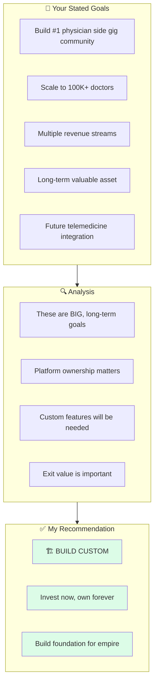

### Why Custom Makes Sense for YOU

| Your Goal | Why Custom is Better |
|-----------|---------------------|
| 🩺 **Doctor-focused platform** | Can build credential verification, shift scheduling, medical-specific features |
| 📈 **Scale to 100K+** | No platform fees eating into profits at scale |
| 💼 **Telemedicine later** | Can integrate with healthcare systems |
| 💰 **Build valuable asset** | 3-5x higher exit value |
| 🎯 **Long-term vision** | Own it forever, customize anything |

### Three Options for You

#### Option A: 🏗️ Full Custom Build (Recommended)

| Details | |
|---------|---|
| **Investment** | $15,000 (middle ground) |
| **Timeline** | 12 weeks |
| **Monthly cost** | ~$100/mo |
| **Ownership** | 100% yours |
| **Best for** | Long-term vision, building an asset |

#### Option B: 🧩 Circle Platform

| Details | |
|---------|---|
| **Investment** | $6,000 |
| **Timeline** | 5 weeks |
| **Monthly cost** | ~$300/mo |
| **Ownership** | Platform-dependent |
| **Best for** | Fast validation, lower risk |

#### Option C: 🔄 Hybrid (Start Circle, Migrate Later)

| Details | |
|---------|---|
| **Investment** | $6,000 now + $15,000 later |
| **Timeline** | 5 weeks now + 12 weeks later |
| **Monthly cost** | $300/mo → $100/mo |
| **Ownership** | Delayed |
| **Best for** | Unsure, want to test first |

---

## 📋 What You Get With Each Option

### Custom Build Deliverables ($15,000)

```
✅ Complete community platform (you own the code)
✅ User registration & authentication
✅ Profile system with credentials
✅ Discussion forum with spaces/topics
✅ 3-tier membership system (Free/Premium/VIP)
✅ Stripe payment integration
✅ Job board with paid listings
✅ Email automation (welcome sequence)
✅ Admin dashboard
✅ Moderation tools
✅ Basic analytics
✅ Mobile-responsive design
✅ Full documentation
✅ Source code ownership
✅ 30 days post-launch support

❌ NOT included (can add later):
   - Native mobile app (+$8-12K)
   - Course platform (+$4-6K)
   - AI features (+$5-8K)
```

### Circle Build Deliverables ($6,000)

```
✅ Circle platform configured
✅ Spaces/communities set up
✅ Membership tiers configured
✅ Stripe connected
✅ Email automation via ConvertKit
✅ Basic branding
✅ Mobile app (Circle's app)

❌ NOT included:
   - Platform ownership
   - Custom features
   - Doctor-specific features
   - Future module flexibility
```

---

## 💳 Payment Terms

### Custom Build Payment Schedule

| Milestone | Amount | When |
|-----------|--------|------|
| 🚀 **Project Start** | $5,000 (33%) | Before work begins |
| 🏗️ **Core Complete** | $5,000 (33%) | Week 6 |
| ✅ **Launch** | $5,000 (33%) | At delivery |
| **TOTAL** | **$15,000** | |

### What's Included in Support

| Item | Duration |
|------|----------|
| 🐛 Bug fixes | 30 days post-launch |
| 📧 Email support | 30 days post-launch |
| 📚 Documentation | Permanent |
| 🎓 Training session | 2 hours included |

---

## ❓ Final Questions for You

Before you decide, honestly answer:

1. **Timeline:** Can you wait 12 weeks instead of 5 weeks?
2. **Budget:** Is $15K upfront feasible, or is $6K the max?
3. **Vision:** Is this a side project or a serious business?
4. **Risk:** Would you rather pay more monthly (Circle) or invest upfront (Custom)?
5. **Future:** Do you want to build unique doctor-specific features?

---

<div align="center">

## 🤝 Let's Discuss

I've presented everything transparently. Both options are valid — it depends on YOUR priorities.

| Option | Best For |
|--------|----------|
| 🧩 **Circle** | Fast launch, lower risk, test the market |
| 🏗️ **Custom** | Long-term asset, full ownership, unlimited future |

### My Honest Opinion

> For your specific goals (100K+ doctors, telemedicine integration, building a valuable asset), **custom build makes more sense long-term**. But I'll support whichever you choose.

---

**Ready to discuss? Let's schedule a call to finalize your decision.**

---

*Analysis prepared with full transparency by Hammad Khan | December 2024*

</div>
