# 🏥 Doctor Side Gigs — Community Platform Build Guide

<div align="center">


## 🩺 Building the #1 Community Hub for Physician Extra Income

**Complete Technical & Strategic Implementation Guide**

*Full ownership • Multi-physician hosting • 100K+ scalability • Total automation*

---

### 📊 Project Overview

| Attribute | Details |
|-----------|---------|
| 🎯 **Project Name** | Doctor Side Gigs Community Platform |
| 👤 **Client** | Haris Rana |
| 🌐 **Domain** | Doctorsidegigs.com |
| 🏗️ **Platform** | Circle.so (Business Plan) |
| 📅 **Timeline** | 4-6 Weeks (Phase 1) |
| 💰 **Platform Cost** | ~$228/month |

---

</div>

## 📋 Table of Contents

- [Executive Vision](#-executive-vision)
- [Platform Architecture](#-platform-architecture)
- [Technology Stack](#-technology-stack)
- [Phase 1: Foundation Build](#-phase-1-foundation-build-weeks-1-2)
- [Phase 2: Automation & Workflows](#-phase-2-automation--workflows-weeks-2-3)
- [Phase 3: Content & Monetization](#-phase-3-content--monetization-weeks-3-4)
- [Phase 4: Launch & Growth](#-phase-4-launch--growth-weeks-4-6)
- [Manual Tasks Checklist](#-manual-tasks-checklist)
- [Impact Analysis](#-impact-analysis)
- [Success Metrics](#-success-metrics)
- [Appendix: Resources](#-appendix-resources)

---

## 🎯 Executive Vision

### The Problem We're Solving

```mermaid
flowchart LR
    subgraph Current["😫 Current State"]
        C1["🔒 Locked in Facebook"]
        C2["📉 No ownership"]
        C3["🚫 Can't monetize"]
        C4["👤 Manual approval"]
        C5["⚠️ Risk of shutdown"]
    end

    subgraph Future["🚀 Future State"]
        F1["🏠 Full ownership"]
        F2["💰 Multiple revenue streams"]
        F3["🤖 Fully automated"]
        F4["📈 Scalable to 100K+"]
        F5["👥 Multi-physician ecosystem"]
    end

    Current -->|"🔄 Transform"| Future

    style C1 fill:#fee2e2,stroke:#dc2626
    style C2 fill:#fee2e2,stroke:#dc2626
    style C3 fill:#fee2e2,stroke:#dc2626
    style C4 fill:#fee2e2,stroke:#dc2626
    style C5 fill:#fee2e2,stroke:#dc2626
    style F1 fill:#dcfce7,stroke:#16a34a
    style F2 fill:#dcfce7,stroke:#16a34a
    style F3 fill:#dcfce7,stroke:#16a34a
    style F4 fill:#dcfce7,stroke:#16a34a
    style F5 fill:#dcfce7,stroke:#16a34a
```

### Strategic Objectives

| Priority | Objective | Success Metric |
|:--------:|-----------|----------------|
| 🔴 | Build owned platform independent of Facebook | Platform live on custom domain |
| 🔴 | Enable multi-physician hosting model | 5+ physician hosts onboarded |
| 🔴 | Implement full automation (zero manual approval) | <5 min avg post-to-publish time |
| 🟡 | Create multiple monetization streams | 3+ revenue channels active |
| 🟡 | Scale to 10K members in Year 1 | Monthly growth rate >20% |
| 🟢 | Position as #1 physician side income hub | Brand recognition surveys |

### Value Proposition

```mermaid
mindmap
  root((🏥 Doctor Side Gigs))
    🎯 For Physicians
      💰 Extra income opportunities
      🤝 Peer networking
      📚 Expert knowledge
      🚀 Business launch support
    💼 For Physician Hosts
      👥 Build personal audience
      💵 Revenue from expertise
      🏆 Thought leadership
      🎓 Course creation
    🏢 For Platform
      📈 Recurring revenue
      🔗 Affiliate commissions
      🌐 Service upsells
      📊 Data insights
```

---

## 🏗️ Platform Architecture

### High-Level System Design

```mermaid
flowchart TD
    subgraph Users["👥 User Layer"]
        U1["🆓 Free Members"]
        U2["💎 Premium Members"]
        U3["🏆 Mastermind Members"]
        U4["👨‍⚕️ Physician Hosts"]
        U5["👑 Admins"]
    end

    subgraph Platform["🏠 Circle Platform"]
        subgraph Spaces["📂 Community Spaces"]
            S1["💬 General Discussion"]
            S2["💼 Side Gig Ideas"]
            S3["🏥 Telemedicine"]
            S4["🏠 Real Estate"]
            S5["💉 MedSpa"]
            S6["❓ Q&A Forum"]
        end

        subgraph Features["⚙️ Core Features"]
            F1["📝 Posts & Discussions"]
            F2["📅 Events & AMAs"]
            F3["📚 Courses"]
            F4["💬 Direct Messages"]
            F5["🔔 Notifications"]
        end

        subgraph Monetization["💰 Revenue"]
            M1["🎫 Memberships"]
            M2["🎓 Paid Courses"]
            M3["🎯 Masterminds"]
            M4["🤝 Affiliates"]
        end
    end

    subgraph Automation["🤖 Automation Layer"]
        A1["📧 Email Sequences"]
        A2["🔍 AI Moderation"]
        A3["🏷️ Auto-tagging"]
        A4["📊 Analytics"]
    end

    subgraph Integrations["🔌 External Services"]
        I1["💳 Stripe Payments"]
        I2["📧 ConvertKit Email"]
        I3["⚙️ Make.com Workflows"]
        I4["🧠 OpenAI API"]
    end

    Users --> Platform
    Platform --> Automation
    Automation --> Integrations

    style U1 fill:#e5e7eb,stroke:#6b7280
    style U2 fill:#dbeafe,stroke:#3b82f6
    style U3 fill:#fef3c7,stroke:#f59e0b
    style U4 fill:#dcfce7,stroke:#16a34a
    style U5 fill:#fce7f3,stroke:#ec4899
```

### Community Structure Blueprint

```mermaid
flowchart TD
    subgraph Main["🏥 DOCTOR SIDE GIGS HUB"]
        direction TB

        subgraph Public["🌐 Public Areas (Free Access)"]
            P1["🏠 Welcome & Onboarding"]
            P2["📢 Announcements"]
            P3["💡 Side Gig Ideas - Preview"]
            P4["🆕 Introduce Yourself"]
        end

        subgraph Premium["💎 Premium Areas ($49/mo)"]
            PR1["💼 Full Side Gig Database"]
            PR2["📊 Income Reports & Case Studies"]
            PR3["🔧 Tools & Templates"]
            PR4["🎥 Expert Video Library"]
            PR5["💬 Premium Discussion"]
        end

        subgraph Mastermind["🏆 Mastermind Spaces ($199/mo)"]
            MA1["👨‍⚕️ Dr. Smith's Telemedicine Circle"]
            MA2["👩‍⚕️ Dr. Jones' Real Estate Group"]
            MA3["👨‍⚕️ Dr. Patel's MedSpa Accelerator"]
            MA4["👩‍⚕️ Dr. Lee's Course Creator Lab"]
        end

        subgraph Events["📅 Events & Live"]
            E1["🎤 Weekly AMA Sessions"]
            E2["🎓 Monthly Workshops"]
            E3["🤝 Networking Calls"]
            E4["🏆 Success Spotlights"]
        end
    end

    Public --> Premium
    Premium --> Mastermind
    Main --> Events

    style P1 fill:#f0fdf4,stroke:#22c55e
    style P2 fill:#f0fdf4,stroke:#22c55e
    style P3 fill:#f0fdf4,stroke:#22c55e
    style P4 fill:#f0fdf4,stroke:#22c55e
    style PR1 fill:#eff6ff,stroke:#3b82f6
    style PR2 fill:#eff6ff,stroke:#3b82f6
    style PR3 fill:#eff6ff,stroke:#3b82f6
    style PR4 fill:#eff6ff,stroke:#3b82f6
    style PR5 fill:#eff6ff,stroke:#3b82f6
    style MA1 fill:#fefce8,stroke:#eab308
    style MA2 fill:#fefce8,stroke:#eab308
    style MA3 fill:#fefce8,stroke:#eab308
    style MA4 fill:#fefce8,stroke:#eab308
```

### User Journey Flow


---

## 💻 Technology Stack

### Core Platform Components

```mermaid
flowchart LR
    subgraph Core["🏠 Core Platform"]
        CIRCLE["⭕ Circle.so<br/>Business Plan<br/>$199/mo"]
    end

    subgraph Automation["🤖 Automation"]
        MAKE["⚙️ Make.com<br/>Core Plan<br/>$9/mo"]
        OPENAI["🧠 OpenAI API<br/>GPT-4<br/>~$20/mo"]
    end

    subgraph Email["📧 Email Marketing"]
        CONVERT["📨 ConvertKit<br/>Free → $29/mo"]
    end

    subgraph Payments["💳 Payments"]
        STRIPE["💰 Stripe<br/>2.9% + $0.30"]
    end

    subgraph Analytics["📊 Analytics"]
        GA4["📈 Google Analytics 4<br/>Free"]
        MIXPANEL["📊 Mixpanel<br/>Free tier"]
    end

    CIRCLE --> MAKE
    MAKE --> OPENAI
    MAKE --> CONVERT
    CIRCLE --> STRIPE
    CIRCLE --> GA4
    CIRCLE --> MIXPANEL

    style CIRCLE fill:#7c3aed,color:#fff
    style MAKE fill:#6366f1,color:#fff
    style OPENAI fill:#10b981,color:#fff
    style CONVERT fill:#f59e0b,color:#fff
    style STRIPE fill:#635bff,color:#fff
```

### Detailed Stack Breakdown

| Layer | Tool | Cost | Purpose | Impact |
|-------|------|------|---------|--------|
| 🏠 **Platform** | Circle Business | $199/mo | Community hosting, spaces, events | Core infrastructure |
| ⚙️ **Workflows** | Make.com Core | $9/mo | Automation orchestration | 90% reduction in manual work |
| 🧠 **AI** | OpenAI API | ~$20/mo | Content moderation, categorization | Zero manual post approval |
| 📧 **Email** | ConvertKit | $0-29/mo | Onboarding sequences, broadcasts | 40% higher engagement |
| 💳 **Payments** | Stripe | 2.9% + $0.30 | Subscription & one-time payments | Seamless transactions |
| 📊 **Analytics** | GA4 + Mixpanel | $0 | User behavior, conversion tracking | Data-driven decisions |
| 🌐 **Domain** | Existing | $0 | Doctorsidegigs.com | Brand continuity |

### Monthly Cost Summary

```mermaid
pie showData
    title 💰 Monthly Platform Costs ($228)
    "Circle Business" : 199
    "Make.com" : 9
    "OpenAI API" : 20
```

| Component | Monthly | Annual | Notes |
|-----------|---------|--------|-------|
| ⭕ Circle Business | $199 | $2,388 | Core platform |
| ⚙️ Make.com Core | $9 | $108 | 10K operations |
| 🧠 OpenAI API | ~$20 | ~$240 | Moderation |
| 📧 ConvertKit | $0-29 | $0-348 | Free up to 1K subs |
| **TOTAL** | **$228-257** | **$2,736-3,084** | |

---

## 🚀 Phase 1: Foundation Build (Weeks 1-2)

### Week 1: Platform Setup

```mermaid
flowchart TD
    subgraph Day1["📅 Day 1-2: Account & Branding"]
        D1A["🔐 Create Circle Business account"]
        D1B["🎨 Upload logo & brand colors"]
        D1C["📝 Configure community name & description"]
        D1D["🌐 Connect custom domain"]
    end

    subgraph Day2["📅 Day 3-4: Space Architecture"]
        D2A["📂 Create main community spaces"]
        D2B["🔒 Configure access levels"]
        D2C["📋 Set up space descriptions"]
        D2D["📌 Pin welcome posts"]
    end

    subgraph Day3["📅 Day 5-7: Member Configuration"]
        D3A["👥 Define member roles"]
        D3B["🏷️ Create member badges"]
        D3C["📊 Set up leaderboard"]
        D3D["⚙️ Configure notification settings"]
    end

    Day1 --> Day2 --> Day3

    style D1A fill:#dbeafe
    style D2A fill:#dcfce7
    style D3A fill:#fef3c7
```

#### 🔐 Task 1.1: Circle Account Setup

**What to do:**
1. Go to [circle.so](https://circle.so) and sign up for Business Plan ($199/mo)
2. Use email: [Haris's business email]
3. Community name: "Doctor Side Gigs"
4. Community URL: doctorsidegigs.circle.so (temporary)

**Why it matters:**
- Business plan unlocks Workflows (automation)
- API access for integrations
- Up to 5 admin seats
- Priority support

**Manual tasks:**
- [ ] Sign up and enter payment details
- [ ] Verify email address
- [ ] Complete initial setup wizard

---

#### 🎨 Task 1.2: Branding Configuration

**What to create manually:**

| Asset | Specifications | Tool to Use |
|-------|---------------|-------------|
| 🖼️ **Logo** | 512x512px PNG, transparent bg | Canva/Figma |
| 🎨 **Cover Image** | 1920x480px | Canva |
| 🌈 **Brand Colors** | Primary: #1E40AF, Accent: #10B981 | - |
| ✍️ **Favicon** | 32x32px ICO | Favicon generator |
| 📱 **Mobile Icon** | 180x180px PNG | Canva |

**Brand Color Palette:**

```
Primary Blue:    #1E40AF (Trust, Professional)
Success Green:   #10B981 (Growth, Money)
Warning Amber:   #F59E0B (Attention, Premium)
Dark Text:       #1F2937 (Readability)
Light Background:#F9FAFB (Clean UI)
```

**Impact:** Consistent branding increases trust by 33% and recognition by 80%

---

#### 📂 Task 1.3: Space Architecture Setup

**Create these spaces in order:**

```mermaid
flowchart TD
    subgraph Free["🆓 FREE TIER SPACES"]
        F1["🏠 Welcome Hub<br/><i>First stop for all members</i>"]
        F2["📢 Announcements<br/><i>Platform updates</i>"]
        F3["👋 Introductions<br/><i>New member intros</i>"]
        F4["💡 Side Gig Ideas<br/><i>Preview - limited posts visible</i>"]
    end

    subgraph Premium["💎 PREMIUM SPACES ($49/mo)"]
        P1["💼 Full Opportunity Database<br/><i>All side gigs listed</i>"]
        P2["📊 Income Reports<br/><i>Real earnings shared</i>"]
        P3["🔧 Tools & Templates<br/><i>Business documents</i>"]
        P4["🎥 Expert Video Library<br/><i>Recorded trainings</i>"]
        P5["💬 Premium Discussion<br/><i>Deep conversations</i>"]
        P6["❓ Ask Experts<br/><i>Direct Q&A</i>"]
    end

    subgraph Mastermind["🏆 MASTERMIND SPACES ($199/mo)"]
        M1["🩺 Telemedicine Accelerator<br/><i>Dr. Host's group</i>"]
        M2["🏠 Real Estate for Doctors<br/><i>Dr. Host's group</i>"]
        M3["💉 MedSpa Launch Lab<br/><i>Dr. Host's group</i>"]
        M4["📚 Course Creator Circle<br/><i>Dr. Host's group</i>"]
    end

    Free --> Premium --> Mastermind
```

**Space Configuration Details:**

| Space | Access | Post Permission | Purpose |
|-------|--------|-----------------|---------|
| 🏠 Welcome Hub | All | Admin only | Orientation |
| 📢 Announcements | All | Admin only | Updates |
| 👋 Introductions | All | All members | Community building |
| 💡 Side Gig Ideas | All (limited view) | Premium+ | Lead magnet |
| 💼 Opportunity Database | Premium+ | Premium+ | Core value |
| 📊 Income Reports | Premium+ | Premium+ | Social proof |
| 🔧 Tools & Templates | Premium+ | Admin only | Resources |
| 🎥 Video Library | Premium+ | Admin only | Education |
| 💬 Premium Discussion | Premium+ | Premium+ | Engagement |
| ❓ Ask Experts | Premium+ | Premium+ | Support |
| 🩺 Mastermind Spaces | Mastermind | Mastermind | High-touch |

**Manual tasks:**
- [ ] Create each space with proper name and emoji
- [ ] Write compelling description for each (100-200 words)
- [ ] Set correct access permissions
- [ ] Upload cover image for each space
- [ ] Create pinned welcome post in each space

---

#### 👥 Task 1.4: Member Roles & Badges

**Role Hierarchy:**

```mermaid
flowchart TD
    subgraph Roles["👥 Member Roles"]
        R1["👑 Admin<br/><i>Full platform control</i>"]
        R2["👨‍⚕️ Physician Host<br/><i>Runs mastermind space</i>"]
        R3["⭐ Moderator<br/><i>Content moderation</i>"]
        R4["🏆 Mastermind Member<br/><i>$199/mo subscribers</i>"]
        R5["💎 Premium Member<br/><i>$49/mo subscribers</i>"]
        R6["🆓 Free Member<br/><i>Basic access</i>"]
    end

    R1 --> R2 --> R3 --> R4 --> R5 --> R6

    style R1 fill:#fce7f3,stroke:#ec4899
    style R2 fill:#dcfce7,stroke:#16a34a
    style R3 fill:#e0e7ff,stroke:#6366f1
    style R4 fill:#fef3c7,stroke:#f59e0b
    style R5 fill:#dbeafe,stroke:#3b82f6
    style R6 fill:#f3f4f6,stroke:#9ca3af
```

**Badge System:**

| Badge | Criteria | Visual | Purpose |
|-------|----------|--------|---------|
| 🆕 **Newcomer** | Just joined | Blue | Welcome indicator |
| 💬 **Contributor** | 10+ posts | Green | Engagement reward |
| 🌟 **Rising Star** | 50+ posts | Gold | Recognition |
| 🏆 **Top Contributor** | 100+ posts | Purple | Status |
| 👨‍⚕️ **Verified Physician** | Credentials verified | Teal | Trust signal |
| 💎 **Premium** | Paid subscriber | Blue diamond | Tier indicator |
| 🥇 **Founding Member** | First 100 members | Gold | Exclusivity |
| 🎓 **Expert** | Host/instructor | Red | Authority |

**Impact:** Gamification increases engagement by 40% and retention by 25%

---

### Week 2: Integrations & Domain

```mermaid
flowchart TD
    subgraph Domain["🌐 Domain Setup"]
        DOM1["Configure DNS records"]
        DOM2["Connect doctorsidegigs.com"]
        DOM3["SSL certificate activation"]
        DOM4["Test all URLs"]
    end

    subgraph Payments["💳 Payment Integration"]
        PAY1["Create Stripe account"]
        PAY2["Connect to Circle"]
        PAY3["Configure pricing tiers"]
        PAY4["Test payment flow"]
    end

    subgraph Email["📧 Email Setup"]
        EM1["Create ConvertKit account"]
        EM2["Design email templates"]
        EM3["Build welcome sequence"]
        EM4["Connect to Circle via Make.com"]
    end

    Domain --> Payments --> Email
```

#### 🌐 Task 2.1: Custom Domain Connection

**DNS Configuration:**

| Record Type | Host | Value | TTL |
|-------------|------|-------|-----|
| CNAME | community | custom.circle.so | 3600 |
| CNAME | www | custom.circle.so | 3600 |

**Steps:**
1. Log into domain registrar (GoDaddy/Namecheap/etc.)
2. Navigate to DNS settings
3. Add CNAME records as shown above
4. In Circle: Settings → Custom Domain → Add domain
5. Wait for SSL certificate (up to 24 hours)

**Manual tasks:**
- [ ] Access domain registrar
- [ ] Add DNS records
- [ ] Verify in Circle dashboard
- [ ] Test: https://doctorsidegigs.com loads community

**Impact:** Custom domain increases trust by 65% and SEO by 40%

---

#### 💳 Task 2.2: Stripe Payment Setup

**Pricing Tiers to Configure:**

```mermaid
flowchart LR
    subgraph Tiers["💰 Membership Tiers"]
        T1["🆓 Free<br/>$0/mo<br/><i>Lead Generation</i>"]
        T2["💎 Premium<br/>$49/mo<br/><i>Full Access</i>"]
        T3["🏆 Mastermind<br/>$199/mo<br/><i>High-Touch</i>"]
        T4["🎓 Annual Premium<br/>$399/yr<br/><i>2 months free</i>"]
    end

    T1 -->|"Upgrade"| T2
    T2 -->|"Upgrade"| T3
    T1 -->|"Annual"| T4

    style T1 fill:#f3f4f6
    style T2 fill:#dbeafe
    style T3 fill:#fef3c7
    style T4 fill:#dcfce7
```

**Stripe Configuration:**

| Setting | Value |
|---------|-------|
| Business name | Doctor Side Gigs |
| Statement descriptor | DOCTORSIDEGIGS |
| Payment methods | Cards, Apple Pay, Google Pay |
| Currency | USD |
| Billing cycle | Monthly & Annual |

**Manual tasks:**
- [ ] Create Stripe account (if not existing)
- [ ] Complete business verification
- [ ] Connect Stripe to Circle (Settings → Payments)
- [ ] Create products for each tier
- [ ] Test with Stripe test mode
- [ ] Switch to live mode

**Impact:** Seamless payments reduce checkout abandonment by 35%

---

#### 📧 Task 2.3: Email Marketing Setup

**Welcome Sequence (7 Emails):**

```mermaid
flowchart TD
    subgraph Sequence["📧 Welcome Email Sequence"]
        E1["📨 Email 1: Welcome!<br/><i>Immediate - Account setup</i>"]
        E2["📨 Email 2: Quick Win<br/><i>Day 1 - First action</i>"]
        E3["📨 Email 3: Community Tour<br/><i>Day 2 - Explore spaces</i>"]
        E4["📨 Email 4: Success Story<br/><i>Day 4 - Social proof</i>"]
        E5["📨 Email 5: Resource Highlight<br/><i>Day 6 - Value demo</i>"]
        E6["📨 Email 6: Premium Preview<br/><i>Day 8 - Soft upgrade pitch</i>"]
        E7["📨 Email 7: Limited Offer<br/><i>Day 10 - Upgrade CTA</i>"]
    end

    E1 --> E2 --> E3 --> E4 --> E5 --> E6 --> E7

    style E1 fill:#dcfce7
    style E7 fill:#fef3c7
```

**Email Template Structure:**

| Email | Subject Line | Goal | CTA |
|-------|--------------|------|-----|
| 1 | 🎉 Welcome to Doctor Side Gigs! | Activate account | Complete profile |
| 2 | 💡 Your first step to extra income | Quick engagement | Post introduction |
| 3 | 🗺️ Here's what you've been missing | Exploration | Visit 3 spaces |
| 4 | 💰 How Dr. Smith made $5K/mo on the side | Social proof | Read full story |
| 5 | 🔧 Free template: Side Gig Business Plan | Value delivery | Download template |
| 6 | 👀 Sneak peek: Premium member benefits | Desire creation | View premium |
| 7 | ⏰ Special: 20% off Premium (48 hrs) | Conversion | Upgrade now |

**Manual tasks:**
- [ ] Create ConvertKit account
- [ ] Design email template with branding
- [ ] Write all 7 email copies
- [ ] Set up automation sequence
- [ ] Create signup form/tag for new members
- [ ] Test full sequence

**Impact:** Welcome sequences increase activation by 50% and conversion by 30%

---

## 🤖 Phase 2: Automation & Workflows (Weeks 2-3)

### Automation Architecture Overview

```mermaid
flowchart TD
    subgraph Triggers["⚡ Trigger Events"]
        T1["👤 New member joins"]
        T2["📝 New post created"]
        T3["💬 New comment"]
        T4["💳 Payment received"]
        T5["😴 Member inactive 7d"]
        T6["🎂 Member anniversary"]
    end

    subgraph Processing["⚙️ Make.com Processing"]
        P1["🔍 Analyze content"]
        P2["🏷️ Apply tags"]
        P3["📊 Update database"]
        P4["🧠 AI moderation check"]
    end

    subgraph Actions["🎯 Automated Actions"]
        A1["📧 Send email"]
        A2["🔔 Push notification"]
        A3["✅ Approve/flag post"]
        A4["🏷️ Assign badge"]
        A5["👨‍⚕️ Notify host"]
        A6["📊 Log analytics"]
    end

    Triggers --> Processing --> Actions

    style T1 fill:#dbeafe
    style P1 fill:#e0e7ff
    style A1 fill:#dcfce7
```

### Workflow 1: New Member Onboarding

```mermaid
sequenceDiagram
    participant M as 👤 New Member
    participant C as ⭕ Circle
    participant MK as ⚙️ Make.com
    participant CK as 📧 ConvertKit
    participant AI as 🧠 OpenAI

    M->>C: Signs up (free)
    C->>MK: Webhook: new_member
    MK->>MK: Extract member data
    MK->>CK: Add to welcome sequence
    MK->>C: Assign "Newcomer" badge
    MK->>C: Send welcome DM
    CK->>M: Email 1: Welcome!

    Note over M,CK: Day 1-10: Automated sequence runs

    alt Member posts intro
        M->>C: Posts in Introductions
        C->>MK: Webhook: new_post
        MK->>AI: Analyze for quality
        AI->>MK: Score: Good
        MK->>C: Auto-approve post
        MK->>C: Award "First Post" badge
    end
```

**Make.com Workflow Configuration:**

| Step | Module | Configuration |
|------|--------|---------------|
| 1 | Circle Webhook | Trigger: member.created |
| 2 | Data Store | Save member info |
| 3 | ConvertKit | Add subscriber + tag "new-member" |
| 4 | Circle API | Assign badge "Newcomer" |
| 5 | Circle API | Send welcome DM |
| 6 | Slack/Discord | Notify admin (optional) |

**Manual tasks:**
- [ ] Create Make.com account
- [ ] Set up Circle webhook in Make.com
- [ ] Build workflow with modules above
- [ ] Connect ConvertKit module
- [ ] Test with test member signup
- [ ] Activate workflow

**Impact:** Automated onboarding increases Day-7 retention by 45%

---

### Workflow 2: AI Content Moderation

```mermaid
flowchart TD
    subgraph Trigger["⚡ New Post Created"]
        T1["📝 Member submits post"]
    end

    subgraph AI["🧠 AI Analysis (OpenAI)"]
        AI1["📊 Content Classification"]
        AI2["🚨 Spam Detection"]
        AI3["😊 Sentiment Analysis"]
        AI4["🏷️ Topic Categorization"]
    end

    subgraph Decision["🔀 Decision Logic"]
        D1{{"Score > 0.8?"}}
        D2{{"Contains spam?"}}
        D3{{"Sentiment OK?"}}
    end

    subgraph Actions["🎯 Actions"]
        A1["✅ Auto-Approve<br/>Publish immediately"]
        A2["⚠️ Flag for Review<br/>Hold + notify admin"]
        A3["❌ Auto-Reject<br/>Notify member"]
    end

    T1 --> AI1
    AI1 --> AI2
    AI2 --> AI3
    AI3 --> AI4
    AI4 --> D1

    D1 -->|Yes| D2
    D1 -->|No| A2
    D2 -->|No| D3
    D2 -->|Yes| A3
    D3 -->|Yes| A1
    D3 -->|No| A2

    style A1 fill:#dcfce7,stroke:#16a34a
    style A2 fill:#fef3c7,stroke:#f59e0b
    style A3 fill:#fee2e2,stroke:#dc2626
```

**OpenAI Prompt for Moderation:**

```
Analyze this community post for a physician side-income community:

POST CONTENT:
{post_content}

Evaluate and return JSON:
{
  "quality_score": 0.0-1.0,
  "is_spam": true/false,
  "sentiment": "positive/neutral/negative",
  "categories": ["telemedicine", "real-estate", "medspa", "general"],
  "suggested_tags": [],
  "flag_reason": null or "reason string",
  "auto_approve": true/false
}

Rules:
- Spam includes: promotions, affiliate links without disclosure, off-topic
- Quality considers: relevance, helpfulness, clarity
- Flag if: profanity, personal attacks, medical advice without disclaimer
```

**Manual tasks:**
- [ ] Create OpenAI API account
- [ ] Add API key to Make.com
- [ ] Create HTTP module with prompt above
- [ ] Configure decision router
- [ ] Set up approval/rejection actions
- [ ] Test with sample posts
- [ ] Monitor first 50 posts manually

**Impact:** AI moderation reduces manual review by 90%, avg approval time <30 seconds

---

### Workflow 3: Engagement Re-activation


**Re-engagement Email Templates:**

| Segment | Subject | Content Focus | CTA |
|---------|---------|---------------|-----|
| Free | 💡 5 side gigs you missed this week | Popular discussions | Log in now |
| Premium | 🔥 New income reports from your peers | FOMO on value | See what's new |
| Mastermind | 📞 [Name], quick check-in | Personal touch | Reply or call |

**Manual tasks:**
- [ ] Create member activity tracking in Make.com
- [ ] Write re-engagement email copy
- [ ] Set up scheduled scenario (daily 9 AM)
- [ ] Configure segment logic
- [ ] Test with dummy inactive users
- [ ] Monitor re-activation rates

**Impact:** Re-engagement campaigns recover 25-35% of churning members

---

### Workflow 4: Physician Host Notifications

```mermaid
sequenceDiagram
    participant M as 👤 Member
    participant C as ⭕ Circle
    participant MK as ⚙️ Make.com
    participant AI as 🧠 OpenAI
    participant H as 👨‍⚕️ Physician Host

    M->>C: Posts question in Mastermind space
    C->>MK: Webhook: new_post
    MK->>AI: Categorize question
    AI->>MK: Category: "telemedicine-legal"
    MK->>MK: Match to host expertise
    MK->>H: 📧 Email: New question for you!
    MK->>H: 📱 Push notification

    alt Host responds within 4 hours
        H->>C: Posts response
        C->>MK: Webhook: new_comment
        MK->>MK: Log response time
    else No response in 4 hours
        MK->>H: ⚠️ Reminder: Question waiting
        MK->>C: Award "Quick Responder" badge (if answered)
    end
```

**Manual tasks:**
- [ ] Define host expertise categories
- [ ] Create host notification email template
- [ ] Set up 4-hour reminder workflow
- [ ] Configure response time tracking
- [ ] Test notification flow
- [ ] Brief hosts on expectations

**Impact:** Host notifications ensure 95%+ question response rate within 24 hours

---

## 💰 Phase 3: Content & Monetization (Weeks 3-4)

### Content Strategy

```mermaid
mindmap
  root((📚 Content Pillars))
    💼 Side Gig Opportunities
      Telemedicine platforms
      Medical surveys
      Expert witness
      Consulting gigs
      Medical writing
    📊 Income & Success
      Real income reports
      Case studies
      Member spotlights
      ROI calculators
    🎓 Education
      How-to guides
      Video tutorials
      Templates & tools
      Live workshops
    🤝 Community
      Discussion threads
      Q&A sessions
      Networking events
      Accountability groups
```

### Seed Content Creation (50 Posts Minimum)

**Content Distribution:**

| Category | # of Posts | Examples |
|----------|------------|----------|
| 💼 **Opportunities** | 15 | "Top 10 Telemedicine Platforms Paying $150+/hr" |
| 📊 **Income Reports** | 10 | "How I Made $3,200 Last Month from Medical Surveys" |
| 🎓 **How-To Guides** | 10 | "Step-by-Step: Setting Up Your Telemedicine Practice" |
| ❓ **Discussion Starters** | 10 | "What's your biggest challenge starting a side gig?" |
| 📢 **Announcements** | 5 | "Welcome! Here's how to get the most from DSG" |

**Content Templates:**

<details>
<summary><strong>📝 Opportunity Post Template</strong></summary>

```markdown
# 💼 [Opportunity Name]: [Brief Description]

## Overview
[2-3 sentences describing the opportunity]

## 💰 Earning Potential
- **Rate:** $X - $Y per [hour/case/survey]
- **Time commitment:** X hours/week
- **Payment frequency:** [Weekly/Monthly]

## ✅ Requirements
- [ ] Active medical license
- [ ] [Other requirements]

## 🚀 How to Get Started
1. [Step 1]
2. [Step 2]
3. [Step 3]

## 🔗 Links
- [Platform website]
- [Application link]

## 💬 Discussion
Have you tried this? Share your experience below!

---
*Posted by [Name] | [Date]*
```

</details>

<details>
<summary><strong>📊 Income Report Template</strong></summary>

```markdown
# 📊 [Month] Income Report: $[Amount] from [Source]

## 👤 About Me
- Specialty: [Specialty]
- Years in practice: [X]
- Side gig experience: [X months/years]

## 💰 This Month's Breakdown

| Source | Hours | Earnings | $/Hour |
|--------|-------|----------|--------|
| [Source 1] | X | $X | $X |
| [Source 2] | X | $X | $X |
| **TOTAL** | **X** | **$X** | **$X** |

## 📈 What Worked
- [Insight 1]
- [Insight 2]

## 📉 Challenges
- [Challenge 1]
- [How I'm addressing it]

## 🎯 Next Month Goals
- [Goal 1]
- [Goal 2]

## 💬 Questions?
Ask me anything in the comments!

---
*Shared by [Username] | Verified ✅*
```

</details>

**Manual tasks:**
- [ ] Write 15 opportunity posts
- [ ] Create 10 income reports (can be anonymized/example-based)
- [ ] Develop 10 how-to guides
- [ ] Craft 10 discussion starters
- [ ] Write 5 announcement/welcome posts
- [ ] Schedule posts across first 2 weeks
- [ ] Assign engaging cover images to each

**Impact:** Quality seed content increases new member activation by 60%

---

### Monetization Setup

```mermaid
flowchart TD
    subgraph Revenue["💰 Revenue Streams"]
        R1["🎫 Memberships"]
        R2["🎓 Courses"]
        R3["🤝 Affiliates"]
        R4["🌐 Services"]
    end

    subgraph Memberships["🎫 Membership Tiers"]
        M1["🆓 Free<br/>$0/mo"]
        M2["💎 Premium<br/>$49/mo"]
        M3["🏆 Mastermind<br/>$199/mo"]
        M4["📅 Annual<br/>$399/yr"]
    end

    subgraph Courses["🎓 Future Courses"]
        C1["Telemedicine 101<br/>$297"]
        C2["Real Estate for Docs<br/>$497"]
        C3["Launch Your MedSpa<br/>$997"]
    end

    subgraph Affiliates["🤝 Affiliate Partners"]
        A1["💼 LLC Formation"]
        A2["📧 Email Tools"]
        A3["💻 Website Services"]
        A4["📊 Accounting"]
    end

    R1 --> Memberships
    R2 --> Courses
    R3 --> Affiliates
    R4 --> Services

    style M1 fill:#f3f4f6
    style M2 fill:#dbeafe
    style M3 fill:#fef3c7
```

### Pricing Strategy

**Value-Based Pricing Justification:**

| Tier | Price | Value Delivered | ROI for Member |
|------|-------|-----------------|----------------|
| 💎 Premium | $49/mo | Access to side gigs worth $1K-10K/mo | 20-200x ROI |
| 🏆 Mastermind | $199/mo | Direct mentorship + accountability | 50-500x ROI |

**Pricing Psychology:**

```mermaid
flowchart LR
    subgraph Anchoring["⚓ Price Anchoring"]
        A1["Show $199 Mastermind first"]
        A2["$49 Premium feels like a deal"]
        A3["Free tier captures leads"]
    end

    subgraph Urgency["⏰ Urgency Tactics"]
        U1["Founding member pricing"]
        U2["Limited mastermind spots"]
        U3["Annual discount (2 months free)"]
    end

    subgraph Social["👥 Social Proof"]
        S1["Member count displayed"]
        S2["Income reports visible"]
        S3["Testimonials on upgrade page"]
    end

    Anchoring --> Urgency --> Social
```

**Manual tasks:**
- [ ] Create Stripe products for each tier
- [ ] Design pricing page in Circle
- [ ] Write compelling tier descriptions
- [ ] Set up "Founding Member" badge for first 100 paid
- [ ] Create upgrade prompts in free spaces
- [ ] Configure trial periods (if offering)

**Impact:** Clear value proposition increases paid conversion by 40%

---

### Affiliate Program Setup

**Recommended Affiliate Partners:**

| Partner | Commission | Relevance | Sign-up |
|---------|------------|-----------|---------|
| 💼 **Incfile (LLC)** | $50-100/signup | High - side businesses need LLCs | [incfile.com/affiliates](https://www.incfile.com/affiliates) |
| 📧 **ConvertKit** | 30% recurring | Medium - email for side biz | [convertkit.com/affiliates](https://convertkit.com/affiliates) |
| 💻 **Webflow** | 50% first payment | High - practice websites | [webflow.com/affiliates](https://webflow.com/affiliates) |
| 📊 **QuickBooks** | $25-50/signup | High - accounting | [quickbooks.intuit.com/affiliates](https://quickbooks.intuit.com/affiliates) |
| 🩺 **Teladoc** | Varies | Direct relevance | Contact directly |

**Manual tasks:**
- [ ] Apply to affiliate programs
- [ ] Create "Recommended Tools" space/post
- [ ] Add affiliate links with disclosure
- [ ] Track conversions
- [ ] Create review posts for top tools

**Impact:** Affiliate revenue can add $500-2000/mo with minimal effort

---

## 🚀 Phase 4: Launch & Growth (Weeks 4-6)

### Launch Strategy

```mermaid
flowchart TD
    subgraph PreLaunch["🔧 Pre-Launch (Week 4)"]
        P1["✅ All systems tested"]
        P2["📝 50 seed posts live"]
        P3["👥 10 beta members invited"]
        P4["🐛 Bug fixes complete"]
    end

    subgraph SoftLaunch["🌱 Soft Launch (Week 5)"]
        S1["📧 Invite 100 members"]
        S2["📊 Monitor engagement"]
        S3["💬 Gather feedback"]
        S4["🔄 Iterate on issues"]
    end

    subgraph PublicLaunch["🚀 Public Launch (Week 6)"]
        L1["📢 Announce on social"]
        L2["📧 Email to full list"]
        L3["🤝 Partner promotions"]
        L4["🎁 Launch offer: 20% off"]
    end

    subgraph Growth["📈 Growth Phase"]
        G1["🔄 Referral program"]
        G2["📱 Content marketing"]
        G3["👨‍⚕️ Onboard hosts"]
        G4["📊 Optimize conversions"]
    end

    PreLaunch --> SoftLaunch --> PublicLaunch --> Growth

    style P1 fill:#dcfce7
    style S1 fill:#dbeafe
    style L1 fill:#fef3c7
    style G1 fill:#fce7f3
```

### Soft Launch Checklist (Week 5)

**Invite Strategy:**

| Source | # to Invite | Method |
|--------|-------------|--------|
| Haris's email list | 50 | Direct email |
| Facebook group connections | 30 | Personal DM |
| LinkedIn network | 15 | InMail/connection message |
| Personal referrals | 5 | Text/call |
| **TOTAL** | **100** | |

**Feedback Collection:**

```mermaid
flowchart LR
    subgraph Feedback["📝 Feedback Channels"]
        F1["📧 Email survey (Day 7)"]
        F2["💬 Feedback space in community"]
        F3["📞 1:1 calls with 10 members"]
        F4["📊 NPS score collection"]
    end

    subgraph Questions["❓ Key Questions"]
        Q1["What's most valuable?"]
        Q2["What's confusing?"]
        Q3["What's missing?"]
        Q4["Would you recommend? Why?"]
    end

    Feedback --> Questions
```

**Manual tasks:**
- [ ] Create invite list of 100 members
- [ ] Write personal invite messages
- [ ] Create feedback survey (Typeform/Google Form)
- [ ] Schedule 1:1 calls with 10 beta members
- [ ] Set up feedback tracking spreadsheet
- [ ] Plan iteration sprint based on feedback

---

### Public Launch Campaign (Week 6)

**Launch Offer:**
> 🎉 **Founding Member Special**: 20% off Premium for life!
> - Regular: $49/mo → **$39/mo locked in forever**
> - Only for first 100 premium members
> - Includes "Founding Member" badge

**Launch Channels:**

| Channel | Content | Timing |
|---------|---------|--------|
| 📧 Email blast | Launch announcement + offer | Day 1, 9 AM |
| 📱 LinkedIn post | Personal story + link | Day 1, 12 PM |
| 🐦 Twitter thread | Value proposition + link | Day 1, 3 PM |
| 📘 Facebook groups | Soft promotion (where allowed) | Day 2-3 |
| 📰 Medium article | "Why I Built DSG" story | Day 3 |
| 🎙️ Podcast pitches | Guest appearances | Week 6+ |

**Launch Email Template:**

```markdown
Subject: 🚀 Doctor Side Gigs is LIVE (Founding Member Discount Inside)

Hey [Name],

After months of building, Doctor Side Gigs is officially open.

This is the community I wish existed when I started exploring
extra income opportunities as a physician.

**What's inside:**
✅ 50+ vetted side gig opportunities ($100-500/hr)
✅ Real income reports from physicians like you
✅ Step-by-step guides to get started
✅ Expert Q&A and live workshops
✅ Private mastermind groups

**Founding Member Special (First 100 only):**
🎁 20% off Premium FOR LIFE
💎 Exclusive "Founding Member" badge
🔒 Price locked at $39/mo forever

[JOIN NOW - FOUNDING MEMBER ACCESS]

See you inside,
Haris Rana, MD
Founder, Doctor Side Gigs

P.S. This offer expires when we hit 100 premium members.
We're at [X] right now. Don't miss out.
```

**Manual tasks:**
- [ ] Write launch email copy
- [ ] Create social media posts
- [ ] Design launch graphics (Canva)
- [ ] Set up countdown timer on site
- [ ] Prepare FAQ document
- [ ] Brief any partners/affiliates
- [ ] Schedule all posts in advance

---

### Referral Program Setup

```mermaid
flowchart TD
    subgraph Program["🔄 Referral Program"]
        P1["👤 Member shares unique link"]
        P2["👥 Friend signs up free"]
        P3["💎 Friend upgrades to Premium"]
        P4["🎁 Both get rewards!"]
    end

    subgraph Rewards["🎁 Reward Structure"]
        R1["Referrer: 1 month free<br/>(on next bill)"]
        R2["Referee: 20% off first month"]
        R3["Bonus: 5 referrals = DSG merch"]
    end

    P1 --> P2 --> P3 --> P4
    P4 --> Rewards

    style P4 fill:#dcfce7
    style R1 fill:#fef3c7
```

**Referral Copy:**

> 🎁 **Give $10, Get $10**
>
> Share your unique link with physician friends:
> `doctorsidegigs.com/join?ref=YOURCODE`
>
> When they upgrade to Premium:
> - They get 20% off their first month
> - You get 1 month free!
>
> Refer 5 friends who upgrade = Exclusive DSG swag pack 🎉

**Manual tasks:**
- [ ] Set up referral tracking (Circle or ReferralCandy)
- [ ] Create unique referral links for members
- [ ] Design referral program page
- [ ] Write referral email templates
- [ ] Order swag for milestone rewards (if doing physical rewards)

**Impact:** Referral programs typically drive 20-35% of community growth

---

## ✅ Manual Tasks Checklist

### Complete Manual Task List by Phase

#### Phase 1: Foundation (Weeks 1-2)

**Account & Setup:**
- [ ] Sign up for Circle Business ($199/mo)
- [ ] Create Stripe account and connect
- [ ] Sign up for Make.com ($9/mo)
- [ ] Create ConvertKit account (free tier)
- [ ] Get OpenAI API key

**Branding (Must Create):**
- [ ] Design logo (512x512px)
- [ ] Create cover images for community & spaces
- [ ] Define brand color palette
- [ ] Create favicon (32x32px)
- [ ] Design email header template

**Space Setup:**
- [ ] Create all 10+ spaces with descriptions
- [ ] Configure access permissions for each
- [ ] Write pinned welcome post for each space
- [ ] Upload space cover images

**Member Configuration:**
- [ ] Define 6 member roles with permissions
- [ ] Create 8 badge types
- [ ] Configure leaderboard settings
- [ ] Set up notification defaults

**Domain & Technical:**
- [ ] Add DNS records for custom domain
- [ ] Verify SSL certificate
- [ ] Test domain resolution

---

#### Phase 2: Automation (Weeks 2-3)

**Make.com Workflows:**
- [ ] Build new member onboarding workflow
- [ ] Create AI moderation workflow
- [ ] Set up re-engagement workflow
- [ ] Build physician host notification workflow
- [ ] Test all workflows end-to-end

**Email Sequences:**
- [ ] Write 7 welcome sequence emails
- [ ] Write 3 re-engagement emails
- [ ] Design email templates in ConvertKit
- [ ] Set up automation triggers

**AI Configuration:**
- [ ] Write moderation prompt
- [ ] Configure OpenAI API in Make.com
- [ ] Test with sample content
- [ ] Tune accuracy based on results

---

#### Phase 3: Content & Monetization (Weeks 3-4)

**Seed Content (50 Posts):**
- [ ] Write 15 opportunity posts
- [ ] Create 10 income report examples
- [ ] Develop 10 how-to guides
- [ ] Craft 10 discussion starters
- [ ] Write 5 announcement posts
- [ ] Add images/graphics to all posts

**Monetization Setup:**
- [ ] Create Stripe products for all tiers
- [ ] Design pricing page with value props
- [ ] Write upgrade prompt copy
- [ ] Set up founding member discount

**Affiliate Setup:**
- [ ] Apply to 5 affiliate programs
- [ ] Create "Recommended Tools" resource
- [ ] Add affiliate links with disclosures

---

#### Phase 4: Launch (Weeks 4-6)

**Pre-Launch:**
- [ ] Complete all system testing
- [ ] Fix identified bugs
- [ ] Prepare launch materials

**Soft Launch:**
- [ ] Create invite list (100 people)
- [ ] Write personalized invite messages
- [ ] Create feedback survey
- [ ] Schedule 10 beta member calls

**Public Launch:**
- [ ] Write launch email
- [ ] Create social media posts
- [ ] Design launch graphics
- [ ] Set up countdown timer
- [ ] Write FAQ document
- [ ] Schedule all content

**Growth Setup:**
- [ ] Configure referral program
- [ ] Create referral link system
- [ ] Design referral rewards

---

## 📈 Impact Analysis

### How Each Component Drives Success

```mermaid
flowchart TD
    subgraph Inputs["🔧 What We Build"]
        I1["⭕ Circle Platform"]
        I2["🤖 Automation"]
        I3["📚 Seed Content"]
        I4["💰 Monetization"]
        I5["🚀 Launch Campaign"]
    end

    subgraph Outputs["📊 Measurable Outcomes"]
        O1["👥 Member Growth"]
        O2["💬 Engagement Rate"]
        O3["💵 Revenue"]
        O4["⏱️ Time Saved"]
        O5["😊 Member Satisfaction"]
    end

    subgraph Impact["🎯 Business Impact"]
        IM1["📈 Scalable to 100K+"]
        IM2["💰 $10K+/mo Revenue"]
        IM3["🏆 #1 Physician Hub"]
        IM4["🔄 Self-sustaining"]
    end

    I1 --> O1
    I1 --> O2
    I2 --> O4
    I2 --> O5
    I3 --> O2
    I3 --> O1
    I4 --> O3
    I5 --> O1

    O1 --> IM1
    O2 --> IM1
    O3 --> IM2
    O4 --> IM4
    O5 --> IM3

    style I1 fill:#dbeafe
    style I2 fill:#dcfce7
    style I3 fill:#fef3c7
    style I4 fill:#fce7f3
    style I5 fill:#e0e7ff
```

### Component Impact Matrix

| Component | Primary Impact | Secondary Impact | Quantified Benefit |
|-----------|---------------|------------------|-------------------|
| ⭕ **Circle Platform** | Ownership & scalability | Brand credibility | Foundation for 100K+ members |
| 🤖 **AI Moderation** | Time savings | Quality control | 90% reduction in manual review |
| 📧 **Email Automation** | Activation & retention | Conversion | 50% higher Day-7 retention |
| 📚 **Seed Content** | Engagement | SEO & discovery | 60% higher new member activation |
| 🏷️ **Gamification** | Engagement | Retention | 40% higher engagement, 25% better retention |
| 💰 **Tiered Pricing** | Revenue | Perceived value | 40% higher conversion vs single tier |
| 🔄 **Referral Program** | Growth | Cost efficiency | 20-35% of new members |
| 👨‍⚕️ **Physician Hosts** | Content & authority | Monetization | 3x content velocity, premium revenue |

### Risk Mitigation

| Risk | Likelihood | Impact | Mitigation |
|------|------------|--------|------------|
| 🐛 Technical issues at launch | Medium | High | Soft launch first, thorough testing |
| 😴 Low initial engagement | Medium | High | Strong seed content, personal invites |
| 💸 Low paid conversion | Medium | Medium | Compelling value prop, founding member offer |
| 🤖 AI moderation errors | Low | Medium | Human review backup, continuous tuning |
| 👨‍⚕️ Host quality issues | Low | High | Vetting process, clear guidelines |
| 📉 Member churn | Medium | Medium | Re-engagement automation, community building |

---

## 🎯 Success Metrics

### Key Performance Indicators (KPIs)

```mermaid
flowchart LR
    subgraph Growth["📈 Growth Metrics"]
        G1["👥 Total Members"]
        G2["📊 Monthly Growth Rate"]
        G3["🔄 Referral Rate"]
    end

    subgraph Engagement["💬 Engagement Metrics"]
        E1["📝 Posts per Week"]
        E2["💬 Comments per Post"]
        E3["👀 DAU/MAU Ratio"]
        E4["⏱️ Avg Session Time"]
    end

    subgraph Revenue["💰 Revenue Metrics"]
        R1["💵 MRR"]
        R2["📈 Conversion Rate"]
        R3["💔 Churn Rate"]
        R4["💎 ARPU"]
    end

    subgraph Satisfaction["😊 Quality Metrics"]
        S1["⭐ NPS Score"]
        S2["🎫 Support Tickets"]
        S3["📊 Feature Usage"]
    end
```

### Target Metrics by Milestone

| Metric | Month 1 | Month 3 | Month 6 | Month 12 |
|--------|---------|---------|---------|----------|
| 👥 **Total Members** | 500 | 2,000 | 5,000 | 15,000 |
| 💎 **Paid Members** | 25 | 150 | 500 | 2,000 |
| 💵 **MRR** | $1,225 | $7,350 | $24,500 | $98,000 |
| 📈 **Conversion Rate** | 5% | 7.5% | 10% | 13% |
| 💬 **Posts/Week** | 50 | 200 | 500 | 1,500 |
| 👀 **DAU/MAU** | 20% | 30% | 40% | 50% |
| 📉 **Monthly Churn** | 10% | 7% | 5% | 4% |
| ⭐ **NPS Score** | 30 | 45 | 55 | 65 |
| 👨‍⚕️ **Physician Hosts** | 2 | 5 | 10 | 25 |

### Revenue Projections

```mermaid
xychart-beta
    title "💰 Projected MRR Growth (Year 1)"
    x-axis ["M1", "M2", "M3", "M4", "M5", "M6", "M7", "M8", "M9", "M10", "M11", "M12"]
    y-axis "Monthly Recurring Revenue ($)" 0 --> 120000
    bar [1225, 3000, 7350, 12000, 18000, 24500, 35000, 48000, 62000, 78000, 88000, 98000]
```

**Revenue Breakdown by Source (Month 12 Target):**

| Source | Members | Price | Monthly Revenue | % of Total |
|--------|---------|-------|-----------------|------------|
| 💎 Premium | 1,600 | $49 | $78,400 | 80% |
| 🏆 Mastermind | 100 | $199 | $19,900 | 20% |
| 🤝 Affiliates | - | - | ~$2,000 | Bonus |
| **TOTAL** | **1,700** | - | **$100,300** | 100% |

---

## 📚 Appendix: Resources

### Tool Links & Documentation

| Tool | Website | Documentation |
|------|---------|---------------|
| ⭕ Circle | [circle.so](https://circle.so) | [Circle Help](https://community.circle.so) |
| ⚙️ Make.com | [make.com](https://make.com) | [Make Academy](https://academy.make.com) |
| 📧 ConvertKit | [convertkit.com](https://convertkit.com) | [CK Help](https://help.convertkit.com) |
| 🧠 OpenAI | [openai.com](https://openai.com) | [API Docs](https://platform.openai.com/docs) |
| 💳 Stripe | [stripe.com](https://stripe.com) | [Stripe Docs](https://stripe.com/docs) |
| 📊 Mixpanel | [mixpanel.com](https://mixpanel.com) | [Mixpanel Docs](https://docs.mixpanel.com) |

### Recommended Reading

| Topic | Resource |
|-------|----------|
| 📚 Community Building | "The Business of Belonging" by David Spinks |
| 💰 Monetization | "Community-Led Growth" by Corinne Riley |
| 🎮 Gamification | "Actionable Gamification" by Yu-kai Chou |
| 📧 Email Marketing | "300 Email Marketing Tips" by Meera Kothand |
| 🚀 Launch Strategy | "Product Launch Formula" by Jeff Walker |

### Template Library

| Template | Link |
|----------|------|
| 📝 Opportunity Post | See Content Templates section above |
| 📊 Income Report | See Content Templates section above |
| 📧 Welcome Email | See Email Sequences section above |
| 🔄 Referral Copy | See Referral Program section above |
| 🚀 Launch Email | See Public Launch section above |

---

<div align="center">

---

## 📄 Document Information

| Attribute | Value |
|-----------|-------|
| **Version** | 1.0 |
| **Created** | December 2024 |
| **Author** | Technical Implementation Guide |
| **Client** | Haris Rana - Doctor Side Gigs |
| **Status** | Ready for Implementation |

---

### 🎯 Ready to Build?

**Next Step:** Schedule kickoff call to begin Phase 1

---

**🏥 Doctor Side Gigs — Building the #1 Hub for Physician Extra Income**

*Full ownership • Multi-physician hosting • 100K+ scalability • Total automation*

---

</div>
