# 🏥 Doctor Side Gigs — Developer Response

## 📋 Complete Answers to Your Development Brief

**Prepared for:** Haris Rana | **Prepared by:** Hammad Khan

---

### 🎯 Quick Summary

| Question | Short Answer |
|----------|--------------|
| 💻 **Best Tech Stack** | Hybrid: Facebook Group + Circle.so + Make.com |
| 💰 **Phase 1 Cost** | **$1,500 - $2,000** |
| 💰 **Phase 2 Cost** | **$1,500 - $2,500** |
| 💰 **Phase 3 Cost** | **$2,000 - $3,000** |
| 📅 **Total Timeline** | **8-12 weeks** |
| 💵 **Monthly Operating** | **$150 - $300/month** |

---

## 📑 Table of Contents

1. [Executive Summary](#-1-executive-summary)
2. [Platform Recommendations](#-2-platform-recommendations)
3. [Monetization Features](#-3-monetization-features)
4. [Value Creation for Doctors](#-4-value-creation-for-doctors)
5. [Scalability Design](#-5-scalability-design)
6. [Alternative Approaches](#-6-alternative-approaches)
7. [Realistic Timeline](#-7-realistic-timeline)
8. [Detailed Cost Breakdown](#-8-detailed-cost-breakdown)
9. [Next Steps](#-9-next-steps)

---

## 🎯 1. Executive Summary

### Your Vision vs My Recommendation

```mermaid
flowchart LR
    subgraph Your_Plan["📋 Your Original Plan"]
        Y1["🌐 Landing Page"]
        Y2["👥 Facebook Group"]
        Y3["📧 Email Capture"]
        Y4["🤖 Auto-posting"]
    end

    subgraph My_Recommendation["✅ My Enhanced Plan"]
        M1["🌐 Landing Page<br/><i>(Same)</i>"]
        M2["👥 Facebook Group<br/><i>(Start here - FREE)</i>"]
        M3["📧 Email System<br/><i>(Same + Better tools)</i>"]
        M4["🤖 Smart Automation<br/><i>(More reliable)</i>"]
        M5["⭕ Circle Platform<br/><i>(Phase 2 - Owned)</i>"]
    end

    Your_Plan -->|"Enhance"| My_Recommendation

    style Y1 fill:#dbeafe
    style Y2 fill:#dbeafe
    style Y3 fill:#dbeafe
    style Y4 fill:#dbeafe
    style M1 fill:#dcfce7
    style M2 fill:#dcfce7
    style M3 fill:#dcfce7
    style M4 fill:#dcfce7
    style M5 fill:#fef3c7
```

### Why I Agree With Your Approach (Mostly)

| Your Idea | My Take | Verdict |
|-----------|---------|---------|
| 👥 **Facebook Group** | Smart! Free, proven, doctors already use it | ✅ **Keep it** |
| 📧 **Email Capture** | Essential! You own this list forever | ✅ **Keep it** |
| 🌐 **Landing Page** | Yes, but make it simple and fast | ✅ **Keep it** |
| 🤖 **Auto-posting (Upwork API)** | Risky - Upwork doesn't allow this easily | ⚠️ **Modify** |
| 🤖 **RSS Feeds** | Good for articles, but needs human touch | ⚠️ **Modify** |

### What I'd Add

| Addition | Why It Matters |
|----------|----------------|
| ⭕ **Circle.so (Phase 2)** | Own your community - Facebook can shut you down anytime |
| 🧠 **AI Content Curation** | Smarter than RSS - finds better opportunities |
| 📊 **Analytics Dashboard** | Know what's working, what's not |
| 💎 **Membership Tiers** | Multiple price points = more revenue |

---

## 💻 2. Platform Recommendations

### Question: "What tech stack would you recommend to build this most efficiently?"

### The Simple Answer

Think of building this like building a restaurant:

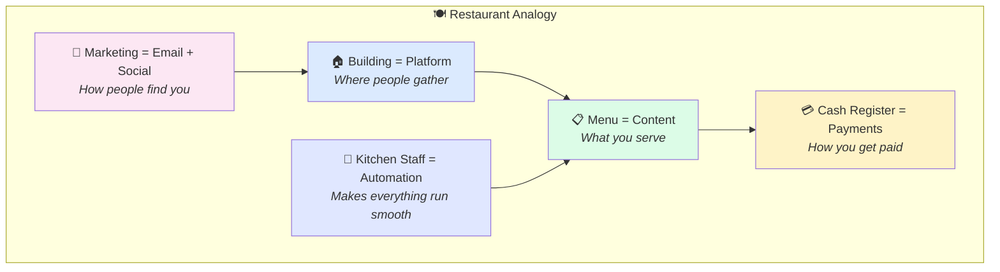

### Recommended Tech Stack (In Plain English)

| Component | Tool | Cost | What It Does |
|-----------|------|------|--------------|
| 🏠 **Community (Phase 1)** | Facebook Group | **FREE** | Where doctors hang out and chat |
| 🏠 **Community (Phase 2)** | Circle.so | **$99/mo** | Your OWN community platform |
| 🌐 **Website** | Webflow or Carrd | **$0-20/mo** | Landing page for doctorsidegigs.com |
| 📧 **Email** | ConvertKit | **$0-29/mo** | Sends automated emails, captures leads |
| 🤖 **Automation** | Make.com | **$9-24/mo** | Connects everything, posts automatically |
| 💳 **Payments** | Stripe | **2.9% per sale** | Takes credit card payments |
| 🧠 **AI Helper** | OpenAI API | **~$20/mo** | Helps curate and write content |

### Visual: How Everything Connects

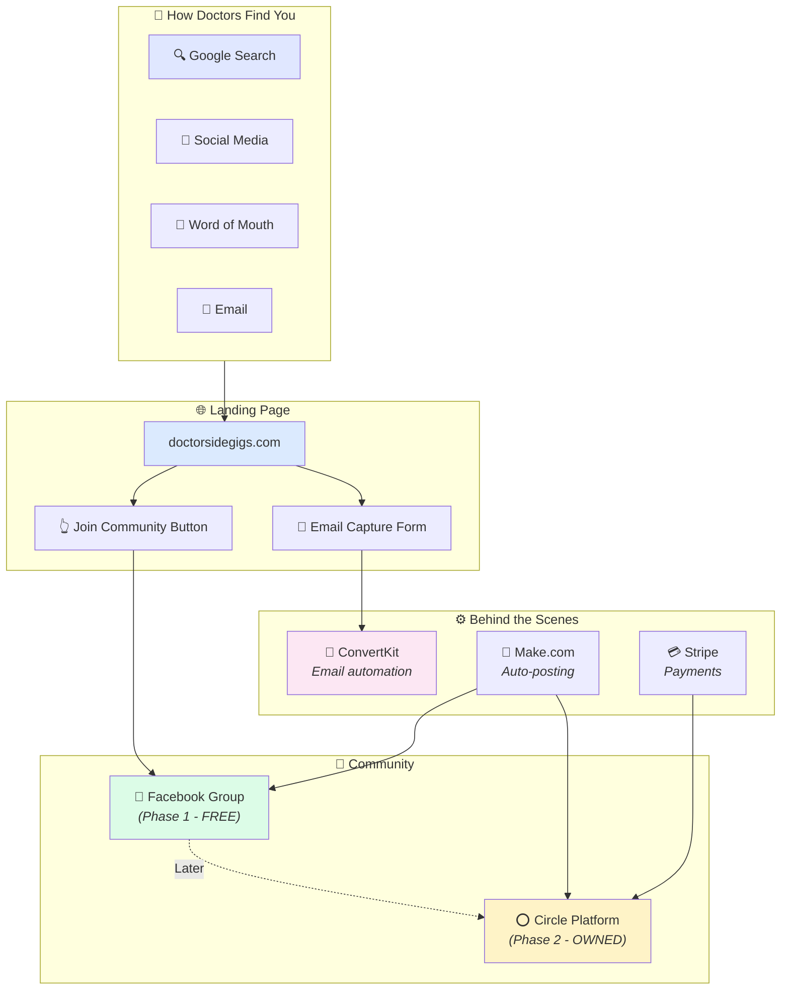

### Why This Stack?

| Reason | Explanation |
|--------|-------------|
| 💰 **Low Cost to Start** | Under $50/month for Phase 1 |
| 🚀 **Fast to Build** | Can launch in 2-3 weeks |
| 📈 **Scales Easily** | Same tools work for 100 or 100,000 members |
| 🔒 **You Own Your Data** | Email list is yours forever |
| 🔧 **Easy to Manage** | No coding needed for daily operations |

---

## 💰 3. Monetization Features

### Question: "What additional features or tools would you suggest to maximize revenue opportunities?"

### Your 6 Ideas + My 6 Additions = 12 Revenue Streams

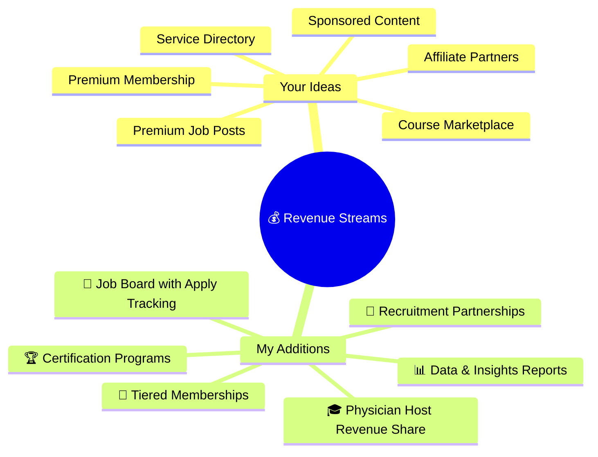

### Detailed Monetization Breakdown

#### 💵 Immediate Revenue (Month 1-3)

| Stream | How It Works | Potential Revenue |
|--------|--------------|-------------------|
| 🤝 **Affiliate Links** | Recommend tools doctors need, earn commission | $200-500/mo |
| 📧 **Sponsored Emails** | Companies pay to reach your email list | $500-1,000/blast |
| 📌 **Featured Posts** | Companies pay for visibility in group | $200-500/post |

#### 💎 Growth Revenue (Month 3-6)

| Stream | How It Works | Potential Revenue |
|--------|--------------|-------------------|
| 💳 **Premium Membership** | $29/mo for exclusive content | $1,000-3,000/mo |
| 🎓 **Mini-Courses** | $97-297 one-time courses | $2,000-5,000/mo |
| 📋 **Job Board Fees** | Companies pay to post jobs | $200-500/post |

#### 🚀 Scale Revenue (Month 6-12)

| Stream | How It Works | Potential Revenue |
|--------|--------------|-------------------|
| 🏆 **Mastermind Groups** | $199-499/mo high-touch groups | $5,000-15,000/mo |
| 👨‍⚕️ **Physician Host Revenue** | Doctors run paid groups, you take 30% | $2,000-10,000/mo |
| 🤝 **Recruitment Partnerships** | Healthcare recruiters pay for access | $1,000-5,000/mo |
| 📊 **Industry Reports** | Sell salary/opportunity data | $500-2,000/mo |

### Revenue Projection Chart

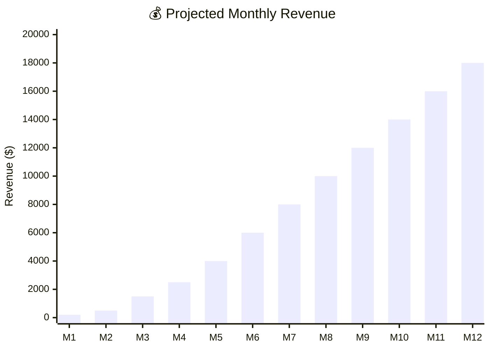

### 🎯 My Top 3 Recommendations for You

| Priority | Feature | Why |
|----------|---------|-----|
| 1️⃣ | **Tiered Membership** | Free → $29 → $99 → $199. More options = more conversions |
| 2️⃣ | **Physician Hosts** | Let successful doctors run masterminds. You take 30% cut |
| 3️⃣ | **Job Board** | Recurring revenue from healthcare companies |

---

## 👨‍⚕️ 4. Value Creation for Doctors

### Question: "What creative ways can we create value for doctors through this platform?"

### Understanding What Doctors Actually Want

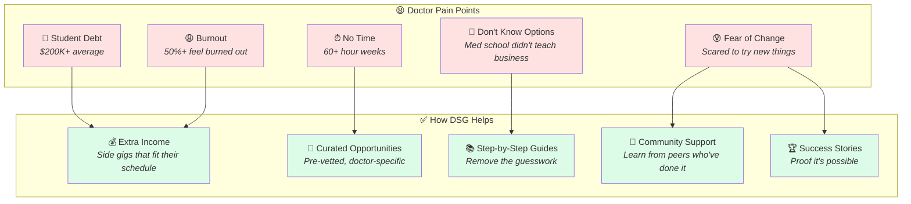

### 12 Creative Value Ideas

#### 📋 Content & Resources

| Idea | Description | Effort | Impact |
|------|-------------|--------|--------|
| 📊 **Income Reports** | Real doctors share exactly how much they make | Low | 🔥🔥🔥 High |
| 🗺️ **Side Gig Roadmaps** | Step-by-step guide for each opportunity | Medium | 🔥🔥🔥 High |
| 📝 **Templates & Scripts** | Email templates, contracts, proposals | Medium | 🔥🔥 Medium |
| 🎥 **Video Walkthroughs** | Screen recordings of how to apply/start | Medium | 🔥🔥🔥 High |

#### 🤝 Community & Connection

| Idea | Description | Effort | Impact |
|------|-------------|--------|--------|
| 👥 **Specialty Groups** | Cardiologists, Surgeons, ER docs | Low | 🔥🔥 Medium |
| 🎤 **Weekly AMAs** | Successful doctor entrepreneurs answer questions | Low | 🔥🔥🔥 High |
| 🤝 **Accountability Partners** | Match doctors working on same goals | Medium | 🔥🔥 Medium |
| 🏆 **Success Spotlights** | Feature members who hit milestones | Low | 🔥🔥🔥 High |

#### 🛠️ Tools & Services

| Idea | Description | Effort | Impact |
|------|-------------|--------|--------|
| 📈 **Opportunity Alerts** | Email when new gigs match their profile | Medium | 🔥🔥🔥 High |
| 💼 **Resume Review** | Help optimize for side gig applications | High | 🔥🔥 Medium |
| 🧮 **Income Calculator** | "How much can I make with X hours?" | Medium | 🔥🔥 Medium |
| 📞 **Expert Consultations** | Book 1:1 calls with successful members | High | 🔥🔥🔥 High |

### The "Value Ladder" Strategy

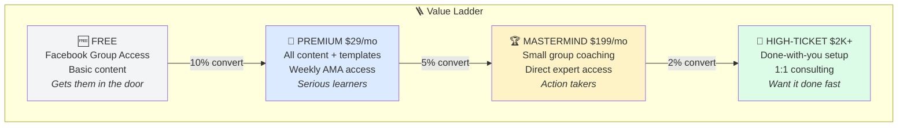

---

## 📈 5. Scalability Design

### Question: "How would you design this to handle rapid growth from 1,000 to 100,000+ members?"

### The Simple Answer

> **You don't need to worry about this now.** The tools I'm recommending automatically scale. Facebook handles billions of users. Circle handles communities with 100K+ members. You won't hit technical limits.

### What Actually Matters for Scale

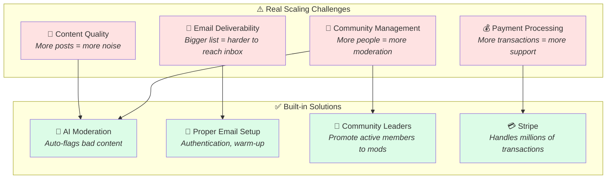

### Growth Architecture

```mermaid
flowchart LR
    subgraph Phase1["📈 1,000 Members"]
        P1A["You manage everything"]
        P1B["Basic automation"]
        P1C["Facebook Group only"]
    end

    subgraph Phase2["📈 10,000 Members"]
        P2A["2-3 volunteer moderators"]
        P2B["Full automation"]
        P2C["Facebook + Circle"]
    end

    subgraph Phase3["📈 100,000+ Members"]
        P3A["Paid moderation team"]
        P3B["AI-assisted everything"]
        P3C["Multiple sub-communities"]
    end

    Phase1 -->|"3-6 months"| Phase2
    Phase2 -->|"6-12 months"| Phase3

    style P1A fill:#dcfce7
    style P2A fill:#dbeafe
    style P3A fill:#fef3c7
```

### Tech That Scales Automatically

| Component | At 1K Members | At 100K Members | Your Action Needed |
|-----------|---------------|-----------------|-------------------|
| 🌐 **Website** | Works fine | Works fine | None |
| 📘 **Facebook** | Works fine | Works fine | None |
| ⭕ **Circle** | Works fine | Works fine | Upgrade plan ($199→$399) |
| 📧 **Email** | Free tier | Paid tier ($79/mo) | Pay more |
| 💳 **Stripe** | 2.9% fee | 2.9% fee | None |
| 🤖 **Automation** | Works fine | Works fine | Maybe upgrade |

### Bottom Line on Scalability

> 💡 **Focus on getting to 1,000 members first.** The technical infrastructure handles itself. Your real challenge will be content quality and community engagement — which is why automation and AI moderation matter.

---

## 🔄 6. Alternative Approaches

### Question: "Are there better ways to structure this that we haven't considered?"

### Three Approaches Compared

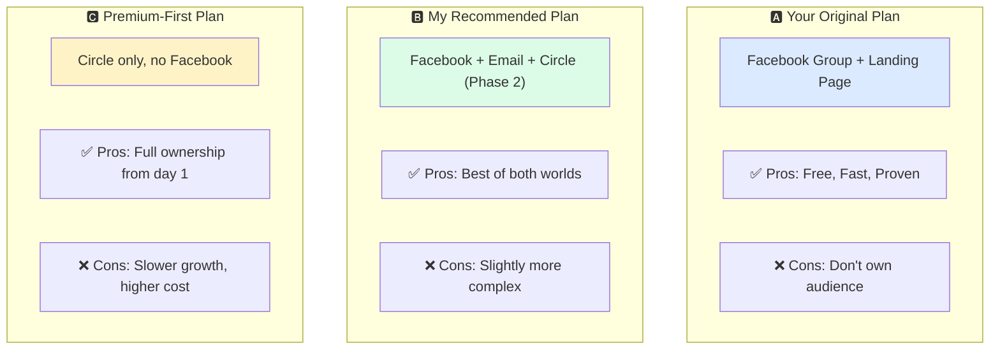

### Detailed Comparison

| Factor | 🅰️ Your Plan | 🅱️ My Recommendation | 🅲 Premium-First |
|--------|-------------|---------------------|------------------|
| 💰 **Startup Cost** | $500-1,000 | $1,500-2,000 | $2,500-4,000 |
| 💵 **Monthly Cost** | $50-100 | $150-300 | $300-500 |
| 🚀 **Time to Launch** | 2 weeks | 3-4 weeks | 4-6 weeks |
| 📈 **Growth Speed** | Fast | Fast | Slower |
| 🔒 **Ownership** | Low (FB owns) | Medium | High |
| 💰 **Revenue Potential** | Medium | High | High |
| ⚠️ **Risk** | High (FB can shut down) | Low | Low |

### My Honest Take

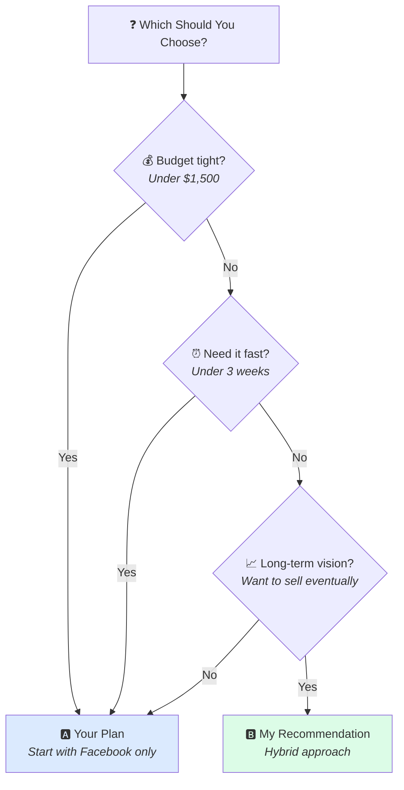

### Why I Recommend the Hybrid Approach

| Reason | Explanation |
|--------|-------------|
| 🛡️ **Risk Mitigation** | If Facebook shuts down your group, you still have email list + Circle |
| 💰 **Higher Revenue** | Owned platforms allow better monetization |
| 🏆 **Exit Value** | If you ever sell, owned platforms are worth 10x more |
| 📊 **Better Data** | Know exactly who your members are |

### The Upwork API Reality Check

> ⚠️ **Important:** Your plan mentions using Upwork API to auto-post jobs. Here's the truth:

| What You Want | Reality |
|---------------|---------|
| Auto-post Upwork jobs to FB | Upwork's API is **restricted** - requires approval and they rarely give it |
| Scrape Upwork listings | **Against Terms of Service** - they can sue you |

**Better Alternative:**
- Use **Google Alerts** for "physician remote jobs", "doctor consulting"
- Use **RSS feeds** from actual job boards that allow this
- Manually curate best opportunities (20 mins/day)
- Use AI to help summarize and rewrite listings

---

## 📅 7. Realistic Timeline

### Question: "What's your realistic timeline for Phase 1, 2, and 3?"

### Timeline Overview

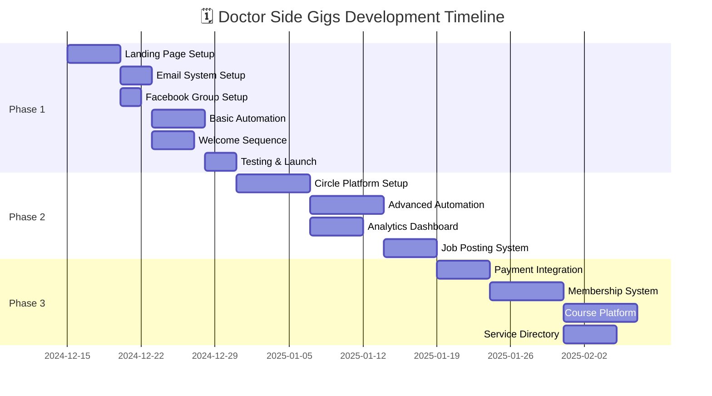

### Phase-by-Phase Breakdown

#### 🚀 Phase 1: MVP Launch (3-4 Weeks)

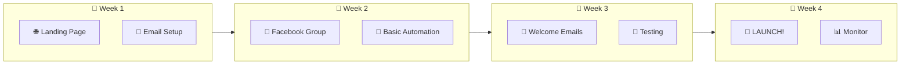

**Deliverables:**
- ✅ doctorsidegigs.com landing page with email capture
- ✅ Facebook Group created and configured
- ✅ ConvertKit email system with 5-email welcome sequence
- ✅ Make.com automation posting 3-5 curated articles/day
- ✅ Google Alerts feeding relevant content

---

#### 📈 Phase 2: Growth & Automation (3-4 Weeks)

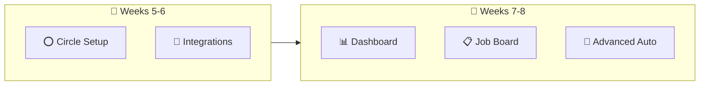

**Deliverables:**
- ✅ Circle.so community platform configured
- ✅ Advanced email automation (behavior-based)
- ✅ Simple analytics dashboard
- ✅ Job posting submission form for companies
- ✅ AI-assisted content curation

---

#### 💰 Phase 3: Monetization (3-4 Weeks)

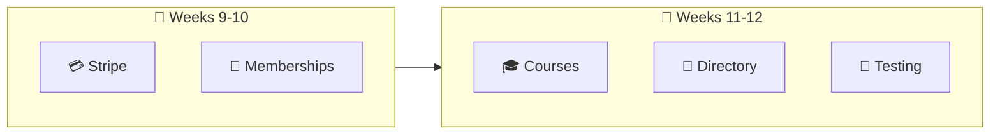

**Deliverables:**
- ✅ Stripe payment processing
- ✅ Premium membership tiers ($29, $99, $199)
- ✅ Course hosting capability
- ✅ Service provider directory
- ✅ Full system testing and optimization

---

### Realistic vs Optimistic Timeline

| Phase | Your Estimate | My Realistic Estimate | Notes |
|-------|---------------|----------------------|-------|
| Phase 1 | 2-4 weeks | **3-4 weeks** | First time takes longer |
| Phase 2 | 4-6 weeks | **3-4 weeks** | Once Phase 1 done, faster |
| Phase 3 | 6-8 weeks | **3-4 weeks** | Payment setup is quick |
| **TOTAL** | 12-18 weeks | **9-12 weeks** | |

---

## 💵 8. Detailed Cost Breakdown

### Question: "Please provide detailed cost breakdown for each phase and monthly operating expenses"

### 💰 Development Costs (One-Time)

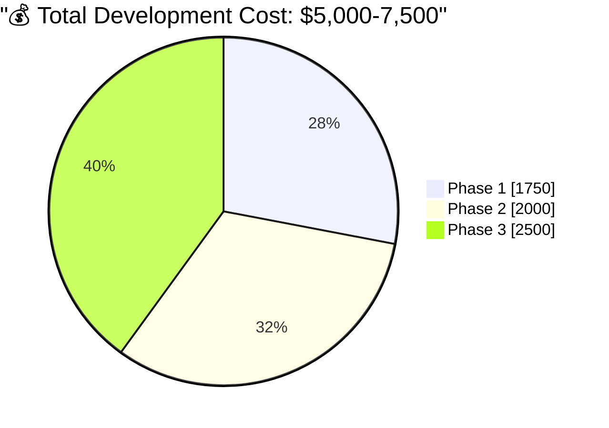

#### Phase 1: $1,500 - $2,000

| Item | Description | Cost |
|------|-------------|------|
| 🌐 **Landing Page** | Design + development on Webflow/Carrd | $300-500 |
| 📧 **Email System Setup** | ConvertKit config + welcome sequence | $200-300 |
| 👥 **Facebook Group** | Setup, rules, pinned posts, graphics | $200-300 |
| 🤖 **Automation Setup** | Make.com workflows, RSS feeds, alerts | $400-500 |
| 🎨 **Branding Assets** | Logo tweaks, social graphics, templates | $200-300 |
| 🧪 **Testing & Launch** | QA, fixes, launch support | $200-300 |
| | **PHASE 1 TOTAL** | **$1,500-2,000** |

#### Phase 2: $1,500 - $2,500

| Item | Description | Cost |
|------|-------------|------|
| ⭕ **Circle Setup** | Full platform configuration | $400-600 |
| 🔗 **Integrations** | Connect email, automation, analytics | $300-400 |
| 📊 **Analytics Dashboard** | Simple tracking setup | $200-300 |
| 📋 **Job Board System** | Submission forms, display | $300-500 |
| 🤖 **Advanced Automation** | AI curation, smart posting | $300-500 |
| 🧪 **Testing** | QA and optimization | $200-300 |
| | **PHASE 2 TOTAL** | **$1,500-2,500** |

#### Phase 3: $2,000 - $3,000

| Item | Description | Cost |
|------|-------------|------|
| 💳 **Payment Integration** | Stripe setup, testing | $300-400 |
| 💎 **Membership System** | Tiers, access control, billing | $500-700 |
| 🎓 **Course Platform** | Hosting setup, delivery system | $500-700 |
| 📂 **Service Directory** | Listings, search, submission | $400-600 |
| 🧪 **Full Testing** | End-to-end QA | $300-400 |
| | **PHASE 3 TOTAL** | **$2,000-3,000** |

---

### 💵 Monthly Operating Costs

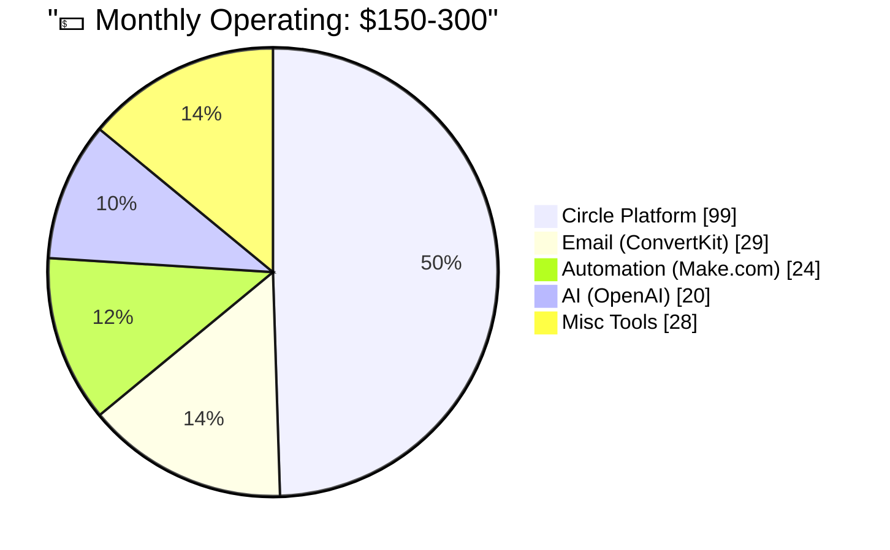

#### Detailed Monthly Breakdown

| Tool | What It Does | Phase 1 | Phase 2+ |
|------|--------------|---------|----------|
| ⭕ **Circle.so** | Community platform | $0 | $99/mo |
| 📧 **ConvertKit** | Email marketing | $0 (free tier) | $29/mo |
| 🤖 **Make.com** | Automation | $9/mo | $24/mo |
| 🧠 **OpenAI API** | AI content help | $10/mo | $20/mo |
| 🌐 **Website** | Landing page hosting | $0-20/mo | $0-20/mo |
| 💳 **Stripe** | Payment processing | 2.9% of sales | 2.9% of sales |
| | **MONTHLY TOTAL** | **$19-39/mo** | **$172-212/mo** |

---

### 📊 Cost Summary Table

| Category | Low Estimate | High Estimate |
|----------|--------------|---------------|
| **Phase 1 Development** | $1,500 | $2,000 |
| **Phase 2 Development** | $1,500 | $2,500 |
| **Phase 3 Development** | $2,000 | $3,000 |
| **TOTAL DEVELOPMENT** | **$5,000** | **$7,500** |
| | | |
| **Monthly (Phase 1)** | $20 | $40 |
| **Monthly (Phase 2+)** | $150 | $250 |

---

### 💡 Cost-Saving Options

| Option | Savings | Trade-off |
|--------|---------|-----------|
| Skip Circle (Phase 2) | -$1,500 dev, -$99/mo | Less ownership, fewer features |
| DIY email sequences | -$200 | Your time, less professional |
| Basic automation only | -$300 | Less content, more manual work |
| Skip course platform | -$500 | No course revenue initially |

### My Recommendation

> 💡 **Start with Phase 1 ($1,500-2,000)** and prove the concept. If you get to 500+ members and see engagement, then invest in Phase 2 and 3. No need to build everything upfront.

---

## 🚀 9. Next Steps

### Immediate Action Items

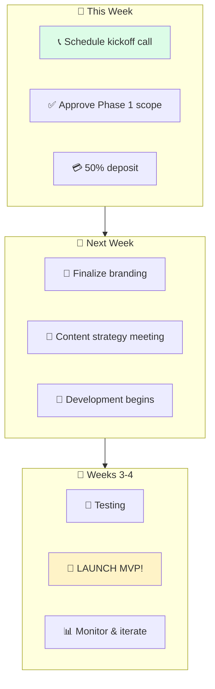

### To Get Started, I Need From You:

| Item | Description | Priority |
|------|-------------|----------|
| ✅ **Approval** | Confirm approach and budget | 🔴 High |
| 🎨 **Branding** | Logo, colors, any existing assets | 🔴 High |
| 📝 **Content** | 10-20 example posts/opportunities | 🟡 Medium |
| 🔐 **Access** | Facebook admin, domain registrar | 🔴 High |
| 📋 **RSS Sources** | Your preferred medical blogs/sites | 🟡 Medium |

### Payment Terms (Suggested)

| Milestone | Payment | When |
|-----------|---------|------|
| 🚀 **Project Start** | 50% of Phase 1 ($750-1,000) | Before work begins |
| ✅ **Phase 1 Complete** | 50% of Phase 1 ($750-1,000) | At launch |
| 📈 **Phase 2 Start** | 50% of Phase 2 | When ready to proceed |
| ✅ **Phase 2 Complete** | 50% of Phase 2 | At completion |
| 💰 **Phase 3 Start** | 50% of Phase 3 | When ready to proceed |
| ✅ **Phase 3 Complete** | 50% of Phase 3 | At completion |

---

## 📞 Ready to Start?

### Let's build Doctor Side Gigs together! 🏥

| Contact | Details |
|---------|---------|
| 📧 **Email** | hammadkhanxcm@gmail.com |
| 📱 **WhatsApp** | [Your number] |
| 📅 **Schedule Call** | [Calendar link] |

---

**Next Step:** Reply to confirm Phase 1 scope and schedule our kickoff call.

---

*Document prepared by Hammad Khan | December 2024*

