# 🔗 Facebook Group Content Integration Guide

<div align="center">

## 📱 Private Facebook Group → 🌠Your Website

**A Complete Guide to Syncing & Repurposing Content**

*Multiple approaches • Detailed cost breakdowns • Automated solutions*

---

</div>

## 📋 Table of Contents

### 📱 Part 1: Facebook Group Content Integration
- [Executive Summary](#-executive-summary)
- [How It Works](#-how-it-works)
- [Quick Comparison](#-quick-comparison)
- [Solution Options](#-solution-options)
  - [Option 1: Budget](#-option-1-budget--0-50month)
  - [Option 2: Mid-Range](#-option-2-mid-range--50-150month)
  - [Option 3: Premium](#-option-3-premium--300-350month)
  - [Option 4: Enterprise](#-option-4-enterprise--700month)
- [Tool Deep-Dives](#-tool-deep-dives)
- [Which Option is Right for You?](#-which-option-is-right-for-you)
- [Important Considerations](#-important-considerations)
- [Next Steps](#-next-steps)

### ğŸ—ï¸ Part 2: Building Your Own Community Platform
- [The Bigger Vision](#-the-bigger-vision)
- [Platform Options Comparison](#-platform-options-comparison)
- [Recommended Platform Stack](#-recommended-platform-stack)
- [Multi-Physician Ecosystem Architecture](#-multi-physician-ecosystem-architecture)
- [Scaling to 100K+ Members](#-scaling-to-100k-members)
- [Automation Strategy](#-automation-strategy)
- [Monetization & Upsell Opportunities](#-monetization--upsell-opportunities)
- [Is Facebook Scraping Still Necessary?](#-is-facebook-scraping-still-necessary)
- [Implementation Roadmap](#-implementation-roadmap)

---

## 📊 Executive Summary

### The Challenge

Extracting content from a **private Facebook group** to repurpose on your own website presents unique challenges:

| Challenge | Impact |
|-----------|--------|
| 🔒 **API Restrictions** | Facebook's Graph API doesn't allow members to pull group content |
| 📜 **Terms of Service** | Automated scraping violates Facebook's ToS |
| ğŸ›¡ï¸ **Privacy Concerns** | Content shared in private groups has privacy expectations |
| 🔠**Login Required** | Any solution requires authenticated access |

### The Solution

We've identified **4 cost-tiered approaches** ranging from manual curation to fully automated pipelines. Each balances:

- 💵 **Cost** — Monthly infrastructure expenses
- ⚡ **Automation Level** — How much manual work required
- âš ï¸ **Risk Level** — Potential for account issues
- 🕠**Setup Time** — Time to get running

---

## 🔄 How It Works

### High-Level Architecture

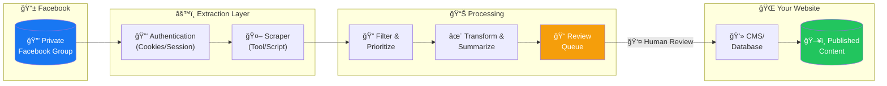
```mermaid
flowchart LR
    subgraph Facebook["📱 Facebook"]
        FBG[("🔒 Private\nFacebook Group")]
    end

    subgraph Extraction["âš™ï¸ Extraction Layer"]
        AUTH["🔑 Authentication\n(Cookies/Session)"]
        SCRAPE["🤖 Scraper\n(Tool/Script)"]
    end

    subgraph Processing["📊 Processing"]
        FILTER["🔠Filter &\nPrioritize"]
        TRANSFORM["✨ Transform &\nSummarize"]
        QUEUE["📠Review\nQueue"]
    end

    subgraph Website["🌠Your Website"]
        CMS["💻 CMS/\nDatabase"]
        SITE[("ğŸ–¥ï¸ Published\nContent")]
    end

    FBG --> AUTH
    AUTH --> SCRAPE
    SCRAPE --> FILTER
    FILTER --> TRANSFORM
    TRANSFORM --> QUEUE
    QUEUE -->|"👤 Human Review"| CMS
    CMS --> SITE

    style FBG fill:#1877f2,color:#fff
    style SITE fill:#22c55e,color:#fff
    style QUEUE fill:#f59e0b,color:#fff
```

### Data Flow Summary

| Step | Description | Who Does It |
|------|-------------|-------------|
| 1ï¸âƒ£ | Authenticate with Facebook using your member credentials | 🤖 Automated |
| 2ï¸âƒ£ | Extract posts from the group feed | 🤖 Automated |
| 3ï¸âƒ£ | Filter for relevant/popular discussions | 🤖 Automated |
| 4ï¸âƒ£ | Transform into your website's format | 🤖 Automated |
| 5ï¸âƒ£ | Review and approve content | 👤 Human |
| 6ï¸âƒ£ | Publish to your website | 🤖/👤 Either |

---

## âš¡ Quick Comparison

### All Options at a Glance

| | 💰 Budget | 💠Mid-Range | 🚀 Premium | 🢠Enterprise |
|---|:---:|:---:|:---:|:---:|
| **Monthly Cost** | $0 - $50 | $50 - $150 | $300 - $350 | $700+ |
| **Automation** | â­ Low | â­â­â­ High | â­â­â­â­ Full | â­â­â­â­â­ Full + Scale |
| **Setup Time** | 2-4 hours | 4-8 hours | 1-2 days | 3-5 days |
| **Technical Skill** | 🟢 Minimal | 🟡 Some | 🟠 Moderate | 🔴 High |
| **Risk Level** | ✅ Very Low | âš ï¸ Low | âš ï¸ Medium | âš ï¸ Medium |
| **Best For** | Testing / Low volume | Regular sync | High volume | Large scale |

### Visual Cost Comparison

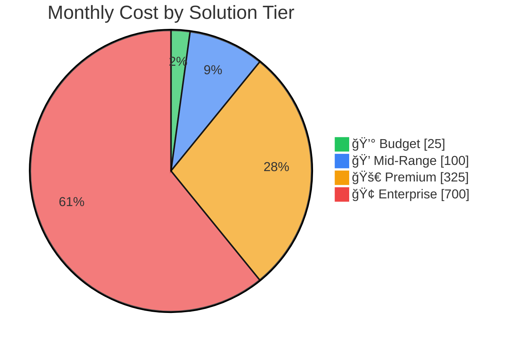
```mermaid
%%{init: {'theme': 'base', 'themeVariables': { 'pie1': '#22c55e', 'pie2': '#3b82f6', 'pie3': '#f59e0b', 'pie4': '#ef4444'}}}%%
pie showData
    title Monthly Cost by Solution Tier
    "💰 Budget" : 25
    "💠Mid-Range" : 100
    "🚀 Premium" : 325
    "🢠Enterprise" : 700
```

---

## ğŸ› ï¸ Solution Options

---

### 💰 Option 1: Budget — $0-50/month

**Best for:** Testing the concept, low-volume needs, or tight budgets

#### Overview

This approach combines **manual monitoring** with **free/low-cost tools** to automate parts of the workflow while keeping costs minimal.

#### Workflow Diagram

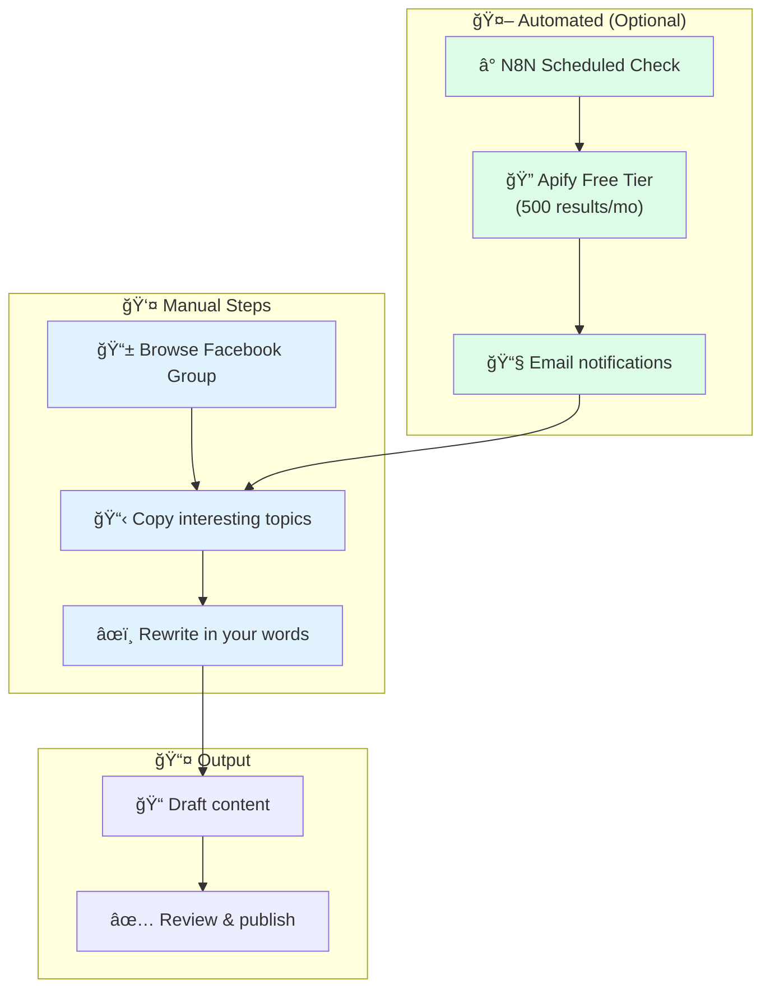
```mermaid
flowchart TD
    subgraph Manual["👤 Manual Steps"]
        M1["📱 Browse Facebook Group"]
        M2["📋 Copy interesting topics"]
        M3["âœï¸ Rewrite in your words"]
    end

    subgraph Automated["🤖 Automated (Optional)"]
        A1["â° N8N Scheduled Check"]
        A2["🔠Apify Free Tier\n(500 results/mo)"]
        A3["📧 Email notifications"]
    end

    subgraph Output["📤 Output"]
        O1["📠Draft content"]
        O2["✅ Review & publish"]
    end

    M1 --> M2
    M2 --> M3
    M3 --> O1

    A1 --> A2
    A2 --> A3
    A3 --> M2

    O1 --> O2

    style M1 fill:#e0f2fe
    style M2 fill:#e0f2fe
    style M3 fill:#e0f2fe
    style A1 fill:#dcfce7
    style A2 fill:#dcfce7
    style A3 fill:#dcfce7
```

#### Cost Breakdown

| Component | Service | Monthly Cost | Notes |
|-----------|---------|-------------|-------|
| ğŸ–¥ï¸ **Server** | DigitalOcean Basic Droplet | $6 | 1GB RAM, 1 vCPU |
| âš™ï¸ **Automation** | N8N Community Edition | $0 | Self-hosted, unlimited |
| 🔠**Scraping** | Apify Free Tier | $0 | $5 credits = ~500 posts |
| 🌠**Proxy** | None (use carefully) | $0 | Higher detection risk |
| | | | |
| | **TOTAL** | **$6 - $12/mo** | |

#### What You Get

| Feature | Included |
|---------|----------|
| Post extraction | ✅ Limited (500/month) |
| Scheduled runs | ✅ Yes |
| Email alerts | ✅ Yes |
| Human review queue | ✅ Basic |
| Detection protection | ⌠Minimal |

#### Pros & Cons

| ✅ Pros | ⌠Cons |
|---------|---------|
| Very low cost | Manual work required |
| Easy to start | Limited automation |
| Low risk (mostly manual) | Doesn't scale well |
| No technical expertise needed | May miss active discussions |

---

### 💠Option 2: Mid-Range — $50-150/month

**Best for:** Regular syncing, moderate volume, some automation desired

#### Overview

This tier uses **cloud-based automation tools** to handle most of the extraction and processing, with human review only for final approval.

#### Workflow Diagram

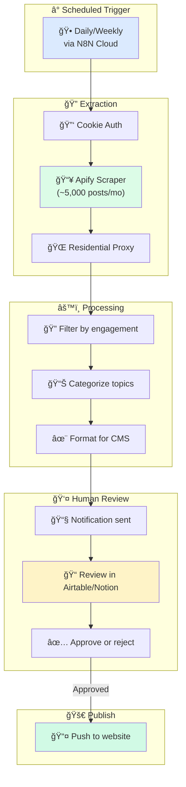
```mermaid
flowchart TD
    subgraph Trigger["â° Scheduled Trigger"]
        T1["🕠Daily/Weekly\nvia N8N Cloud"]
    end

    subgraph Extract["🔠Extraction"]
        E1["🔑 Cookie Auth"]
        E2["📥 Apify Scraper\n(~5,000 posts/mo)"]
        E3["🌠Residential Proxy"]
    end

    subgraph Process["âš™ï¸ Processing"]
        P1["🔠Filter by engagement"]
        P2["📊 Categorize topics"]
        P3["✨ Format for CMS"]
    end

    subgraph Review["👤 Human Review"]
        R1["📧 Notification sent"]
        R2["📠Review in Airtable/Notion"]
        R3["✅ Approve or reject"]
    end

    subgraph Publish["🚀 Publish"]
        PUB1["📤 Push to website"]
    end

    T1 --> E1
    E1 --> E2
    E2 --> E3
    E3 --> P1
    P1 --> P2
    P2 --> P3
    P3 --> R1
    R1 --> R2
    R2 --> R3
    R3 -->|Approved| PUB1

    style T1 fill:#dbeafe
    style E2 fill:#dcfce7
    style R2 fill:#fef3c7
    style PUB1 fill:#d1fae5
```

#### Cost Breakdown

| Component | Service | Monthly Cost | Notes |
|-----------|---------|-------------|-------|
| âš™ï¸ **Automation** | N8N Cloud Starter | $24 | 2,500 executions |
| 🔠**Scraping** | Apify Starter | $49 | ~10,000+ posts |
| 🌠**Proxy** | Webshare Residential | $15 | ~3GB bandwidth |
| 📊 **Review Tool** | Airtable Free | $0 | Or Notion, Google Sheets |
| | | | |
| | **TOTAL** | **$88/mo** | |

**Alternative Stack:**

| Component | Service | Monthly Cost |
|-----------|---------|-------------|
| âš™ï¸ **Automation** | Make.com Core | $9 |
| 🔠**Scraping** | PhantomBuster Starter | $69 |
| 🌠**Proxy** | Included in PhantomBuster | $0 |
| | **TOTAL** | **$78/mo** |

#### What You Get

| Feature | Included |
|---------|----------|
| Post extraction | ✅ 5,000-10,000/month |
| Scheduled runs | ✅ Daily or custom |
| Smart filtering | ✅ By engagement, keywords |
| Human review queue | ✅ Professional (Airtable/Notion) |
| Detection protection | ✅ Residential proxies |
| Email notifications | ✅ Yes |

#### Pros & Cons

| ✅ Pros | ⌠Cons |
|---------|---------|
| High automation | Monthly subscription costs |
| Professional tools | Some setup required |
| Good proxy protection | Learning curve for tools |
| Scalable if needed | Still requires human review |
| Visual workflow builders | |

---

### 🚀 Option 3: Premium — $300-350/month

**Best for:** High volume, fully automated pipelines, minimal manual intervention

#### Overview

This tier provides **enterprise-grade automation** with dedicated browser infrastructure, professional scraping tools, and robust proxy networks for reliable, high-volume extraction.

#### Workflow Diagram

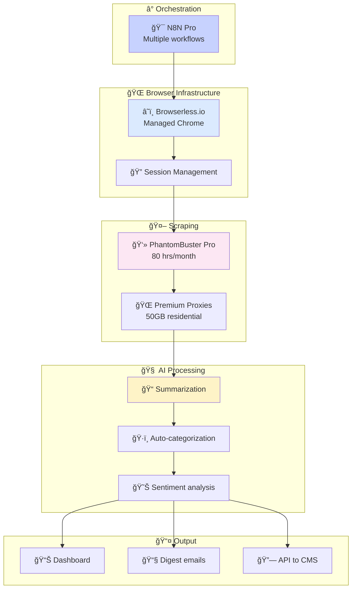
```mermaid
flowchart TD
    subgraph Schedule["â° Orchestration"]
        S1["🯠N8N Pro\nMultiple workflows"]
    end

    subgraph Browser["🌠Browser Infrastructure"]
        B1["â˜ï¸ Browserless.io\nManaged Chrome"]
        B2["🔠Session Management"]
    end

    subgraph Scrape["🤖 Scraping"]
        SC1["👻 PhantomBuster Pro\n80 hrs/month"]
        SC2["🌠Premium Proxies\n50GB residential"]
    end

    subgraph AI["🧠 AI Processing"]
        AI1["📠Summarization"]
        AI2["ğŸ·ï¸ Auto-categorization"]
        AI3["😊 Sentiment analysis"]
    end

    subgraph Output["📤 Output"]
        O1["📊 Dashboard"]
        O2["📧 Digest emails"]
        O3["🔗 API to CMS"]
    end

    S1 --> B1
    B1 --> B2
    B2 --> SC1
    SC1 --> SC2
    SC2 --> AI1
    AI1 --> AI2
    AI2 --> AI3
    AI3 --> O1
    AI3 --> O2
    AI3 --> O3

    style S1 fill:#c7d2fe
    style B1 fill:#dbeafe
    style SC1 fill:#fce7f3
    style AI1 fill:#fef3c7
```

#### Cost Breakdown

| Component | Service | Monthly Cost | Notes |
|-----------|---------|-------------|-------|
| âš™ï¸ **Automation** | N8N Cloud Pro | $60 | 10,000 executions |
| 🤖 **Scraping** | PhantomBuster Pro | $159 | 80 hours execution |
| 🌠**Browser** | Browserless.io Starter | $50 | Managed headless Chrome |
| 🔒 **Proxies** | Premium Residential | $50 | ~10-15GB via Oxylabs/Webshare |
| | | | |
| | **TOTAL** | **$319/mo** | |

#### What You Get

| Feature | Included |
|---------|----------|
| Post extraction | ✅ Unlimited |
| Scheduled runs | ✅ Multiple per day |
| Smart filtering | ✅ Advanced with AI |
| Human review queue | ✅ Optional (can auto-publish) |
| Detection protection | ✅ Enterprise-grade |
| Content summarization | ✅ AI-powered |
| Auto-categorization | ✅ Yes |
| API integration | ✅ Direct to CMS |
| Support | ✅ Priority |

#### Pros & Cons

| ✅ Pros | ⌠Cons |
|---------|---------|
| Fully automated | Higher monthly cost |
| AI-powered processing | Requires setup expertise |
| Enterprise reliability | More components to manage |
| Scales to high volume | Overkill for small groups |
| Direct CMS integration | |
| Priority support | |

---

### 🢠Option 4: Enterprise — $700+/month

**Best for:** Large-scale operations, multiple groups, custom requirements

#### Overview

This tier provides **custom infrastructure** with dedicated cloud resources, enterprise-grade proxy services, and full customization capabilities for organizations with serious scale requirements.

#### Architecture Diagram

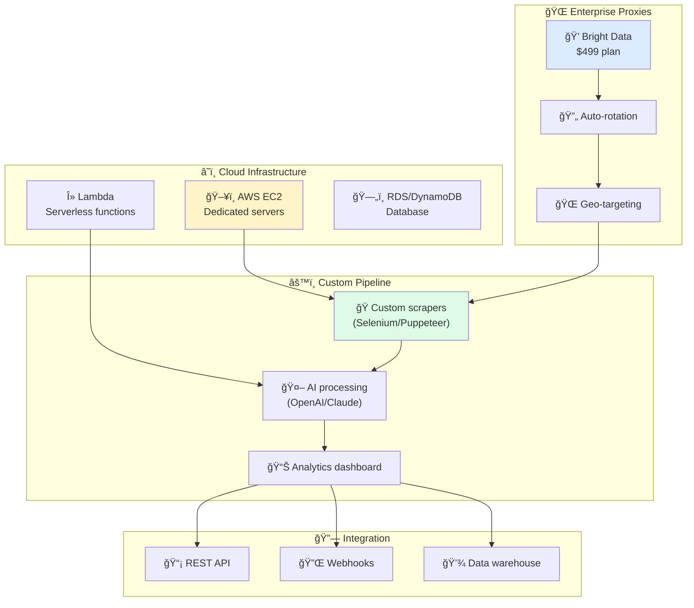
```mermaid
flowchart TD
    subgraph Cloud["â˜ï¸ Cloud Infrastructure"]
        C1["ğŸ–¥ï¸ AWS EC2\nDedicated servers"]
        C2["λ Lambda\nServerless functions"]
        C3["ğŸ—„ï¸ RDS/DynamoDB\nDatabase"]
    end

    subgraph Proxy["🌠Enterprise Proxies"]
        P1["💠Bright Data\n$499 plan"]
        P2["🔄 Auto-rotation"]
        P3["🌠Geo-targeting"]
    end

    subgraph Custom["âš™ï¸ Custom Pipeline"]
        CU1["ğŸ Custom scrapers\n(Selenium/Puppeteer)"]
        CU2["🤖 AI processing\n(OpenAI/Claude)"]
        CU3["📊 Analytics dashboard"]
    end

    subgraph Integration["🔗 Integration"]
        I1["📡 REST API"]
        I2["🔌 Webhooks"]
        I3["💾 Data warehouse"]
    end

    C1 --> CU1
    C2 --> CU2
    P1 --> P2
    P2 --> P3
    P3 --> CU1
    CU1 --> CU2
    CU2 --> CU3
    CU3 --> I1
    CU3 --> I2
    CU3 --> I3

    style C1 fill:#fef3c7
    style P1 fill:#dbeafe
    style CU1 fill:#dcfce7
```

#### Cost Breakdown

| Component | Service | Monthly Cost | Notes |
|-----------|---------|-------------|-------|
| â˜ï¸ **Cloud** | AWS EC2 (xlarge) | $200 | Dedicated compute |
| λ **Serverless** | AWS Lambda | $10 | Processing functions |
| ğŸ—„ï¸ **Database** | AWS RDS | $50 | Persistent storage |
| 🌠**Proxies** | Bright Data Residential | $499 | Enterprise tier |
| âš™ï¸ **Automation** | Make.com Teams | $180 | High-volume workflows |
| | | | |
| | **TOTAL** | **$939/mo** | |

**Scaled-Down Enterprise:**

| Component | Service | Monthly Cost |
|-----------|---------|-------------|
| â˜ï¸ **Cloud** | AWS Lambda + S3 | $50 |
| 🌠**Proxies** | Oxylabs Starter | $99 |
| âš™ï¸ **Automation** | N8N Enterprise | Custom |
| | **TOTAL** | **$700+/mo** |

#### What You Get

| Feature | Included |
|---------|----------|
| Post extraction | ✅ Unlimited, multi-group |
| Scheduled runs | ✅ Real-time capable |
| Smart filtering | ✅ Custom AI models |
| Detection protection | ✅ Best available |
| Custom development | ✅ Full flexibility |
| Analytics | ✅ Full dashboard |
| Data warehouse | ✅ Long-term storage |
| SLA/Support | ✅ Enterprise agreements |
| Multi-tenant | ✅ Multiple clients |

#### Pros & Cons

| ✅ Pros | ⌠Cons |
|---------|---------|
| Unlimited scale | High ongoing cost |
| Full customization | Requires dedicated DevOps |
| Best proxy quality | Complex architecture |
| Enterprise support | Overkill for most use cases |
| Multi-group capable | |
| Data analytics | |

---

## 🔧 Tool Deep-Dives

### âš™ï¸ N8N — Workflow Automation

<details>
<summary><strong>Click to expand N8N details</strong></summary>

#### What is N8N?

N8N is a **workflow automation platform** that connects different services and automates tasks. Think of it as "if this, then that" for complex business processes.

#### Pricing Options

| Plan | Cost | Executions | Best For |
|------|------|------------|----------|
| 🆓 **Community** | Free (self-host) | Unlimited | Budget-conscious |
| â­ **Starter** | $24/month | 2,500/mo | Getting started |
| 💼 **Pro** | $60/month | 10,000/mo | Regular use |
| 🢠**Enterprise** | Custom | Custom | Large teams |

#### For Facebook Scraping

N8N can:
- â° Schedule scraping runs
- 🔗 Connect to scraping services (Apify, PhantomBuster)
- 📊 Process and filter data
- 📧 Send notifications
- 🔌 Push to your CMS

#### Self-Hosted vs Cloud

| Aspect | Self-Hosted | Cloud |
|--------|-------------|-------|
| **Cost** | $6-10/mo (server) | $24-60/mo |
| **Executions** | Unlimited | Limited by plan |
| **Setup** | 2-4 hours | Instant |
| **Maintenance** | You handle | N8N handles |
| **Updates** | Manual | Automatic |

</details>

---

### 🔄 Make.com — Visual Automation

<details>
<summary><strong>Click to expand Make.com details</strong></summary>

#### What is Make.com?

Make.com (formerly Integromat) is a **visual automation builder** with a drag-and-drop interface. Great for non-technical users.

#### Pricing

| Plan | Cost | Operations | Best For |
|------|------|------------|----------|
| 🆓 **Free** | $0 | 1,000/mo | Testing |
| 📗 **Core** | $9/month | 10,000/mo | Basic needs |
| 📘 **Pro** | $19/month | 10,000/mo | Advanced features |
| 📙 **Teams** | $180/month | 150,000/mo | Teams |

#### Operations Explained

Each "step" in a workflow = 1 operation
- Fetching a post = 1 operation
- Filtering = 1 operation
- Saving to database = 1 operation

A 5-step workflow processing 100 posts = 500 operations

#### Integration with Facebook Tools

Make.com connects natively to:
- PhantomBuster
- Apify
- Google Sheets
- Airtable
- Most CMS platforms

</details>

---

### 👻 PhantomBuster — Social Media Automation

<details>
<summary><strong>Click to expand PhantomBuster details</strong></summary>

#### What is PhantomBuster?

PhantomBuster provides **pre-built "Phantoms"** that automate social media tasks without coding.

#### Pricing

| Plan | Cost | Execution Time | Best For |
|------|------|----------------|----------|
| 🧪 **Trial** | Free | 2 hours | Testing |
| â­ **Starter** | $69/month | 20 hours | Light use |
| 💼 **Pro** | $159/month | 80 hours | Regular use |
| 👥 **Team** | $439/month | 300 hours | Teams |

#### Facebook-Specific Phantoms

| Phantom | What It Does |
|---------|--------------|
| **Group Members Export** | Extract member lists |
| **Profile Scraper** | Get profile details |
| **Auto Liker** | Engage with posts |
| **Post Scraper** | Extract post content |

#### Execution Time Explained

- Running a Phantom = uses execution time
- Extracting 1,000 members ≈ 15-30 minutes
- Daily scrape of 100 posts ≈ 5-10 minutes
- 20 hours/month = ~40-80 daily runs

</details>

---

### 🔠Apify — Web Scraping Platform

<details>
<summary><strong>Click to expand Apify details</strong></summary>

#### What is Apify?

Apify is a **web scraping platform** with pre-built scrapers and pay-per-result pricing.

#### Pricing Model

**Platform Plans:**
| Plan | Cost | Credits | Best For |
|------|------|---------|----------|
| 🆓 **Free** | $0 | $5/month | Testing |
| â­ **Starter** | $49/month | $49 credits | Regular use |
| 📈 **Scale** | $499/month | $499 credits | High volume |

**Pay-Per-Result (Facebook):**
| Scraper | Cost per 1,000 |
|---------|----------------|
| Facebook Posts | $4.00 |
| Facebook Ads | $5.00 |
| Facebook Marketplace | $5.00 |
| Facebook Followers | $7.00 |

#### Facebook Scrapers Available

1. **Facebook Pages Scraper** — Public pages
2. **Facebook Posts Scraper** — Post content
3. **Facebook Ads Library** — Ad creatives
4. **Facebook Marketplace** — Listings

âš ï¸ **Note:** Private groups require custom setup with your login cookies

</details>

---

### 🌠Proxy Services — Detection Protection

<details>
<summary><strong>Click to expand Proxy details</strong></summary>

#### Why Use Proxies?

Proxies help avoid detection by:
- 🔄 Rotating your IP address
- 🌠Appearing from different locations
- 🠠Using residential IPs (real devices)

#### Provider Comparison

| Provider | Starting Price | Type | Best For |
|----------|---------------|------|----------|
| **Webshare** | $2.99/mo | Mixed | Budget |
| **Oxylabs** | $99/mo (11GB) | Premium | Mid-range |
| **Bright Data** | $499/mo | Enterprise | High volume |

#### Data Usage Estimates

| Activity | Data per 1,000 |
|----------|----------------|
| Post extraction | ~50-100 MB |
| With images | ~500 MB - 1 GB |
| Full page loads | ~1-2 GB |

**Budget Estimate:**
- 1,000 posts/month (text only) ≈ 100 MB ≈ $0.50-$5
- 5,000 posts/month ≈ 500 MB ≈ $2.50-$25

</details>

---

## 🤔 Which Option is Right for You?

### Decision Flowchart

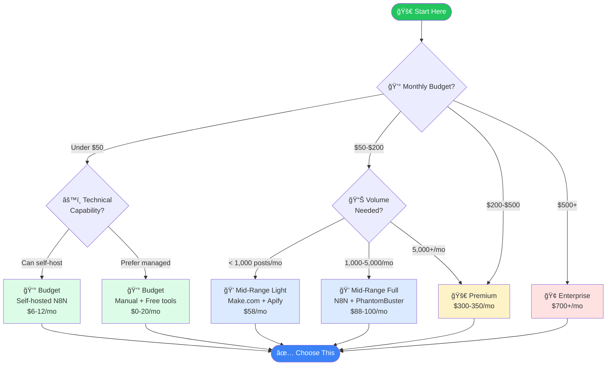
```mermaid
flowchart TD
    START([🚀 Start Here]) --> Q1{💰 Monthly Budget?}

    Q1 -->|Under $50| Q2{âš™ï¸ Technical\nCapability?}
    Q1 -->|$50-$200| Q3{📊 Volume\nNeeded?}
    Q1 -->|$200-$500| PREMIUM[🚀 Premium\n$300-350/mo]
    Q1 -->|$500+| ENTERPRISE[🢠Enterprise\n$700+/mo]

    Q2 -->|Can self-host| BUDGET_SELF[💰 Budget\nSelf-hosted N8N\n$6-12/mo]
    Q2 -->|Prefer managed| BUDGET_MANAGED[💰 Budget\nManual + Free tools\n$0-20/mo]

    Q3 -->|< 1,000 posts/mo| MIDRANGE_LIGHT[💠Mid-Range Light\nMake.com + Apify\n$58/mo]
    Q3 -->|1,000-5,000/mo| MIDRANGE_FULL[💠Mid-Range Full\nN8N + PhantomBuster\n$88-100/mo]
    Q3 -->|5,000+/mo| PREMIUM

    BUDGET_SELF --> DONE([✅ Choose This])
    BUDGET_MANAGED --> DONE
    MIDRANGE_LIGHT --> DONE
    MIDRANGE_FULL --> DONE
    PREMIUM --> DONE
    ENTERPRISE --> DONE

    style START fill:#22c55e,color:#fff
    style DONE fill:#3b82f6,color:#fff
    style BUDGET_SELF fill:#dcfce7
    style BUDGET_MANAGED fill:#dcfce7
    style MIDRANGE_LIGHT fill:#dbeafe
    style MIDRANGE_FULL fill:#dbeafe
    style PREMIUM fill:#fef3c7
    style ENTERPRISE fill:#fee2e2
```

### Quick Recommendation Matrix

| Your Situation | Recommended Option |
|----------------|-------------------|
| 🧪 Just testing the concept | 💰 Budget ($6-12) |
| 💼 Small team, moderate needs | 💠Mid-Range ($50-100) |
| 📈 Growing, need reliability | 🚀 Premium ($300-350) |
| 🢠Enterprise, multiple groups | 🢠Enterprise ($700+) |
| 💻 Technical team available | Self-host where possible |
| 🙅 No technical team | Fully managed services |

---

## âš ï¸ Important Considerations

### 🔒 Risk Assessment

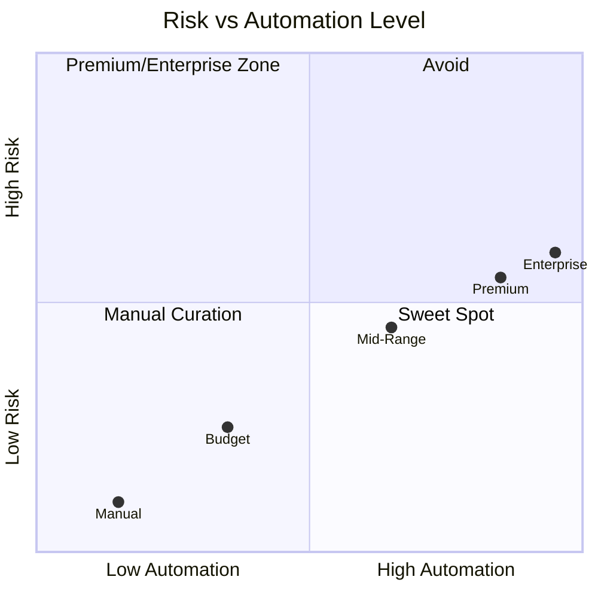
```mermaid
quadrantChart
    title Risk vs Automation Level
    x-axis Low Automation --> High Automation
    y-axis Low Risk --> High Risk
    quadrant-1 Avoid
    quadrant-2 Premium/Enterprise Zone
    quadrant-3 Manual Curation
    quadrant-4 Sweet Spot
    Manual: [0.15, 0.1]
    Budget: [0.35, 0.25]
    Mid-Range: [0.65, 0.45]
    Premium: [0.85, 0.55]
    Enterprise: [0.95, 0.6]
```

### Facebook Terms of Service

| âš ï¸ What's Against ToS | ✅ What's Generally OK |
|-----------------------|------------------------|
| Mass automated scraping | Manual browsing & copying |
| Storing personal data | Summarizing topics/ideas |
| Republishing verbatim content | Rephrasing in your words |
| Using bots to interact | Reading as a logged-in member |
| Selling scraped data | Internal research use |

### ğŸ›¡ï¸ Detection Mitigation Best Practices

| Practice | Impact |
|----------|--------|
| 🢠**Slow down scraping** | Reduces detection significantly |
| 🔄 **Use residential proxies** | Appears like normal user |
| â° **Randomize timing** | Avoids pattern detection |
| 📉 **Low volume** | <100 posts/day recommended |
| 🪠**Fresh cookies** | Update session regularly |
| 📱 **Mobile site** | Often less protected |

### âš–ï¸ Ethical Content Use

**DO:**
- ✅ Summarize discussions in your own words
- ✅ Extract topic ideas (not exact text)
- ✅ Anonymize any user references
- ✅ Add your own value/insights
- ✅ Get permission for direct quotes

**DON'T:**
- ⌠Copy-paste entire posts
- ⌠Include personal information
- ⌠Share without transformation
- ⌠Claim others' work as yours
- ⌠Expose private discussions publicly

---

## 🚀 Next Steps

### Getting Started Checklist

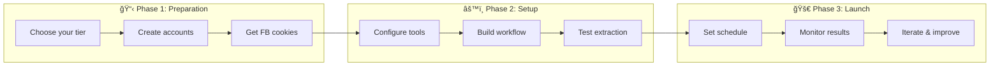
```mermaid
flowchart LR
    subgraph Phase1["📋 Phase 1: Preparation"]
        P1A["Choose your tier"]
        P1B["Create accounts"]
        P1C["Get FB cookies"]
    end

    subgraph Phase2["âš™ï¸ Phase 2: Setup"]
        P2A["Configure tools"]
        P2B["Build workflow"]
        P2C["Test extraction"]
    end

    subgraph Phase3["🚀 Phase 3: Launch"]
        P3A["Set schedule"]
        P3B["Monitor results"]
        P3C["Iterate & improve"]
    end

    P1A --> P1B --> P1C --> P2A --> P2B --> P2C --> P3A --> P3B --> P3C
```

### Action Items by Tier

#### 💰 If choosing Budget:
1. ☠Set up DigitalOcean account ($6 droplet)
2. ☠Install N8N Community Edition
3. ☠Create Apify free account
4. ☠Export Facebook cookies
5. ☠Build basic workflow

#### 💠If choosing Mid-Range:
1. ☠Sign up for N8N Cloud Starter ($24)
2. ☠Create Apify Starter account ($49)
3. ☠Set up Webshare proxy ($15)
4. ☠Create Airtable/Notion for review queue
5. ☠Connect all services in N8N

#### 🚀 If choosing Premium:
1. ☠Sign up for N8N Pro ($60)
2. ☠Create PhantomBuster Pro account ($159)
3. ☠Set up Browserless.io ($50)
4. ☠Configure premium proxies ($50)
5. ☠Build comprehensive workflow

#### 🢠If choosing Enterprise:
1. ☠Consult with DevOps team
2. ☠Set up AWS infrastructure
3. ☠Contact Bright Data for enterprise plan
4. ☠Design custom architecture
5. ☠Plan implementation timeline

---

## 📚 Resources & Links

### Tool Links

| Tool | Website | Pricing Page |
|------|---------|--------------|
| N8N | [n8n.io](https://n8n.io) | [Pricing](https://n8n.io/pricing/) |
| Make.com | [make.com](https://make.com) | [Pricing](https://www.make.com/en/pricing) |
| PhantomBuster | [phantombuster.com](https://phantombuster.com) | [Pricing](https://phantombuster.com/pricing) |
| Apify | [apify.com](https://apify.com) | [Pricing](https://apify.com/pricing) |
| Browserless | [browserless.io](https://browserless.io) | [Pricing](https://www.browserless.io/pricing) |
| DigitalOcean | [digitalocean.com](https://digitalocean.com) | [Pricing](https://www.digitalocean.com/pricing/droplets) |
| Webshare | [webshare.io](https://webshare.io) | [Pricing](https://www.webshare.io/pricing) |
| Bright Data | [brightdata.com](https://brightdata.com) | [Pricing](https://brightdata.com/pricing) |

---

<div align="center">

# ğŸ—ï¸ PART 2: Building Your Own Community Platform

## 🩺 Doctor Side Gigs — Native Community Vision

**Beyond Facebook: Building a Scalable, Owned Ecosystem**

*Full ownership • Multi-physician hosting • 100K+ member scalability*

---

</div>

## 📋 Part 2 Contents

- [The Bigger Vision](#-the-bigger-vision)
- [Platform Options Comparison](#-platform-options-comparison)
- [Recommended Platform Stack](#-recommended-platform-stack)
- [Multi-Physician Ecosystem Architecture](#-multi-physician-ecosystem-architecture)
- [Scaling to 100K+ Members](#-scaling-to-100k-members)
- [Automation Strategy](#-automation-strategy)
- [Monetization & Upsell Opportunities](#-monetization--upsell-opportunities)
- [Is Facebook Scraping Still Necessary?](#-is-facebook-scraping-still-necessary)
- [Implementation Roadmap](#-implementation-roadmap)

---

## 🯠The Bigger Vision

### Client Requirements Summary

| Requirement | Description | Priority |
|-------------|-------------|----------|
| 🠠**Native Platform** | Reddit-style or private forum for healthcare professionals | 🔴 Critical |
| 👥 **Multi-Physician Hosting** | Allow doctors to post, answer, run masterminds, build followings | 🔴 Critical |
| 📈 **Scale to 100K+** | Platform structure that supports rapid growth | 🔴 Critical |
| 🤖 **Full Automation** | Eliminate manual post approval (unlike competitors) | 🔴 Critical |
| 🔌 **Modular Design** | Expandable with sub-communities and features | 🟡 High |
| 💰 **Revenue Streams** | Upsell opportunities (websites, services, affiliates) | 🟡 High |
| 🔗 **Brand Hub** | Position Doctor Side Gigs as #1 destination | 🟡 High |

### Why Build Your Own vs. Stay on Facebook?


```mermaid
flowchart LR
    subgraph Facebook["📱 Facebook Group"]
        F1["⌠No ownership"]
        F2["⌠Algorithm controls reach"]
        F3["⌠Can't monetize directly"]
        F4["⌠Limited customization"]
        F5["⌠Risk of shutdown"]
    end

    subgraph Own["🠠Your Own Platform"]
        O1["✅ Full ownership"]
        O2["✅ Direct member access"]
        O3["✅ Multiple revenue streams"]
        O4["✅ Complete customization"]
        O5["✅ Build equity/asset value"]
    end

    Facebook -->|"Migration"| Own

    style F1 fill:#fee2e2
    style F2 fill:#fee2e2
    style F3 fill:#fee2e2
    style F4 fill:#fee2e2
    style F5 fill:#fee2e2
    style O1 fill:#dcfce7
    style O2 fill:#dcfce7
    style O3 fill:#dcfce7
    style O4 fill:#dcfce7
    style O5 fill:#dcfce7
```

---

## 🆠Platform Options Comparison

### Community Platform Comparison

| Platform | Monthly Cost | Best For | Max Members | Transaction Fee | Mobile App |
|----------|-------------|----------|-------------|-----------------|------------|
| **Skool** | $99 | Course creators, coaches | Unlimited | 0% | ✅ Native |
| **Circle** | $89-$399 | Professional communities | Unlimited | 0.5-4% | ✅ Native |
| **Mighty Networks** | $41-$219 | Membership businesses | Unlimited | 2-3% | ✅ Native |
| **Discourse** | $20-$100 | Discussion forums | Unlimited | 0% | 📱 PWA |
| **Bettermode** | $599+ | Enterprise communities | Unlimited | 0% | ✅ Native |
| **Custom (Flarum/NodeBB)** | $20-$50 (hosting) | Full control | Unlimited | 0% | 📱 PWA |

### Detailed Platform Analysis

<details>
<summary><strong>📠Skool — $99/month (Flat Rate)</strong></summary>

#### Overview
Created by Sam Ovens (partnered with Alex Hormozi in 2024). Simple, gamified community platform with 2-3x higher engagement than competitors.

#### Pricing
- **Single Plan:** $99/month (all features included)
- **Transaction Fees:** 0%
- **14-day free trial**

#### Key Features
| Feature | Included |
|---------|----------|
| Unlimited courses | ✅ |
| Unlimited members | ✅ |
| Gamification (leaderboards) | ✅ |
| Native mobile app | ✅ |
| Live events/calls | ✅ |
| Community spaces | ✅ |
| Affiliate program | ✅ |

#### Pros & Cons
| ✅ Pros | ⌠Cons |
|---------|---------|
| Simple flat pricing | Limited customization |
| High engagement rates | No white-labeling |
| Built-in gamification | Single community only |
| Zero transaction fees | No API access |
| Strong mobile app | Less flexible than Circle |

#### Best For Doctor Side Gigs?
â­â­â­ **Good** — Simple to start, high engagement, but limited multi-physician architecture.

</details>

<details>
<summary><strong>⭕ Circle — $89-$399/month</strong></summary>

#### Overview
Professional community platform with courses, events, and rich customization. Used by many creator businesses.

#### Pricing
| Plan | Monthly | Members | Admins | Transaction Fee |
|------|---------|---------|--------|-----------------|
| Professional | $89 | Unlimited | 3 | 2% |
| Business | $199 | Unlimited | 5 | 1% |
| Enterprise | $399 | Unlimited | 10 | 0.5% |

#### Key Features
| Feature | Professional | Business | Enterprise |
|---------|-------------|----------|------------|
| Spaces (sub-communities) | ✅ | ✅ | ✅ |
| Courses | ✅ | ✅ | ✅ |
| Live streams | ✅ | ✅ | ✅ |
| Workflows (automation) | ⌠| ✅ | ✅ |
| API access | ⌠| ✅ | ✅ |
| White-label emails | ⌠| ✅ | ✅ |
| Custom SSO | ⌠| ⌠| ✅ |
| Branded mobile app | 💰 | 💰 | 💰 |

*💰 Branded app = Circle Plus (~$30K/year)*

#### Pros & Cons
| ✅ Pros | ⌠Cons |
|---------|---------|
| Highly customizable | Transaction fees on all plans |
| Great for sub-communities | Branded app is expensive |
| Workflows for automation | Steeper learning curve |
| Rich API for integrations | Higher cost at scale |
| Professional look | |

#### Best For Doctor Side Gigs?
â­â­â­â­ **Excellent** — Best for multi-physician model with Spaces feature. Business plan recommended.

</details>

<details>
<summary><strong>💪 Mighty Networks — $41-$219/month</strong></summary>

#### Overview
Community + courses platform with excellent mobile experience. Strong for membership businesses.

#### Pricing
| Plan | Monthly (Annual) | Transaction Fee |
|------|------------------|-----------------|
| Community | $41 | 3% |
| Courses | $99 | 2% |
| Business | $179 | 2% |
| Mighty Pro | Custom | 1% |

#### Key Features
| Feature | Community | Courses | Business |
|---------|-----------|---------|----------|
| Spaces | ✅ | ✅ | ✅ |
| Events | ✅ | ✅ | ✅ |
| Courses | ⌠| ✅ | ✅ |
| White-label | ⌠| ⌠| ✅ |
| Native app | ✅ | ✅ | ✅ |
| Branded app | ⌠| ⌠| 💰 Pro |

#### Pros & Cons
| ✅ Pros | ⌠Cons |
|---------|---------|
| Excellent mobile app | Transaction fees on all plans |
| Unlimited members on all plans | Less customizable than Circle |
| Good pricing for starter | Limited automation |
| Strong community features | No API on lower plans |

#### Best For Doctor Side Gigs?
â­â­â­ **Good** — Solid choice, but Circle offers better multi-community architecture.

</details>

<details>
<summary><strong>💬 Discourse — $20-$100/month (Self-hosted)</strong></summary>

#### Overview
Open-source forum software. Most customizable option. Used by many large communities (100K+ members).

#### Pricing
| Option | Monthly Cost | Setup |
|--------|-------------|-------|
| Self-hosted (DO) | $20 | DIY |
| Self-hosted (VPS) | $5-50 | DIY |
| Discourse Hosted | $100+ | Managed |
| Communiteq Hosted | $50-200 | Managed |

#### Key Features
| Feature | Included |
|---------|----------|
| Unlimited everything | ✅ |
| Full customization | ✅ |
| Plugin ecosystem | ✅ |
| API access | ✅ |
| Categories/sub-forums | ✅ |
| Trust levels (gamification) | ✅ |
| Mobile PWA | ✅ |
| Native app | ⌠(PWA only) |

#### Pros & Cons
| ✅ Pros | ⌠Cons |
|---------|---------|
| Completely free (self-host) | Requires technical setup |
| Unlimited scale | No native mobile app |
| Full ownership | Less modern UI |
| Massive plugin ecosystem | Maintenance required |
| Battle-tested at scale | Steeper learning curve |

#### Best For Doctor Side Gigs?
â­â­â­ **Good for scale** — Best for 100K+ members, but requires technical resources.

</details>

### Platform Recommendation Matrix

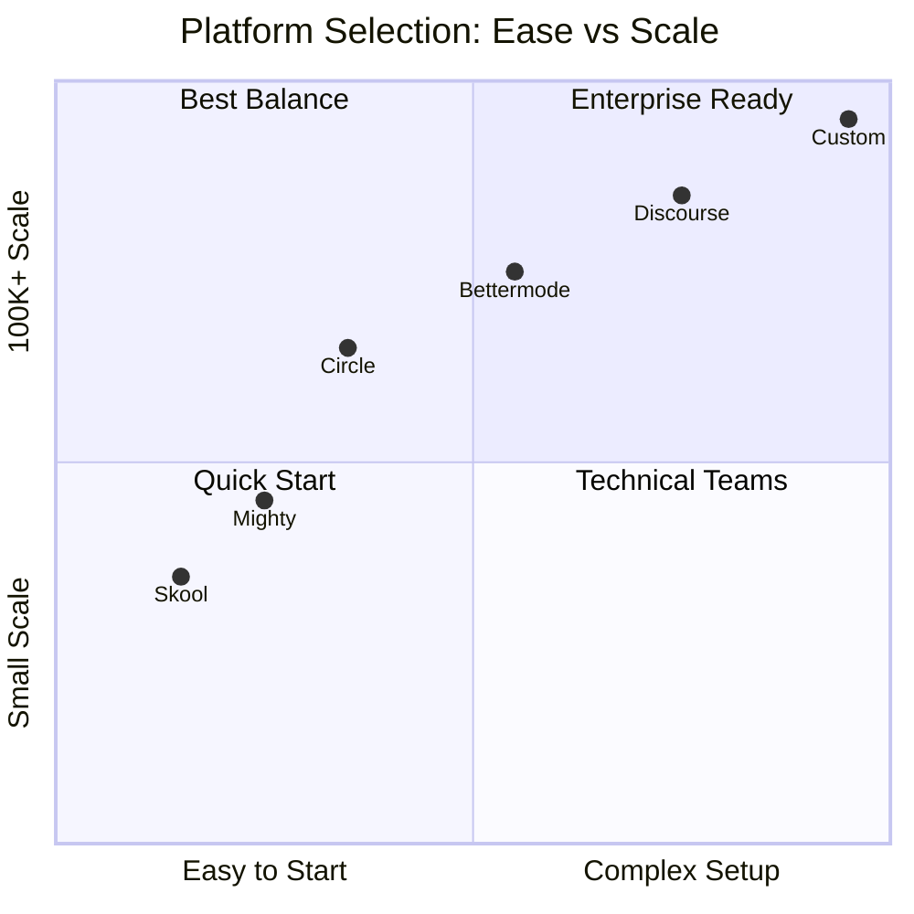
```mermaid
quadrantChart
    title Platform Selection: Ease vs Scale
    x-axis Easy to Start --> Complex Setup
    y-axis Small Scale --> 100K+ Scale
    quadrant-1 Enterprise Ready
    quadrant-2 Best Balance
    quadrant-3 Quick Start
    quadrant-4 Technical Teams
    Skool: [0.15, 0.35]
    Circle: [0.35, 0.65]
    Mighty: [0.25, 0.45]
    Discourse: [0.75, 0.85]
    Bettermode: [0.55, 0.75]
    Custom: [0.95, 0.95]
```

---

## ğŸ—ï¸ Recommended Platform Stack

### For Doctor Side Gigs: Circle Business Plan

Based on the requirements for multi-physician hosting, automation, and scalability, **Circle Business** is the recommended platform.

#### Why Circle?

| Requirement | Circle Solution |
|-------------|-----------------|
| 🠠Native platform | ✅ Full-featured community |
| 👥 Multi-physician hosting | ✅ **Spaces** = Each doctor gets their own space |
| 🤖 Automation | ✅ **Workflows** = Auto-approve, auto-tag, auto-notify |
| 📈 Scale to 100K+ | ✅ Unlimited members |
| 💰 Monetization | ✅ Paid memberships, courses, events |
| 🔌 Integrations | ✅ API + Zapier/Make.com |

#### Recommended Setup

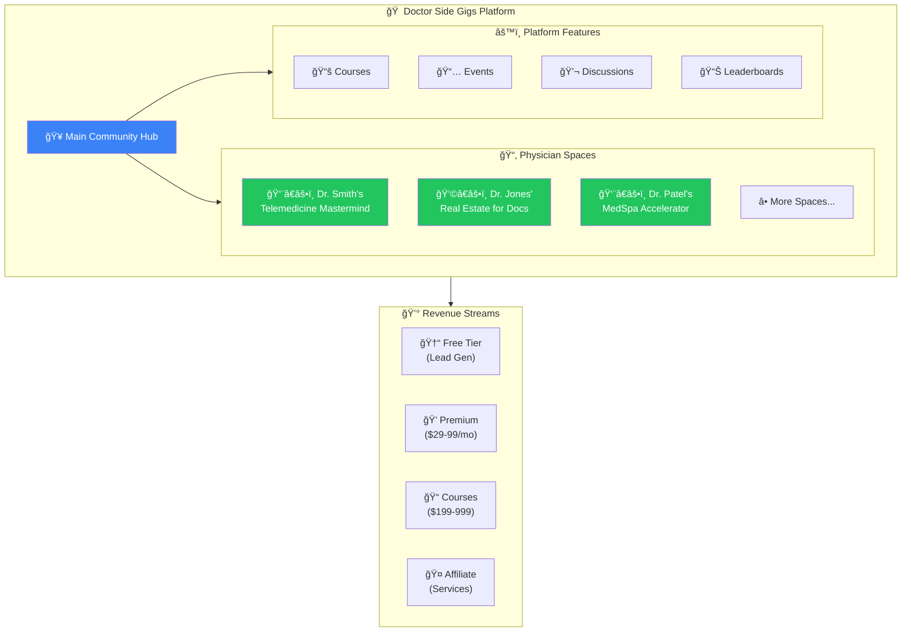
```mermaid
flowchart TD
    subgraph Platform["🠠Doctor Side Gigs Platform"]
        MAIN["🥠Main Community Hub"]

        subgraph Spaces["📂 Physician Spaces"]
            S1["👨â€âš•ï¸ Dr. Smith's\nTelemedicine Mastermind"]
            S2["👩â€âš•ï¸ Dr. Jones'\nReal Estate for Docs"]
            S3["👨â€âš•ï¸ Dr. Patel's\nMedSpa Accelerator"]
            S4["â• More Spaces..."]
        end

        subgraph Features["âš™ï¸ Platform Features"]
            F1["📚 Courses"]
            F2["📅 Events"]
            F3["💬 Discussions"]
            F4["📊 Leaderboards"]
        end
    end

    subgraph Revenue["💰 Revenue Streams"]
        R1["🆓 Free Tier\n(Lead Gen)"]
        R2["💠Premium\n($29-99/mo)"]
        R3["📠Courses\n($199-999)"]
        R4["🤠Affiliate\n(Services)"]
    end

    MAIN --> Spaces
    MAIN --> Features
    Platform --> Revenue

    style MAIN fill:#3b82f6,color:#fff
    style S1 fill:#22c55e,color:#fff
    style S2 fill:#22c55e,color:#fff
    style S3 fill:#22c55e,color:#fff
```

#### Cost Breakdown

| Component | Service | Monthly Cost |
|-----------|---------|-------------|
| 🠠**Platform** | Circle Business | $199/month |
| 📧 **Email Marketing** | ConvertKit/Mailchimp | $29-$79/month |
| 🤖 **Automation** | Make.com or N8N | $9-$24/month |
| 🔠**Analytics** | Built-in + GA4 | $0 |
| | | |
| | **TOTAL** | **$237-$302/month** |

---

## 👥 Multi-Physician Ecosystem Architecture

### The "Physician Host" Model

Allow established physicians to run their own sub-communities within the Doctor Side Gigs ecosystem.

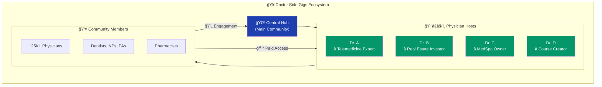
```mermaid
flowchart TD
    subgraph DSG["🥠Doctor Side Gigs Ecosystem"]
        HUB["🌠Central Hub\n(Main Community)"]

        subgraph Hosts["👨â€âš•ï¸ Physician Hosts"]
            H1["Dr. A\nâ­ Telemedicine Expert"]
            H2["Dr. B\nâ­ Real Estate Investor"]
            H3["Dr. C\nâ­ MedSpa Owner"]
            H4["Dr. D\nâ­ Course Creator"]
        end

        subgraph Members["👥 Community Members"]
            M1["125K+ Physicians"]
            M2["Dentists, NPs, PAs"]
            M3["Pharmacists"]
        end
    end

    HUB --> Hosts
    Hosts --> Members
    Members -->|"🔄 Engagement"| HUB
    Members -->|"💰 Paid Access"| Hosts

    style HUB fill:#1e40af,color:#fff
    style H1 fill:#059669,color:#fff
    style H2 fill:#059669,color:#fff
    style H3 fill:#059669,color:#fff
    style H4 fill:#059669,color:#fff
```

### Physician Host Features

| Feature | Description | Benefit |
|---------|-------------|---------|
| 🠠**Own Space** | Dedicated sub-community | Build personal brand |
| 📠**Post & Answer** | Share expertise | Establish authority |
| 🯠**Mastermind Rooms** | Private group coaching | Revenue stream |
| 👥 **Follower System** | Members can follow hosts | Audience building |
| 📊 **Analytics** | Track engagement | Measure impact |
| 💰 **Revenue Share** | Earn from paid content | Incentive alignment |

### Revenue Model for Physician Hosts

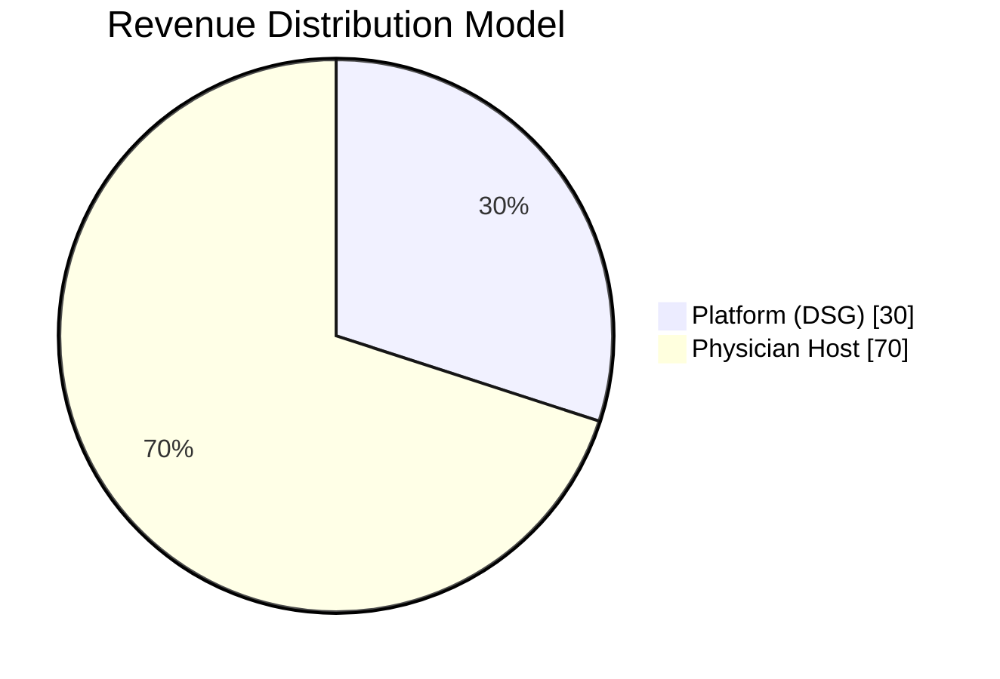
```mermaid
pie showData
    title Revenue Distribution Model
    "Platform (DSG)" : 30
    "Physician Host" : 70
```

| Tier | Price | Platform Cut | Host Earnings |
|------|-------|--------------|---------------|
| Free Space | $0 | N/A | Brand building |
| Premium Space | $29/mo | 30% ($8.70) | 70% ($20.30) |
| Mastermind | $199/mo | 30% ($59.70) | 70% ($139.30) |
| Course | $499 one-time | 30% ($149.70) | 70% ($349.30) |

---

## 📈 Scaling to 100K+ Members

### Growth Architecture


```mermaid
flowchart LR
    subgraph Phase1["📈 Phase 1: 0-10K"]
        P1A["🌱 Seed with FB content"]
        P1B["👥 Invite power users"]
        P1C["📢 Social promotion"]
    end

    subgraph Phase2["📈 Phase 2: 10K-50K"]
        P2A["🯠Physician hosts"]
        P2B["📚 Exclusive content"]
        P2C["🔄 Referral program"]
    end

    subgraph Phase3["📈 Phase 3: 50K-100K+"]
        P3A["📱 Branded mobile app"]
        P3B["🢠Enterprise features"]
        P3C["🌠Multi-specialty expansion"]
    end

    Phase1 --> Phase2 --> Phase3

    style P1A fill:#dcfce7
    style P2A fill:#dbeafe
    style P3A fill:#fef3c7
```

### Platform Scaling Comparison

| Members | Skool | Circle | Mighty | Discourse |
|---------|-------|--------|--------|-----------|
| 1,000 | ✅ Easy | ✅ Easy | ✅ Easy | ✅ Easy |
| 10,000 | ✅ Good | ✅ Good | ✅ Good | ✅ Good |
| 50,000 | âš ï¸ Limits | ✅ Good | ✅ Good | ✅ Excellent |
| 100,000+ | âš ï¸ Limits | ✅ Possible | âš ï¸ Slow | ✅ Excellent |

### Engagement & Retention Strategies

| Strategy | Implementation | Expected Impact |
|----------|----------------|-----------------|
| 🮠**Gamification** | Points, badges, leaderboards | +40% engagement |
| 📧 **Email Digests** | Weekly highlights | +25% return visits |
| 🔔 **Smart Notifications** | Personalized alerts | +30% daily active |
| 🆠**Challenges** | Monthly competitions | +50% posting |
| 👥 **Peer Matching** | Connect similar members | +35% retention |

---

## 🤖 Automation Strategy

### The Competitor Problem

> *"The other doctor who runs a physician side gigs community has to approve every post and I'm sure she has a virtual assistant"*

### Your Automation Advantage

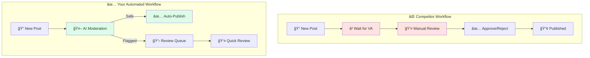
```mermaid
flowchart TD
    subgraph Competitor["⌠Competitor Workflow"]
        C1["📠New Post"] --> C2["ⳠWait for VA"]
        C2 --> C3["👤 Manual Review"]
        C3 --> C4["✅ Approve/Reject"]
        C4 --> C5["📢 Published"]
    end

    subgraph Yours["✅ Your Automated Workflow"]
        Y1["📠New Post"] --> Y2["🤖 AI Moderation"]
        Y2 -->|"Safe"| Y3["✅ Auto-Publish"]
        Y2 -->|"Flagged"| Y4["📋 Review Queue"]
        Y4 --> Y5["👤 Quick Review"]
    end

    style C2 fill:#fee2e2
    style C3 fill:#fee2e2
    style Y2 fill:#dcfce7
    style Y3 fill:#dcfce7
```

### Automation Stack

| Layer | Tool | Cost | Function |
|-------|------|------|----------|
| 🠠**Platform** | Circle (Workflows) | Included | Auto-tagging, notifications |
| 🤖 **AI Moderation** | OpenAI API | ~$20/mo | Content screening |
| 🔗 **Integration** | Make.com/N8N | $24/mo | Connect everything |
| 📧 **Email** | ConvertKit | $29/mo | Automated sequences |
| 📊 **Analytics** | Mixpanel Free | $0 | User behavior |

### Automated Workflows to Implement

#### 1. New Member Onboarding
```
Trigger: New member joins
→ Send welcome email
→ Assign "New Member" badge
→ Add to onboarding sequence
→ Notify relevant space hosts
```

#### 2. Content Auto-Moderation
```
Trigger: New post created
→ AI scans for spam/inappropriate content
→ If clean: Auto-publish + notify followers
→ If flagged: Queue for 5-min human review
→ Apply auto-tags based on content
```

#### 3. Engagement Boosters
```
Trigger: Member inactive 7 days
→ Send personalized "We miss you" email
→ Highlight popular discussions they'd like
→ Offer exclusive content preview
```

#### 4. Physician Host Alerts
```
Trigger: Question in host's specialty
→ Notify host immediately
→ If no response in 4hrs: Escalate
→ Track response rates for leaderboard
```

### Automation Cost Summary

| Component | Monthly Cost |
|-----------|-------------|
| Circle Workflows | $0 (included in Business) |
| Make.com Pro | $24 |
| OpenAI API (moderation) | $20 |
| ConvertKit (10K contacts) | $79 |
| **TOTAL** | **~$123/mo** |

---

## 💰 Monetization & Upsell Opportunities

### Revenue Streams Architecture

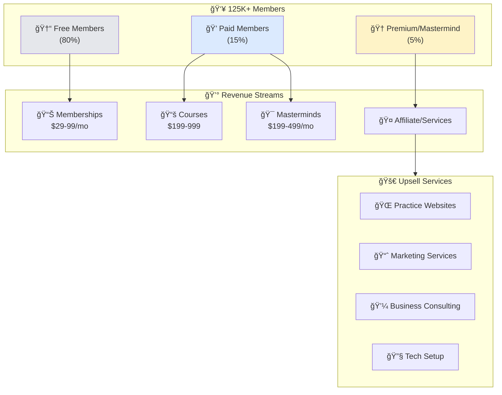
```mermaid
flowchart TD
    subgraph Members["👥 125K+ Members"]
        FREE["🆓 Free Members\n(80%)"]
        PAID["💠Paid Members\n(15%)"]
        PREMIUM["🆠Premium/Mastermind\n(5%)"]
    end

    subgraph Revenue["💰 Revenue Streams"]
        R1["📊 Memberships\n$29-99/mo"]
        R2["📚 Courses\n$199-999"]
        R3["🯠Masterminds\n$199-499/mo"]
        R4["🤠Affiliate/Services"]
    end

    subgraph Upsell["🚀 Upsell Services"]
        U1["🌠Practice Websites"]
        U2["📈 Marketing Services"]
        U3["💼 Business Consulting"]
        U4["🔧 Tech Setup"]
    end

    FREE --> R1
    PAID --> R2
    PAID --> R3
    PREMIUM --> R4
    R4 --> Upsell

    style FREE fill:#e5e7eb
    style PAID fill:#dbeafe
    style PREMIUM fill:#fef3c7
```

### Revenue Projections

| Metric | Conservative | Moderate | Aggressive |
|--------|--------------|----------|------------|
| **Total Members** | 50,000 | 100,000 | 150,000 |
| **Paid Conversion** | 5% | 10% | 15% |
| **Avg. Monthly/Member** | $39 | $49 | $59 |
| **Monthly Revenue** | $97,500 | $490,000 | $1,327,500 |
| **Platform Costs** | $500 | $1,000 | $2,000 |
| **Net Monthly** | $97,000 | $489,000 | $1,325,500 |

### Affiliate & Service Upsells

| Service | Potential Partners | Commission |
|---------|-------------------|------------|
| 🌠**Practice Websites** | Freelancers/Agencies | 20-30% |
| 📧 **Email Marketing** | ConvertKit, Mailchimp | 30% recurring |
| 💼 **LLC Formation** | LegalZoom, Incfile | $50-100/signup |
| 📊 **Accounting** | Bench, QuickBooks | 20% first year |
| 🥠**Malpractice Insurance** | Various providers | $100-500/policy |
| 💻 **Telemedicine Platforms** | Doxy.me, VSee | 15-25% |

### Upsell Funnel

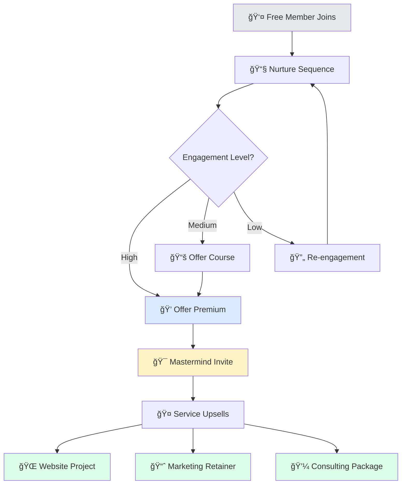
```mermaid
flowchart TD
    A["👤 Free Member Joins"] --> B["📧 Nurture Sequence"]
    B --> C{"Engagement Level?"}
    C -->|High| D["💠Offer Premium"]
    C -->|Medium| E["📚 Offer Course"]
    C -->|Low| F["🔄 Re-engagement"]

    D --> G["🯠Mastermind Invite"]
    E --> D
    F --> B

    G --> H["🤠Service Upsells"]
    H --> I["🌠Website Project"]
    H --> J["📈 Marketing Retainer"]
    H --> K["💼 Consulting Package"]

    style A fill:#e5e7eb
    style D fill:#dbeafe
    style G fill:#fef3c7
    style I fill:#dcfce7
    style J fill:#dcfce7
    style K fill:#dcfce7
```

---

## â“ Is Facebook Scraping Still Necessary?

### Honest Assessment

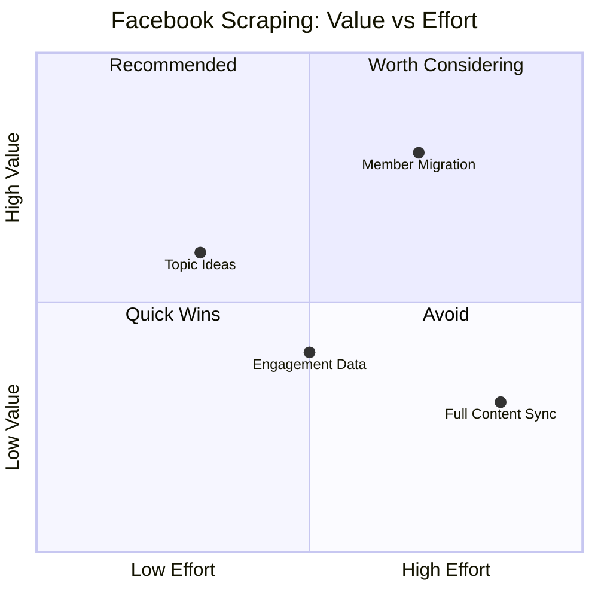
```mermaid
quadrantChart
    title Facebook Scraping: Value vs Effort
    x-axis Low Effort --> High Effort
    y-axis Low Value --> High Value
    quadrant-1 Worth Considering
    quadrant-2 Recommended
    quadrant-3 Quick Wins
    quadrant-4 Avoid
    "Topic Ideas": [0.3, 0.6]
    "Full Content Sync": [0.85, 0.3]
    "Engagement Data": [0.5, 0.4]
    "Member Migration": [0.7, 0.8]
```

### Recommendation: **Reduce Priority**

| Use Case | Recommendation | Reasoning |
|----------|----------------|-----------|
| 🌱 **Seed initial content** | ✅ Yes, limited | Good for launch momentum |
| 📊 **Ongoing topic ideas** | âš ï¸ Optional | Your community will generate its own |
| 🔄 **Full content sync** | ⌠No | Too risky, low ROI |
| 👥 **Member recruitment** | ✅ Yes, manual | Invite FB group members directly |

### Better Alternatives to Scraping

| Instead of... | Do This |
|---------------|---------|
| Scraping posts | Post engaging questions yourself |
| Copying discussions | Invite FB members to continue discussions on your platform |
| Automated sync | Manual "best of" curation monthly |
| Topic detection | Use polls/surveys in your community |

### Scraping as Optional Add-On

If you still want topic inspiration from the FB group:

| Approach | Cost | Effort | Risk |
|----------|------|--------|------|
| 💰 **Budget** (Part 1) | $6-12/mo | Low | Low |
| 🙅 **Skip entirely** | $0 | None | None |

**Verdict:** Scraping can be a $6-12/month add-on for topic ideas, but it's **not essential** for building a successful community platform. Focus resources on the native platform.

---

## ğŸ—ºï¸ Implementation Roadmap

### Phase Overview

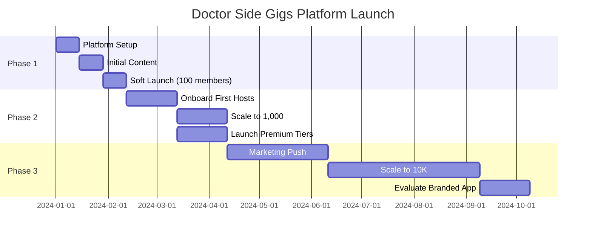
```mermaid
gantt
    title Doctor Side Gigs Platform Launch
    dateFormat  YYYY-MM-DD
    section Phase 1
    Platform Setup           :p1, 2024-01-01, 14d
    Initial Content          :p2, after p1, 14d
    Soft Launch (100 members):p3, after p2, 14d
    section Phase 2
    Onboard First Hosts      :p4, after p3, 30d
    Scale to 1,000           :p5, after p4, 30d
    Launch Premium Tiers     :p6, after p4, 30d
    section Phase 3
    Marketing Push           :p7, after p6, 60d
    Scale to 10K             :p8, after p7, 90d
    Evaluate Branded App     :p9, after p8, 30d
```

### Detailed Implementation Steps

#### 🚀 Phase 1: Foundation (Weeks 1-6)

| Week | Task | Owner | Cost |
|------|------|-------|------|
| 1-2 | Set up Circle Business account | Admin | $199/mo |
| 1-2 | Configure Spaces architecture | Admin | - |
| 2-3 | Set up automation workflows | Tech | $50/mo |
| 3-4 | Create initial seed content (50 posts) | Content | - |
| 4-5 | Invite 100 beta members from FB group | Marketing | - |
| 5-6 | Gather feedback, iterate | All | - |

**Phase 1 Budget: ~$250/month**

#### 📈 Phase 2: Growth (Weeks 7-18)

| Week | Task | Owner | Cost |
|------|------|-------|------|
| 7-8 | Recruit 3-5 Physician Hosts | Admin | Revenue share |
| 8-10 | Launch premium membership tier | Admin | - |
| 10-12 | Implement referral program | Marketing | $0-50/mo |
| 12-14 | Scale to 1,000 members | Marketing | Ad spend |
| 14-18 | Launch first courses | Hosts | Revenue share |

**Phase 2 Budget: ~$300-500/month + ad spend**

#### 🆠Phase 3: Scale (Weeks 19+)

| Milestone | Task | Budget |
|-----------|------|--------|
| 5K members | Evaluate Circle Enterprise | $399/mo |
| 10K members | Consider branded mobile app | ~$30K/year |
| 25K members | Add more Physician Hosts | Revenue share |
| 50K members | Explore Discourse migration if needed | TBD |
| 100K members | Full enterprise infrastructure | TBD |

### Launch Checklist

#### Pre-Launch ✅
- [ ] Circle Business account created
- [ ] Main community space configured
- [ ] 3-5 physician host spaces created
- [ ] Automation workflows active
- [ ] Welcome email sequence ready
- [ ] 50+ seed posts published
- [ ] Pricing tiers configured
- [ ] Payment processing connected

#### Soft Launch ✅
- [ ] 100 beta members invited
- [ ] Feedback collected and implemented
- [ ] First physician host actively posting
- [ ] Premium tier tested with 5-10 users
- [ ] Mobile experience verified

#### Public Launch ✅
- [ ] Announcement to FB group (if allowed)
- [ ] Email to existing contacts
- [ ] Social media campaign
- [ ] Referral program active
- [ ] Press/podcast outreach

---

## 📊 Success Metrics

### Key Performance Indicators

| Metric | Target (6 mo) | Target (12 mo) |
|--------|---------------|----------------|
| 👥 **Total Members** | 5,000 | 25,000 |
| 📈 **Monthly Active** | 40% | 50% |
| 💬 **Posts/Week** | 500 | 2,000 |
| 💰 **Paid Conversion** | 5% | 10% |
| 🔄 **Retention (30-day)** | 60% | 75% |
| 👨â€âš•ï¸ **Physician Hosts** | 5 | 20 |
| 💵 **Monthly Revenue** | $7,500 | $75,000 |

---

## 📚 Resources & Links (Part 2)

### Platform Links

| Platform | Website | Pricing |
|----------|---------|---------|
| Circle | [circle.so](https://circle.so) | [Pricing](https://circle.so/pricing) |
| Skool | [skool.com](https://skool.com) | $99/mo flat |
| Mighty Networks | [mightynetworks.com](https://mightynetworks.com) | [Pricing](https://www.mightynetworks.com/pricing) |
| Discourse | [discourse.org](https://discourse.org) | [Pricing](https://www.discourse.org/pricing) |

### Automation Tools

| Tool | Website | Use Case |
|------|---------|----------|
| Make.com | [make.com](https://make.com) | Workflow automation |
| N8N | [n8n.io](https://n8n.io) | Self-hosted automation |
| Zapier | [zapier.com](https://zapier.com) | Simple integrations |
| OpenAI | [openai.com](https://openai.com) | AI moderation |

---

<div align="center">

---

**📄 Document Version:** 2.0
**📅 Last Updated:** December 2024
**💰 Pricing Verified:** December 2024

*Prices are subject to change. Always verify current pricing on vendor websites.*

---

**🥠Doctor Side Gigs — Building the #1 Hub for Physician Extra Income**

---

</div>
