# 🔍 Platform Comparison: Circle vs Lovable AI vs Custom Build

## 🏥 Doctor Side Gigs Platform Options

**Which Platform Should You Choose?**

*Complete feature breakdown • Honest pros & cons • What you CAN and CAN'T do*

---

## 📋 Table of Contents

1. [Quick Overview](#-quick-overview)
2. [Circle.so - Detailed Analysis](#-circleso---detailed-analysis)
3. [Lovable AI - Detailed Analysis](#-lovable-ai---detailed-analysis)
4. [Custom Build - Detailed Analysis](#-custom-build---detailed-analysis)
5. [Feature-by-Feature Comparison](#-feature-by-feature-comparison)
6. [What You CAN and CAN'T Do](#-what-you-can-and-cant-do)
7. [Cost Comparison](#-cost-comparison)
8. [Decision Matrix](#-decision-matrix)
9. [Final Recommendation](#-final-recommendation)

---

## 🎯 Quick Overview

### What Are These Platforms?

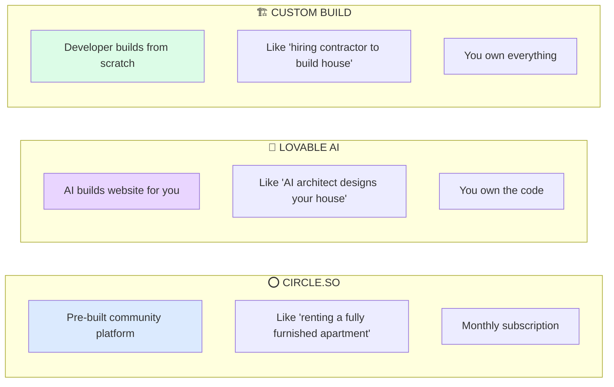

### At-a-Glance Comparison

| Factor | ⭕ Circle | 💜 Lovable AI | 🏗️ Custom Build |
|--------|----------|---------------|-----------------|
| **What is it?** | Ready-made community platform | AI website builder | Developer-built platform |
| **Cost** | $99-399/mo + setup | $0-50/mo + setup | $12-18K one-time |
| **Setup Time** | 2-4 weeks | 1-2 weeks | 10-14 weeks |
| **Technical Skill Needed** | None | Low | None (developer handles) |
| **Ownership** | ❌ Rent platform | ✅ Own code | ✅ Own everything |
| **Customization** | Limited | Medium | Unlimited |
| **Best For** | Quick launch, proven model | Simple sites, MVPs | Long-term, serious business |

---

## ⭕ Circle.so - Detailed Analysis

### What is Circle?

> **Circle.so** is a ready-made community platform. Think of it like moving into a fully furnished apartment — everything is already set up, you just customize the decorations.

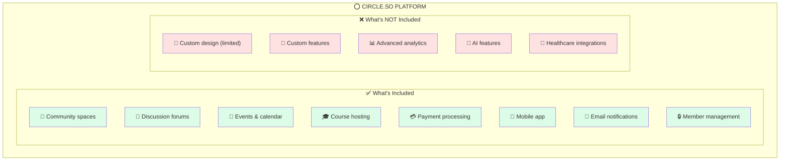

### Circle Pricing

| Plan | Monthly Cost | What You Get |
|------|-------------|--------------|
| **Professional** | $99/mo | 3 admins, basic features, 2% transaction fee |
| **Business** | $199/mo | 5 admins, workflows, API access, 1% fee |
| **Enterprise** | $399/mo | 10 admins, SSO, priority support, 0.5% fee |

**Total Cost for Doctor Side Gigs:**
- Setup: $5,000 - $7,500 (one-time)
- Monthly: $199/mo (Business plan recommended)
- Transaction fees: 1% of all payments

---

### ✅ What You CAN Do with Circle

| Feature | Details | Rating |
|---------|---------|--------|
| 👥 **Create community spaces** | Multiple sub-communities for different topics | ⭐⭐⭐⭐⭐ |
| 💬 **Discussion forums** | Posts, comments, threads, rich text | ⭐⭐⭐⭐⭐ |
| 📅 **Host events** | Live events, AMAs, calendar integration | ⭐⭐⭐⭐⭐ |
| 🎓 **Sell courses** | Built-in course platform, video hosting | ⭐⭐⭐⭐ |
| 💎 **Membership tiers** | Free, paid, multiple levels | ⭐⭐⭐⭐⭐ |
| 💳 **Collect payments** | Stripe integration, subscriptions | ⭐⭐⭐⭐ |
| 📱 **Mobile app** | Native iOS/Android app included | ⭐⭐⭐⭐⭐ |
| 📧 **Send emails** | Basic notifications and digests | ⭐⭐⭐ |
| 🔄 **Automations** | Workflows (on Business plan) | ⭐⭐⭐⭐ |
| 🎮 **Gamification** | Points, badges, leaderboards | ⭐⭐⭐⭐ |
| 🔗 **Integrations** | Zapier, Make.com, API access | ⭐⭐⭐⭐ |
| 🎨 **Basic branding** | Logo, colors, cover images | ⭐⭐⭐ |

---

### ❌ What You CAN'T Do with Circle

| Limitation | Why It Matters | Workaround |
|------------|----------------|------------|
| 🎨 **Custom design** | Can't change layout, fonts, or structure | Limited to their templates |
| 📋 **Job board** | No built-in job listing feature | Use external tool + embed |
| 🔐 **Credential verification** | Can't verify doctor licenses | Manual process |
| 📊 **Custom analytics** | Limited to their reports | Export data, analyze elsewhere |
| 🤖 **AI features** | No AI matching, recommendations | Build separately |
| 🏥 **EMR integration** | Can't connect to hospital systems | Not possible |
| 📅 **Shift scheduling** | No doctor-specific scheduling | Use external tool |
| 💼 **Service marketplace** | Can't list/sell services | Not possible |
| 🎯 **White-labeling** | Always shows Circle branding (unless $30K+ app) | Pay extra $30K/year |
| 📱 **Custom mobile app** | Stuck with Circle's app design | Pay $30K+/year for branded app |
| 🔒 **Data portability** | Hard to export and leave | Locked in |
| 💰 **Transaction fees** | 0.5-2% on all payments FOREVER | Can't avoid |

---

### Circle: Pros & Cons Summary

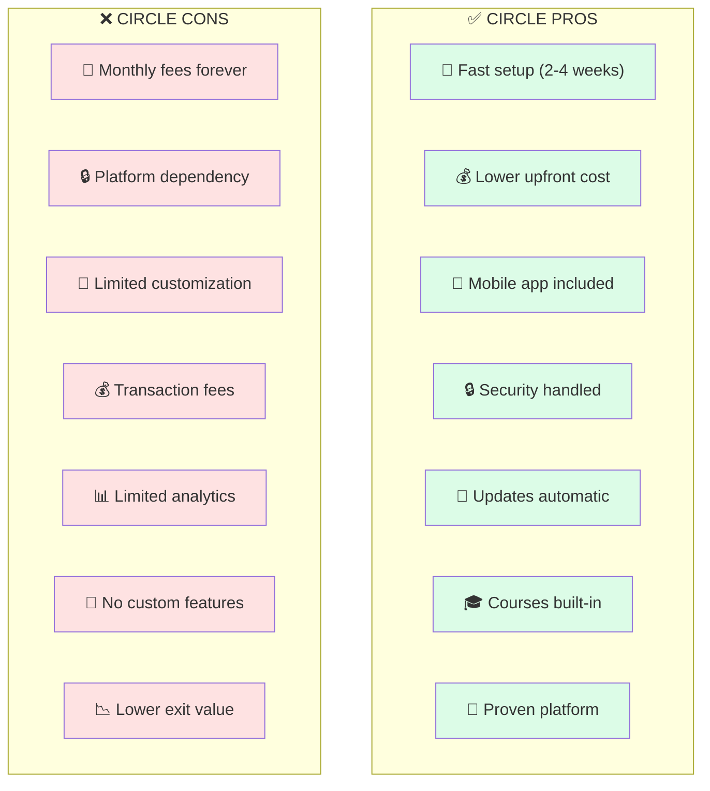

---

## 💜 Lovable AI - Detailed Analysis

### What is Lovable AI?

> **Lovable AI** (formerly GPT Engineer) is an AI tool that builds websites and web apps from text descriptions. Think of it like having an AI architect design your house — fast and cheap, but limited complexity.

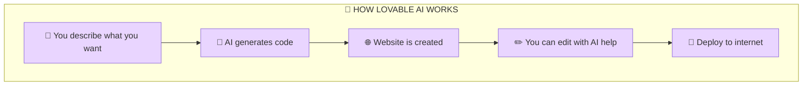

### Lovable AI Pricing

| Plan | Monthly Cost | What You Get |
|------|-------------|--------------|
| **Free** | $0/mo | Limited generations, basic features |
| **Starter** | $20/mo | More generations, deploy to web |
| **Pro** | $50/mo | Unlimited, custom domains, priority |

**Total Cost for Doctor Side Gigs:**
- Setup: $2,000 - $5,000 (developer time to refine)
- Monthly: $20-50/mo (Lovable subscription)
- Hosting: $0-50/mo (Vercel/Netlify)

---

### ✅ What You CAN Do with Lovable AI

| Feature | Details | Rating |
|---------|---------|--------|
| 🌐 **Create website** | Landing pages, basic web apps | ⭐⭐⭐⭐ |
| 🎨 **Custom design** | AI generates unique designs | ⭐⭐⭐⭐ |
| 📝 **Basic forms** | Contact forms, email capture | ⭐⭐⭐⭐ |
| 🔗 **API connections** | Connect to external services | ⭐⭐⭐ |
| 📱 **Responsive design** | Works on mobile | ⭐⭐⭐⭐ |
| 💻 **Own the code** | Export and host anywhere | ⭐⭐⭐⭐⭐ |
| 🚀 **Fast prototypes** | Build MVPs quickly | ⭐⭐⭐⭐⭐ |
| ✏️ **AI editing** | Ask AI to make changes | ⭐⭐⭐⭐ |

---

### ❌ What You CAN'T Do with Lovable AI

| Limitation | Why It Matters | Reality |
|------------|----------------|---------|
| 👥 **Full community platform** | Can't build Circle-like communities | Need separate backend |
| 💬 **Real-time chat** | No built-in messaging | Complex to add |
| 💳 **Payment processing** | Basic Stripe only | Limited features |
| 🔐 **User authentication** | Basic login only | Security concerns |
| 🗄️ **Database management** | Limited data handling | Need developer help |
| 📱 **Mobile app** | Only web, no native apps | Not possible |
| 🎓 **Course platform** | No video hosting/progress | Need external tool |
| 🔄 **Complex automation** | Limited logic | Need developer |
| 🏥 **HIPAA compliance** | No healthcare security | Risky for doctors |
| 📊 **Advanced analytics** | Basic only | Need separate tool |
| 👥 **Multi-user management** | Limited admin features | Basic only |
| 🔌 **Complex integrations** | AI has limits | May break |

---

### Lovable AI: Honest Reality Check

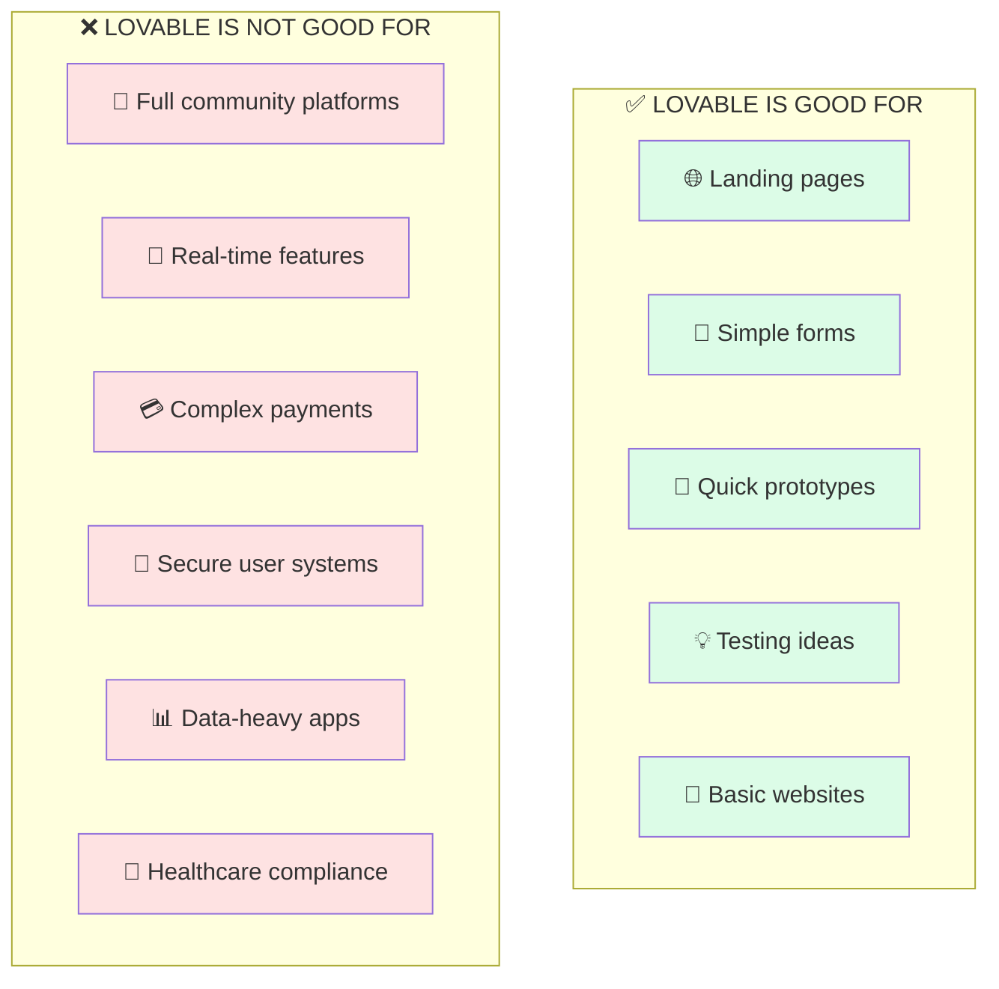

### ⚠️ Lovable AI Warning for Doctor Side Gigs

> **Honest Assessment:** Lovable AI is great for simple websites and landing pages, but it **cannot** build a full community platform like what you need. You would still need:
> - A backend developer
> - Database setup
> - Authentication system
> - Payment processing
> - Community features
>
> **Verdict:** Lovable could build your LANDING PAGE, but not your COMMUNITY PLATFORM.

---

## 🏗️ Custom Build - Detailed Analysis

### What is Custom Build?

> **Custom Build** means hiring a developer (me) to build your platform from scratch using professional code. Think of it like hiring a contractor to build your dream house — takes longer, costs more upfront, but you own it forever and can customize anything.

```mermaid
flowchart TD
    subgraph CustomPlatform["🏗️ CUSTOM BUILD PLATFORM"]
        subgraph Core["🏠 Core Features (Included)"]
            C1["👤 User system & auth"]
            C2["💬 Community forums"]
            C3["📂 Spaces/groups"]
            C4["💳 Stripe payments"]
            C5["💎 Membership tiers"]
            C6["📋 Job board"]
            C7["📧 Email automation"]
            C8["⚙️ Admin dashboard"]
            C9["🛡️ Moderation tools"]
            C10["📊 Analytics"]
        end

        subgraph Future["🔮 Can Add Later"]
            F1["📱 Mobile app"]
            F2["🎓 Course platform"]
            F3["🤖 AI features"]
            F4["🏥 Telemedicine"]
            F5["💼 Marketplace"]
            F6["🔐 Credential verification"]
            F7["📅 Shift scheduling"]
            F8["🎯 White-label"]
        end
    end

    Core --> Future

    style C1 fill:#dcfce7
    style C2 fill:#dcfce7
    style C3 fill:#dcfce7
    style C4 fill:#dcfce7
    style C5 fill:#dcfce7
    style C6 fill:#dcfce7
    style C7 fill:#dcfce7
    style C8 fill:#dcfce7
    style C9 fill:#dcfce7
    style C10 fill:#dcfce7
    style F1 fill:#dbeafe
    style F2 fill:#dbeafe
    style F3 fill:#dbeafe
    style F4 fill:#dbeafe
    style F5 fill:#dbeafe
    style F6 fill:#dbeafe
    style F7 fill:#dbeafe
    style F8 fill:#dbeafe
```

### Custom Build Pricing

| Phase | Cost | What You Get |
|-------|------|--------------|
| **Phase 1: Core Platform** | $12,000 - $15,000 | Full community, payments, job board |
| **Phase 2: Advanced (optional)** | $4,000 - $8,000 | Courses, enhanced features |
| **Phase 3: Mobile (optional)** | $8,000 - $12,000 | iOS & Android apps |

**Total Cost for Doctor Side Gigs:**
- Setup: $12,000 - $18,000 (one-time)
- Monthly: $50 - $150/mo (hosting, email, etc.)
- Transaction fees: 2.9% Stripe only (no platform cut)

---

### ✅ What You CAN Do with Custom Build

| Feature | Details | Rating |
|---------|---------|--------|
| 👥 **Full community platform** | Forums, spaces, discussions | ⭐⭐⭐⭐⭐ |
| 🎨 **100% custom design** | Unique look, your brand | ⭐⭐⭐⭐⭐ |
| 📋 **Job board** | Built-in job listings | ⭐⭐⭐⭐⭐ |
| 💳 **Payments (no platform fee)** | Only Stripe's 2.9% | ⭐⭐⭐⭐⭐ |
| 💎 **Unlimited membership tiers** | Any pricing structure | ⭐⭐⭐⭐⭐ |
| 📧 **Advanced email automation** | Complex sequences | ⭐⭐⭐⭐⭐ |
| 📊 **Custom analytics** | Track exactly what matters | ⭐⭐⭐⭐⭐ |
| 🔐 **Credential verification** | Verify doctor licenses | ⭐⭐⭐⭐⭐ |
| 🤖 **AI features** | Gig matching, recommendations | ⭐⭐⭐⭐⭐ |
| 🏥 **Healthcare integrations** | EMR, telemedicine | ⭐⭐⭐⭐⭐ |
| 📅 **Shift scheduling** | Doctor-specific features | ⭐⭐⭐⭐⭐ |
| 💼 **Service marketplace** | Buy/sell services | ⭐⭐⭐⭐⭐ |
| 🎯 **White-label** | License to others | ⭐⭐⭐⭐⭐ |
| 📈 **Sell the platform** | 3-5x higher exit value | ⭐⭐⭐⭐⭐ |
| 🔒 **Full data ownership** | Your data, your servers | ⭐⭐⭐⭐⭐ |

---

### ❌ What You CAN'T Do with Custom Build (Initially)

| Limitation | Why | Solution |
|------------|-----|----------|
| 📱 **Mobile app (Day 1)** | Takes extra time/cost | Add in Phase 2 ($8-12K) |
| 🎓 **Course platform (Day 1)** | Takes extra time/cost | Add in Phase 2 ($4-6K) |
| 🚀 **Launch in 2 weeks** | Takes 10-14 weeks | Plan ahead |
| 🔄 **Instant updates** | Need developer for changes | Hire for updates |
| 🛡️ **Zero maintenance** | Needs occasional updates | Budget $50-100/mo |

---

### Custom Build: Pros & Cons Summary

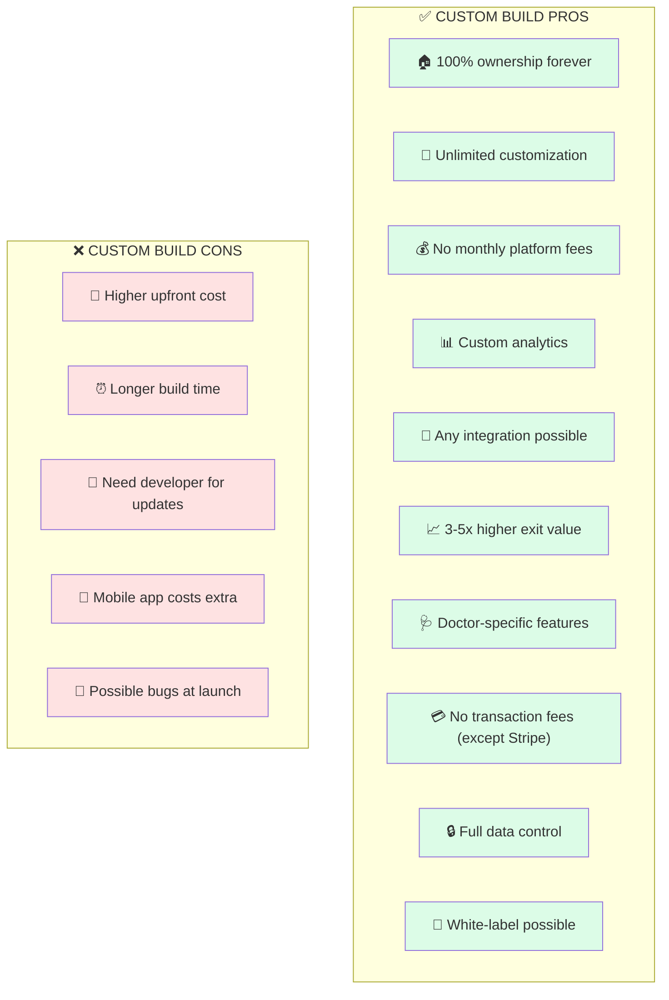

---

## 📊 Feature-by-Feature Comparison

### Complete Feature Matrix

| Feature | ⭕ Circle | 💜 Lovable AI | 🏗️ Custom |
|---------|:--------:|:-------------:|:---------:|
| **COMMUNITY** | | | |
| Discussion forums | ✅ Full | ❌ No | ✅ Full |
| Multiple spaces/groups | ✅ Full | ❌ No | ✅ Full |
| Member profiles | ✅ Good | ⚠️ Basic | ✅ Full |
| Direct messaging | ✅ Full | ❌ No | ✅ Full |
| @mentions & notifications | ✅ Full | ❌ No | ✅ Full |
| **CONTENT** | | | |
| Posts & comments | ✅ Full | ❌ No | ✅ Full |
| Rich text editor | ✅ Good | ⚠️ Basic | ✅ Full |
| Image/video uploads | ✅ Full | ⚠️ Basic | ✅ Full |
| Content moderation | ✅ Good | ❌ No | ✅ Full |
| **MONETIZATION** | | | |
| Membership tiers | ✅ Full | ❌ No | ✅ Full |
| One-time payments | ✅ Full | ⚠️ Basic | ✅ Full |
| Subscriptions | ✅ Full | ❌ No | ✅ Full |
| Transaction fees | ⚠️ 0.5-2% | ⚠️ Stripe only | ✅ Stripe only |
| Job board | ❌ No | ❌ No | ✅ Full |
| Service marketplace | ❌ No | ❌ No | ✅ Possible |
| **ENGAGEMENT** | | | |
| Gamification | ✅ Good | ❌ No | ✅ Full |
| Events & calendar | ✅ Full | ❌ No | ✅ Full |
| Live streaming | ✅ Full | ❌ No | ⚠️ Integration |
| Email notifications | ✅ Good | ⚠️ Basic | ✅ Full |
| **LEARNING** | | | |
| Course hosting | ✅ Full | ❌ No | ⚠️ Add later |
| Video hosting | ✅ Full | ❌ No | ⚠️ Add later |
| Progress tracking | ✅ Full | ❌ No | ⚠️ Add later |
| Certificates | ⚠️ Basic | ❌ No | ✅ Full |
| **MOBILE** | | | |
| Mobile app | ✅ Included | ❌ Web only | ⚠️ Add later |
| Responsive web | ✅ Full | ✅ Full | ✅ Full |
| Push notifications | ✅ Full | ❌ No | ⚠️ Add later |
| **CUSTOMIZATION** | | | |
| Custom branding | ⚠️ Limited | ✅ Full | ✅ Full |
| Custom features | ❌ No | ⚠️ Limited | ✅ Unlimited |
| Custom integrations | ⚠️ API only | ⚠️ Limited | ✅ Unlimited |
| Custom analytics | ❌ Limited | ❌ No | ✅ Full |
| **DOCTOR-SPECIFIC** | | | |
| Credential verification | ❌ No | ❌ No | ✅ Possible |
| Shift scheduling | ❌ No | ❌ No | ✅ Possible |
| EMR integration | ❌ No | ❌ No | ✅ Possible |
| HIPAA considerations | ⚠️ Limited | ❌ No | ✅ Possible |
| **OWNERSHIP** | | | |
| Own the code | ❌ No | ✅ Yes | ✅ Yes |
| Own the data | ⚠️ Partial | ✅ Yes | ✅ Yes |
| Exit value | ⚠️ 1-2x | ⚠️ 2-3x | ✅ 3-5x |
| No platform dependency | ❌ No | ✅ Yes | ✅ Yes |

**Legend:** ✅ Full support | ⚠️ Limited/Partial | ❌ Not available

---

## 🚫 What You CAN and CAN'T Do

### Visual Summary

```mermaid
flowchart TD
    subgraph Circle["⭕ CIRCLE"]
        subgraph CircleCan["✅ CAN DO"]
            CC1["Community forums"]
            CC2["Membership tiers"]
            CC3["Events & courses"]
            CC4["Mobile app"]
        end
        subgraph CircleCant["❌ CAN'T DO"]
            CCN1["Custom features"]
            CCN2["Job board"]
            CCN3["Doctor verification"]
            CCN4["Own the platform"]
        end
    end

    subgraph Lovable["💜 LOVABLE"]
        subgraph LovableCan["✅ CAN DO"]
            LC1["Landing pages"]
            LC2["Simple forms"]
            LC3["Basic websites"]
            LC4["Own the code"]
        end
        subgraph LovableCant["❌ CAN'T DO"]
            LCN1["Full community"]
            LCN2["Real-time features"]
            LCN3["Complex payments"]
            LCN4["Mobile apps"]
        end
    end

    subgraph Custom["🏗️ CUSTOM"]
        subgraph CustomCan["✅ CAN DO"]
            CUC1["Everything above"]
            CUC2["Custom features"]
            CUC3["Doctor-specific tools"]
            CUC4["Full ownership"]
        end
        subgraph CustomCant["❌ CAN'T DO (initially)"]
            CUCN1["Mobile app Day 1"]
            CUCN2["Launch in 2 weeks"]
            CUCN3["Zero maintenance"]
        end
    end

    style CC1 fill:#dcfce7
    style CC2 fill:#dcfce7
    style CC3 fill:#dcfce7
    style CC4 fill:#dcfce7
    style CCN1 fill:#fee2e2
    style CCN2 fill:#fee2e2
    style CCN3 fill:#fee2e2
    style CCN4 fill:#fee2e2

    style LC1 fill:#dcfce7
    style LC2 fill:#dcfce7
    style LC3 fill:#dcfce7
    style LC4 fill:#dcfce7
    style LCN1 fill:#fee2e2
    style LCN2 fill:#fee2e2
    style LCN3 fill:#fee2e2
    style LCN4 fill:#fee2e2

    style CUC1 fill:#dcfce7
    style CUC2 fill:#dcfce7
    style CUC3 fill:#dcfce7
    style CUC4 fill:#dcfce7
    style CUCN1 fill:#fef3c7
    style CUCN2 fill:#fef3c7
    style CUCN3 fill:#fef3c7
```

---

## 💰 Cost Comparison

### Upfront Costs

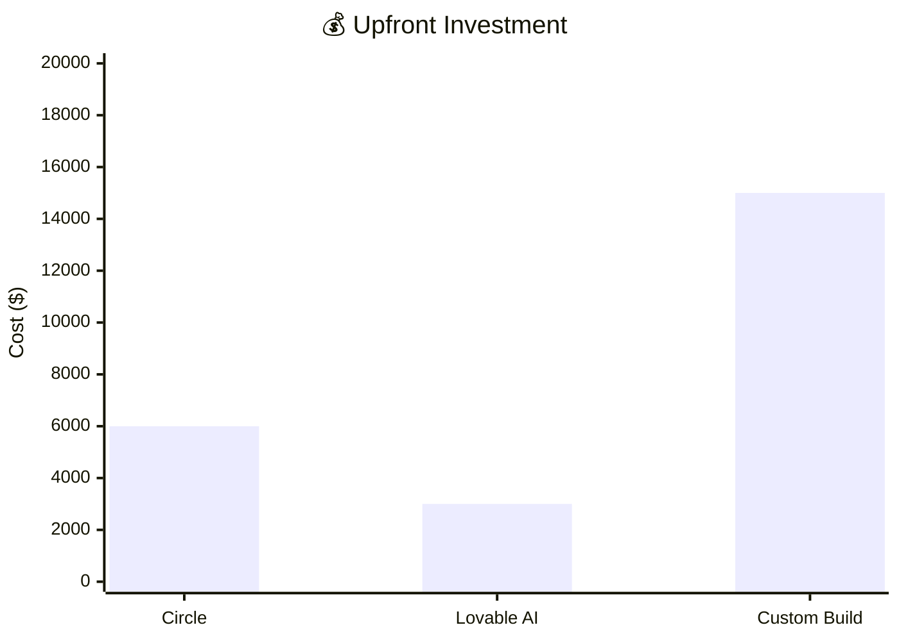

| Platform | Setup/Development | What You Get |
|----------|------------------|--------------|
| ⭕ **Circle** | $5,000 - $7,500 | Configured platform, branding, automations |
| 💜 **Lovable AI** | $2,000 - $5,000 | Landing page + basic features only |
| 🏗️ **Custom** | $12,000 - $18,000 | Full platform, owned forever |

### Monthly Operating Costs

| Expense | ⭕ Circle | 💜 Lovable | 🏗️ Custom |
|---------|----------|-----------|-----------|
| Platform fee | $199/mo | $20-50/mo | $0 |
| Hosting | $0 (included) | $20-50/mo | $20-40/mo |
| Database | $0 (included) | $25/mo | $0-25/mo |
| Email | $29-79/mo | $20/mo | $0-20/mo |
| Automation | $24/mo | $0 | $0 (built-in) |
| **TOTAL** | **$252-302/mo** | **$85-145/mo** | **$50-150/mo** |

### 5-Year Total Cost

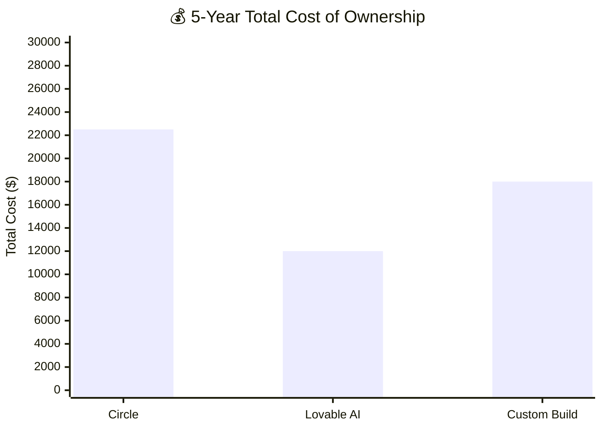

| Platform | Year 1 | Years 2-5 | **5-Year Total** |
|----------|--------|-----------|------------------|
| ⭕ **Circle** | $10,500 | $12,000 | **$22,500** |
| 💜 **Lovable** | $4,000 | $8,000 | **$12,000** |
| 🏗️ **Custom** | $16,800 | $4,800 | **$21,600** |

> ⚠️ **Note on Lovable:** The $12,000 5-year cost is ONLY if you just need a landing page. For a full community platform, you'd need to add custom development anyway, making it similar to custom build cost.

### Transaction Fee Impact (At Scale)

If you process $50,000/month in payments:

| Platform | Transaction Fee | Monthly Cost | Annual Cost |
|----------|----------------|--------------|-------------|
| ⭕ **Circle** (1%) | $500/mo | $500 | **$6,000/year** |
| 🏗️ **Custom** (0%) | $0/mo | $0 | **$0/year** |

> 💡 **At scale, custom build saves thousands in transaction fees.**

---

## 🤔 Decision Matrix

### Which Platform for Which Goal?

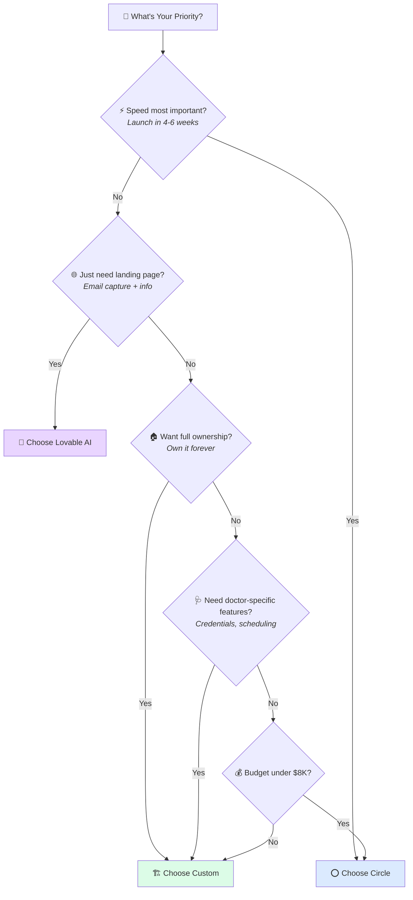

### Recommendation by Scenario

| Your Situation | Recommended | Why |
|----------------|-------------|-----|
| 💨 Need to launch ASAP | ⭕ Circle | Fastest option |
| 💵 Budget under $6K | ⭕ Circle | Lowest upfront |
| 🌐 Just need landing page | 💜 Lovable | Simple and cheap |
| 🏠 Want to own platform | 🏗️ Custom | Full ownership |
| 🩺 Doctor-specific features | 🏗️ Custom | Only option |
| 📈 Building serious business | 🏗️ Custom | Best long-term value |
| 💰 Want highest exit value | 🏗️ Custom | 3-5x vs 1-2x |
| 🚀 Scale to 100K+ members | 🏗️ Custom | No platform fees eating profits |

---

## 🎯 Final Recommendation

### For Doctor Side Gigs Specifically

Based on your goals of:
- Building the #1 physician side gig community
- Scaling to 100K+ members
- Future telemedicine integration
- Long-term valuable asset

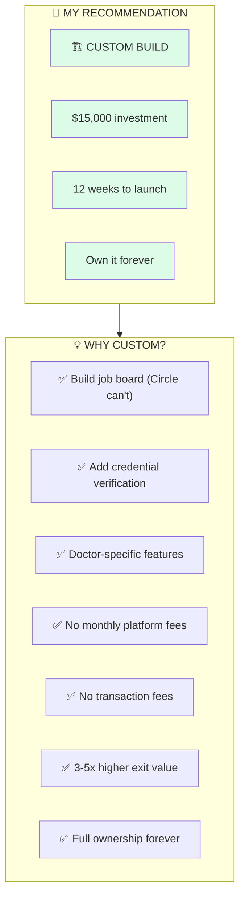

### Alternative: If You Want to Start Faster

| Phase | Platform | Cost | Timeline |
|-------|----------|------|----------|
| **Phase 1** | 💜 Lovable for landing page | $1,000 | 1 week |
| **Phase 2** | 🏗️ Custom for full platform | $15,000 | 12 weeks |
| **Total** | Hybrid approach | $16,000 | 13 weeks |

This gets you a landing page collecting emails while the full platform is being built.

---

## 📋 Summary Table

| Factor | ⭕ Circle | 💜 Lovable | 🏗️ Custom |
|--------|:--------:|:----------:|:---------:|
| **Best For** | Quick launch | Landing pages | Serious business |
| **Upfront Cost** | $6K | $3K | $15K |
| **Monthly Cost** | $300 | $100 | $100 |
| **Time to Launch** | 4-6 weeks | 1-2 weeks | 10-14 weeks |
| **Ownership** | ❌ No | ✅ Yes | ✅ Yes |
| **Customization** | ⚠️ Limited | ⚠️ Limited | ✅ Unlimited |
| **Job Board** | ❌ No | ❌ No | ✅ Yes |
| **Doctor Features** | ❌ No | ❌ No | ✅ Yes |
| **Mobile App** | ✅ Included | ❌ No | ⚠️ Extra cost |
| **Exit Value** | 1-2x | 2-3x | 3-5x |

---

### 🤝 Ready to Decide?

Let me know which option interests you most, and we can discuss the next steps!

---

*Comparison prepared by Hammad Khan | December 2024*

